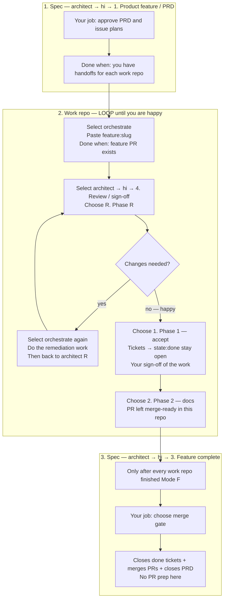

# OpenCode Agent Orchestration

Stage-based **Architect → Orchestrate** pipeline with model routing in [`opencode.json`](opencode.json).

**Operational detail:** [docs/RUNBOOK.md](docs/RUNBOOK.md) · **Feature pipeline:** [docs/FEATURE-PIPELINE.md](docs/FEATURE-PIPELINE.md) · **Capability matrix:** [docs/architecture/opencode-capability-matrix.md](docs/architecture/opencode-capability-matrix.md)

---

## Feature flow (PRD → sign-off)

Plan in **spec**. Build and sign off the work in each **work repo** (with a review ↔ build loop). Close the feature in **spec**.

**Reminders**

- Sign-off of the **work** (review, remediation, tickets to `state:done`, docs, PR merge-ready) = **architect in the work repo**.
- Sign-off of the **feature across the stack** (merge + close) = **architect in spec** → **3. Feature complete**.
- Spec closes tickets that are already `state:done`. Getting them to done and making the PR merge-ready is **work-repo** work — not spec.

### How to use

1. Open the repo for the current step (`*-spec` or a work repo such as `*-web` / `*-api`).
2. Choose only **architect** or **orchestrate**.
3. For **architect**, always start with **`hi`**, then pick the **menu line** you see.
4. Approve when asked; paste handoffs into **orchestrate**; stay in the work-repo loop until you are happy before returning to spec.

### Diagram



```text
SPEC (start)          WORK REPO (loop until happy)              SPEC (finish)
architect / 1    →    orchestrate ⇄ architect / 4 (R→1→2)   →   architect / 3
PRD + handoffs        build → review → (fix → review)*          merge + close
```

### Responsibility at each stage

| Stage | Repo | Select | Your choice | Your job | This stage owns |
|-------|------|--------|-------------|----------|-----------------|
| Plan / PRD | **spec** | **architect** → `hi` | **1. Product feature / PRD — …** | Answer grill; **approve PRD**; **approve** issue plans | Planning + handoffs only — not code, not PR polish |
| Build | **work repo** | **orchestrate** | Paste `feature:<slug>` / handoff | Wait for the feature PR | Implements the queue; opens/updates the feature PR |
| Review / accept / docs | **same work repo** | **architect** → `hi` | **4. Review / sign-off — Mode F …** then **R** / **1** / **2** | Drive review; when happy: accept then docs | **All PR readiness and ticket acceptance** before spec |
| Remediation loop | **same work repo** | **orchestrate** ↔ **architect** | After **R**, if changes needed: **orchestrate** → then **4** → **R** again | Stay until happy — **do not go to spec yet** | Work-repo loop only |
| Final close | **spec** | **architect** → `hi` | **3. Feature complete — …** | After every work repo finished Mode F; choose merge gate | Merge PRs; **close** `state:done` tickets; close PRD. No PR prep |

Detail (labels, gates, Mode F phases): [docs/FEATURE-PIPELINE.md](docs/FEATURE-PIPELINE.md). If the stack is not bootstrapped yet, continue with [Prerequisites](#prerequisites) below.

---

## Prerequisites


| Requirement                                                       | Why                                                                                       |
| ----------------------------------------------------------------- | ----------------------------------------------------------------------------------------- |
| **`OPENCODE_CONFIG_DIR`** (default `~/.config/opencode` on macOS) | OpenCode loads `opencode.json`, agents, skills, and [rules/](rules/)                    |
| **GitHub CLI** (`gh`) authenticated                               | Issues, `setup-project`, fanout, PR workflows                                             |
| **`GH_ORG`** (or `--org`) for stack bootstrap                     | GitHub **owner** in `owner/repo` — your user login or org, not the app slug               |
| **`GH_PROJECT`** (optional) in `~/.opencode-agent-env`            | Org-wide project board — PRD parent + child issues registered at publish/fanout           |
| **Sibling clones** before spec bootstrap                          | `setup-project` creates/syncs **`<app>-spec`** and links repos that already exist on disk |


Optional but recommended:

- Add OpenCode CLI tools to your shell: `export PATH="$OPENCODE_CONFIG_DIR/bin:$PATH"`
- Org project board: `export GH_PROJECT="https://github.com/orgs/RoborewDev/projects/1"` in `~/.opencode-agent-env` — see [docs/GITHUB-PROJECT-BOARD.md](docs/GITHUB-PROJECT-BOARD.md)
- Label sync across repos: `gh secret set LABEL_SYNC_PAT --repo <owner>/<app>-spec` (see [templates/spec-repo/.github/workflows/sync-labels.yml](templates/spec-repo/.github/workflows/sync-labels.yml))
- Consistent agent shell: [scripts/agent-run.zsh](scripts/agent-run.zsh) and `~/.opencode-agent-env` for secrets (see RUNBOOK)

---

## Install this config

On macOS this checkout lives at **`~/.config/opencode`**. Add to `~/.zshenv` so the desktop app and terminal both pick it up:

```bash
export OPENCODE_CONFIG_DIR="$HOME/.config/opencode"  # change if your checkout is not here
export PATH="$OPENCODE_CONFIG_DIR/bin:$PATH"
```

Restart OpenCode after the first edit. Per-repo files (`opencode.md`, `CONTEXT.md`, `docs/agents/`) live in **your application repos**, not in this config repo.

---

## Claude Context indexing (host vs Docker server)

`claude-context` speeds semantic discovery; OpenCode still works if it is off (agents fall back to bash/glob with `MCP_FALLBACK`).

**Control:** `mcp.claude-context.enabled` in [`opencode.json`](opencode.json).

| How you run OpenCode | Set host `enabled` to | Indexing backend |
|----------------------|----------------------|------------------|
| **Local only** — Desktop or CLI using this checkout as `OPENCODE_CONFIG_DIR`, no remote server | `true` | Host MCP (`npx` / local binary). Turn on when you want indexing. |
| **Docker server** — Desktop/CLI attached to the [utilities OpenCode stack](https://github.com/roborew/opencode) (`opencode.home.internal:4097` / `127.0.0.1:4097`) | `false` | Container MCP + Milvus (server override forces `enabled: true` inside the image). |

**Why the split:** With Desktop on Docker *and* host `enabled: true`, OpenCode can spawn many host `claude-context-mcp` processes (multi‑GB RAM) while the server already indexes via Milvus. Keep **one** side on.

```json
"claude-context": {
  "type": "local",
  "enabled": false,
  "command": ["npx", "-y", "@zilliz/claude-context-mcp@latest"]
}
```

- Docker / server mode (this repo’s usual pairing with the utilities stack): leave `"enabled": false` on the **host** checkout.
- Local-only indexing: set `"enabled": true`, restart OpenCode Desktop/CLI.

Agents already treat a missing MCP as optional — see [docs/RUNBOOK.md](docs/RUNBOOK.md#mcp-usage-policy).

---

## Choose your setup path


| Situation                                                | What to do                                                                                                     |
| -------------------------------------------------------- | -------------------------------------------------------------------------------------------------------------- |
| **New product, multiple repos** (web + API + spec)       | [New multi-repo project](#new-multi-repo-project) → shell `setup-project` → OpenCode **setup-project** in spec |
| **One repo only** (no PRD / fanout stack)                | [Single repository](#single-repository) — `setup-skills` + `opencode.md` / `CONTEXT.md`                        |
| **Repos already exist** (adding OpenCode or new sibling) | [Existing repositories](#existing-repositories) — re-run `setup-project`, then architect interview             |


**Repo naming:** Prefer **surface or capability** (`<app>-web`, `<app>-api`, `<app>-mobile`) over vague “frontend” only.

**Project layout:** The parent folder (e.g. `~/code/myapp/`) is a **container only** — not a git root. Siblings are typically **`myapp-spec`**, **`myapp-web`**, **`myapp-api`**. The parent folder basename becomes the **app slug** (lowercased). GitHub remotes may use different casing; bootstrap reads **git remote** from each clone.

---

## New multi-repo project

### 1. Create GitHub repos and clone siblings

Create implementation repos on GitHub first, then clone them under one parent:

```bash
export GH_ORG=your-github-login-or-org   # owner in owner/repo

mkdir -p ~/code/myapp && cd ~/code/myapp
gh repo clone "$GH_ORG/myapp-web"
gh repo clone "$GH_ORG/myapp-api"
# myapp-spec is created by setup-project if it does not exist yet
```

### 2. Shell bootstrap (once per stack)

From the **project parent** — not inside `myapp-spec`:

```bash
cd ~/code/myapp
setup-project
```

What this does:

- Creates or syncs **`myapp-spec`** from [templates/spec-repo/](templates/spec-repo/)
- Updates **`docs/agents/repos.md`** with discovered siblings
- Wires **`docs/agents/issue-tracker.md`** in each implementation repo (links to spec)
- Aligns GitHub templates and doc scaffolding (no automation scripts copied into repos)

Project automation runs from central config via **`opencode-run`** (e.g. `opencode-run spec fanout <slug>`). Application repos may use `bin/` for **app-specific** scripts only.

**Re-runs are safe** — idempotent doc/registry alignment and re-link; an existing spec repo **stays on its current branch** unless you pass `--keep-branch` explicitly on first create.

Useful flags:


| Flag            | Use when                                                           |
| --------------- | ------------------------------------------------------------------ |
| `--keep-branch` | First run but you want to stay on a feature branch in spec         |
| `--spec-only`   | Spec repo only; skip linking implementation repos                  |
| `--all`         | Discover **all** git siblings, not only `myapp-`* prefixed folders |
| `--check-only`  | Validate registry, PRDs, and impl wiring without writes            |
| `--app <slug>`  | Parent folder name differs from desired slug                       |
| `--org <org>`   | Override `GH_ORG` for one command                                  |


`new-spec-repo` and `link-spec-repo` are **deprecated shims** — use `setup-project` from the project parent.

### 3. OpenCode stack interview — **spec repo only** (do not repeat per impl repo)

After shell `setup-project`, open OpenCode **once**, in the **spec** repo:

```bash
cd ~/code/myapp/myapp-spec
opencode
```

| Do | Don't |
|----|--------|
| Run **architect** → menu **7. Setup / bootstrap stack** (loads **setup-project**) | Open `myapp-web`, `myapp-api`, etc. and run setup-project again |
| Stay in `myapp-spec` for the whole interview | Run **setup-skills** in each impl repo (that's for single-repo / orphan repos only) |

What **setup-project** does from that one session:

1. Confirms sibling repos against `docs/agents/repos.md`
2. Interviews you (triage labels, `application_role`, capabilities, product vocabulary)
3. Delegates **stack-bootstrap** into each implementation repo for you (templates, `docs/agents/*`) — you do not `cd` into siblings
4. Optionally archives legacy `.plan/feature.*` after you confirm

Registry rows may show **INCOMPLETE** / `NEXT:` until this step finishes — normal right after shell bootstrap alone.

### 4. Context files (all repos — edit files, not another setup run)

Shell bootstrap and **stack-bootstrap** already copy most scaffolding into **every** sibling. You do **not** run OpenCode setup again in each repo.

Check or fill in these files (architect/scribe can help during step 3; you can also edit by hand later):

| File | Spec repo (`myapp-spec`) | Each impl repo (`myapp-web`, …) |
|------|--------------------------|----------------------------------|
| [`opencode.md`](docs/templates/opencode.md.template) | Stack-wide commands if needed | Build/test/lint commands for that codebase |
| `CONTEXT.md` | Product glossary | Repo-specific gotchas only (not full product glossary) |
| `LANGUAGE.md` | Optional shared vocabulary | Usually omitted |

### 5. Validate

From the project parent:

```bash
setup-project --check-only ~/code/myapp
```


| Exit / message | Meaning                                                                       |
| -------------- | ----------------------------------------------------------------------------- |
| **0**          | Registry and wiring look complete                                             |
| **3**          | Shell OK; OpenCode interview still needed (`docs/agents/repos.md` TBD fields) |
| **4**          | Implementation repo wiring gaps (missing clone, bad `issue-tracker.md`, etc.) |
| **6**          | PRD / ticket validation errors in spec                                        |


Then start product work: [Daily use](#daily-use).

---

## Single repository

Use this when you will **not** run the spec → PRD → fanout pipeline (small fixes, one codebase, **targeted change** in [CONTEXT.md](CONTEXT.md)).

1. Clone or create the repo; point OpenCode at this config (above).
2. Copy [docs/templates/opencode.md.template](docs/templates/opencode.md.template) → **`opencode.md`**; add **`CONTEXT.md`** (glossary + conventions).
3. In **`architect`**, run **`setup-skills`** once. It scaffolds:
  - `docs/agents/issue-tracker.md`
  - `docs/agents/triage-labels.md`
  - `docs/agents/domain.md`
  - `## Agent skills` in **`AGENTS.md`** or **`README.md`** (not both)
4. Enable workflow skills on agents as needed ([Optional workflow skills](#optional-workflow-skills)).

Work items: **`to-issues`** → optional **issue-expand** → **`orchestrate`**. No spec repo required.

For a repo that later joins a stack, run [Existing repositories](#existing-repositories) from the project parent instead of maintaining a separate bootstrap path.

---

## Existing repositories

### Add OpenCode to repos you already have

1. **Install this config** (above).
2. Place clones as **siblings** under one parent (e.g. move `myapp-web` and `myapp-api` under `~/code/myapp/`).
3. From the parent, run **`setup-project`** (same as [shell bootstrap](#2-shell-bootstrap-once-per-stack)). Existing spec content (PRDs, ADRs, prototypes) is preserved; tooling and registry links are refreshed.
4. Open **`myapp-spec` only** in OpenCode → **architect → option 8 (Setup / bootstrap stack)**. Do not repeat setup in impl repos; stack-bootstrap updates them from spec.

### Add a new implementation repo to a stack

1. Create and clone `myapp-new-surface` next to existing siblings.
2. Re-run from parent: `setup-project` (links the new repo, updates registry).
3. In **spec only**: **architect → option 8** to register `application_role`, capabilities, and run **stack-bootstrap** on the new repo.

### Legacy `.plan/` and old `docs/agents/`

During **setup-project**, architect scans implementation repos for `.plan/feature.*` and duplicate agent docs. Confirmed items are **archived** (not deleted) under `.plan/_archive/legacy/` or `docs/_archive/legacy/`. Open `feature:<slug>` issues should use **issue-expand** before archiving the matching plan file.

### Upgrade OpenCode templates later

Re-run **`setup-project`** from the project parent to align docs and GitHub templates. Use **`opencode-assess-stack --fix .`** once to remove legacy copied `bin/` tooling from older stacks.

PRD ticket edits after publish: `feature-upgrade <slug>` from the project parent or `opencode-run spec feature-upgrade <slug>` in spec.

---

## Agent scratch `.gitignore` (recommended)

Add to each application repo:

```gitignore
# OpenCode agent scratch
tmp/
.research/
.qa/
.plan/*.completed.md
```

---

## Daily use

See **[Feature flow (PRD → sign-off)](#feature-flow-prd--sign-off)** for the full map (including the work-repo review ↔ orchestrate loop). Short session cheat-sheet:

| Step | Repo | Select | You do |
|------|------|--------|--------|
| Plan | **spec** | **architect** → `hi` → **1. Product feature / PRD …** | Approve PRD and issue plans; copy handoffs |
| Build | **each work repo** | **orchestrate** (new session) | Paste `feature:<slug>` / handoff; wait for PR |
| Review loop | **same work repo** | **architect** → `hi` → **4. Review / sign-off …** → **R** ↔ **orchestrate** until happy → **1** → **2** | Accept (`state:done`); docs; leave PR merge-ready |
| Close | **spec** | **architect** → `hi` → **3. Feature complete …** | Merge gate after every work repo finished Mode F |

Optional same-session path after a short HANDOFF block: `/compact` then switch agent. If the provider errors on tool history, use `/new` instead.

**Legacy path:** work-repo architect targeted change → orchestrate → architect Mode B (local `.plan` archive). Prefer the GitHub / Mode F path above.

**Single-repo (no PRD stack):** [Single repository](#single-repository) — `to-issues` → **orchestrate** (no spec fanout).

---

## Quick reference


| Topic                                                         | Location                                                                                                                   |
| ------------------------------------------------------------- | -------------------------------------------------------------------------------------------------------------------------- |
| Feature pipeline, two modes                                   | [docs/FEATURE-PIPELINE.md](docs/FEATURE-PIPELINE.md)                                                                     |
| Pipeline, grading, MCP policy                                 | [docs/RUNBOOK.md](docs/RUNBOOK.md)                                                                                       |
| Claude Context host vs Docker server                          | [Claude Context indexing](#claude-context-indexing-host-vs-docker-server)                                              |
| Stack bootstrap skill                                         | [skills/setup-project/SKILL.md](skills/setup-project/SKILL.md)                                                           |
| Per-repo bootstrap (orphan repo)                              | [skills/setup-skills/SKILL.md](skills/setup-skills/SKILL.md)                                                             |
| Per-project context template                                  | [docs/templates/opencode.md.template](docs/templates/opencode.md.template)                                               |
| Spec repo template layout                                     | [templates/spec-repo/](templates/spec-repo/)                                                                             |
| Shared rules (loaded via `instructions`)                      | [rules/](rules/)                                                                                                         |
| Helper scripts (secrets scan, session context, format, tests) | [scripts/](scripts/)                                                                                                     |
| Project automation (fanout, issue-expand, feature-check) | `opencode-run` — see [bin/opencode-run](bin/opencode-run) |
| Stack cleanup (remove legacy copied bin/) | `opencode-assess-stack` |
| Git / SQL guardrails (scripts)                                | [scripts/block-dangerous-git.sh](scripts/block-dangerous-git.sh), [scripts/preflight-git.sh](scripts/preflight-git.sh) |
| Worktree env copy / verify (scripts)                          | [scripts/worktree-env.sh](scripts/worktree-env.sh), [scripts/preflight-worktree-verify.sh](scripts/preflight-worktree-verify.sh) |
| Project vs host Node (preflight)                              | [scripts/preflight-runtime.sh](scripts/preflight-runtime.sh) |


---

## Built-in agents

`plan` (DeepSeek V4 Flash) and `build` (DeepSeek V4 Flash) — see `opencode.json`.

## Custom pipeline (summary)

- **`architect`** — planning; invokes `scribe` for docs artifacts; never executes code.
- **`orchestrate`** — execution coordinator; dispatches `developer`, `frontend-dev`, `ux-dev`, `code-review`, etc.; never writes files directly.
- **`scribe`** — only writer for plans, `docs/changelog|guides|architecture|adr|agents`, `CONTEXT.md`, `CONTEXT-MAP.md`, root `README`, optional `AGENTS.md`, `.env.example` (per allow list in [agents/scribe.md](agents/scribe.md)).
- **`review`** — may Task `security-reviewer`, `performance-reviewer`, `doc-reviewer` for focused passes (see agent + skill).

Global **`instructions`** pull in [rules/](rules/). Global **`permission`** in `opencode.json` allows workspace edits with asks/denies for `opencode.json`, lockfiles, `.env*`, keys, and credential directories under home.

## Optional workflow skills

[skills/ship](skills/ship), [skills/hotfix](skills/hotfix), [skills/debug-fix](skills/debug-fix), [skills/tdd](skills/tdd), [skills/handoff](skills/handoff), [skills/zoom-out](skills/zoom-out), [skills/caveman](skills/caveman), [skills/to-issues](skills/to-issues), [skills/setup-skills](skills/setup-skills) — add each skill to an agent’s `permission.skill` in [agents/*.md](agents/) when you want it available (`opencode.json` does not list skills).

**`grill-me`** (architect Mode A) embeds the [grill-with-docs](https://github.com/mattpocock/skills/tree/main/skills/engineering/grill-with-docs) flow: domain glossary + ADRs persisted via `scribe`.

**`improve-codebase-architecture`** (architect impl option 7) adapts Matt Pocock's [improve-codebase-architecture](https://github.com/mattpocock/skills/tree/main/skills/engineering/improve-codebase-architecture) as a periodic codebase audit: HTML architecture report, optional security pass, and optional `feature:<audit-slug>` remediation tickets via `to-issues` for `orchestrate`.

**CodeRabbit** (`skills/code-review`, from [coderabbitai/skills](https://github.com/coderabbitai/skills)): orchestrate runs **one** **CodeRabbit gate** via `review` after **all** stages/issues pass final code-review (`medium`/`hard`) — before difficulty gates and architect handoff (GitHub: after the full `feature:<slug>` queue, not per issue). Requires CodeRabbit CLI + auth.

**Cloudflare** (narrow set from [cloudflare/skills](https://github.com/cloudflare/skills)): `cloudflare` (DNS/domains + web-app platform guidance), `wrangler` (local run/deploy), `workers-best-practices`. Cloudflare API, Docs, and the internal docs MCP are managed through the `mcpjungle` gateway in `opencode.json`. Allowed on `architect`, `developer`, `senior-dev`, `frontend-dev`, and `debugger` via each agent’s `permission.skill`.

**Git guardrails:** `opencode.json` denies branch mutation commands (`git switch`, `git checkout -b`, protected-branch checkouts) for execution agents. `scripts/block-dangerous-git.sh` blocks the same patterns for hook-style validation. Orchestrate runs **`checkout-contract.sh`** every session to capture the current branch; subagents must not create or switch branches. Use `scripts/preflight-git.sh '<command>'` before risky git invocations, or wrap tool calls with `scripts/block-dangerous-git.sh` where your runtime supports stdin JSON hooks.

## Desktop / shell environment

If the OpenCode desktop app misses `mise`/`node`/`ruby` on PATH, put shared setup in `~/.zshenv` and optional secrets in `~/.opencode-agent-env` (see RUNBOOK). Run commands through [scripts/agent-run.zsh](scripts/agent-run.zsh) for a consistent login shell.
