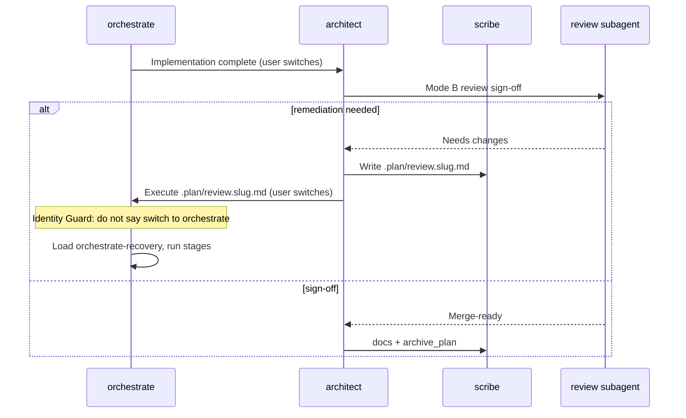

# 2026-05-15 — Architect review guards and agent handoff identity

**Session scope:** Stop architect from triggering implementation work during review/planning (especially invoking `refactor` or execution paths after returning from orchestrate). Preserve read-only planning specialists’ ability to use shell for discovery without file mutation. Fix stale chat context after UI agent switches so orchestrate does not repeat “Switch to orchestrate” and architect does not repeat “Switch to architect” when already active.

**Status:** Designed, implemented, and finalized in this chat. **Verify on disk before merge** — at documentation time the live repo did **not** contain these edits (no `Agent Identity Guard`, no `Mode B guard`, no extended `validate-opencode-config.sh`). Treat this document as the authoritative re-apply spec.

**Naming:** Prefix `2026-05-15-` reflects the date this chat completed its work (ISO date, then slug) for chronological sorting in `TO REVIEW`.

---

## Executive summary

| Area | Outcome |
| --- | --- |
| Root cause (review incident) | Architect in Mode B (or confused context) Tasked `refactor` / behaved like orchestrator; `refactor` skill kept but routing tightened |
| Root cause (handoff loop) | Agent UI switches; conversation history retains prior agent’s “Switch to …” text; new agent repeats stale instruction |
| Mode B routing | Architect may Task only `review`, `document`, `scribe` after orchestrate handoff — never `refactor`, `debugger`, `strategist`, `designer`, or execution agents |
| Mode A `refactor` | Kept for explicit Refactor plans (option 3 / `@refactor`); not for post-implementation review |
| Bash policy | **Not** shellless — read-only agents keep `bash: true` with granular `permission.bash`: allow discovery (`rg`, `find`, `git diff`, …), deny mutations (`rm`, `mv`, `git commit`, redirects, …), `*` → `ask` |
| Handoff identity | **Agent Identity Guard** on both `architect` and `orchestrate` so current agent file wins over stale chat |
| Validation | Extended `scripts/validate-opencode-config.sh` for guarded bash + Mode B guard presence |
| Shell scripts | Added repo-root `.gitattributes` with `*.sh text eol=lf` so validators remain executable |

**Explicit non-goal:** Do **not** load `orchestrate-execution` (or other orchestrator skills) on architect when switching back. Handoff is artifact-path + identity guard, not skill cross-loading.

---

## Problems reported (operator)

### 1. Architect invoked refactor during review

After orchestrate completed work and user returned to architect for review, architect started implementation-style behaviour — including initiating `refactor` — and repo files were touched. Expected: review produces a remediation **plan** (`.plan/review.<slug>.md`); orchestrate executes fixes.

Example unwanted architect output:

```text
I'm the Architect — I can't apply code fixes directly. The review artifact is ready at
.plan/review.centralized-navigation.md with all 5 issues documented.
Switch to orchestrate to apply the fixes.
```

That message is correct **from architect**, but orchestrate then repeated the same “Switch to orchestrate” instruction after the user had already switched.

### 2. Orchestrate did not recognize it was already active

User switched to orchestrate to apply review fixes. Orchestrate again told them to switch to orchestrate instead of executing `.plan/review.<slug>.md`.

### 3. Operator concern: blinded planning specialists

Initial fix set `bash: false` on debugger/refactor/review/etc. Operator correctly noted debugger and other planners need `rg`, `git diff`, and deeper shell discovery when Claude Context index is insufficient — shellless risks hallucination. **Final design:** guarded read-only bash, not removal.

---

## Design principles (final)

1. **Separation of concerns:** Architect plans and coordinates; scribe writes markdown; orchestrate executes stages; developer/frontend-dev mutate code.
2. **Mode B is narrow:** Post-implementation review/docs only — no planning specialists except `review` → `document` → `scribe`.
3. **`refactor` skill preserved:** Still used for Mode A Refactor plan drafting; forbidden in Mode B and during review remediation handoff interpretation.
4. **Bash ≠ write:** OpenCode `permission.bash` can allow read-only commands while `edit: deny` and mutation patterns stay denied ([OpenCode permissions](https://dev.opencode.ai/docs/permissions)).
5. **Current-agent truth:** Stale “Switch to X” lines in chat history are handoff **payload**, not instructions for the active agent to repeat.
6. **Concrete handoff strings:** Prefer “In `orchestrate`, execute `.plan/review.<slug>.md`” over vague “Switch to orchestrate.”

---

## Architecture (handoff flow)



---

## Files changed (this chat)

| File | Change |
| --- | --- |
| `agents/architect.md` | Agent Identity Guard; Mode B guard; refactor Mode A-only dispatch hint; `permission.bash` read-only allowlist; Hard Rule “current-agent truth”; MCP fallback to guarded shell |
| `agents/orchestrate.md` | Agent Identity Guard; review remediation routing; handoff override before plan picker; Hard Rule “never switch to orchestrate while orchestrate” |
| `agents/debugger.md` | `permission.bash` read-only allowlist; MCP fallback prose |
| `agents/refactor.md` | Same bash guard; planning-only Hard Rules unchanged |
| `agents/review.md` | Same bash guard |
| `agents/strategist.md` | Same bash guard |
| `agents/document.md` | Same bash guard |
| `agents/designer.md` | Same bash guard |
| `agents/security-reviewer.md` | Same bash guard |
| `agents/performance-reviewer.md` | Same bash guard |
| `agents/doc-reviewer.md` | Same bash guard |
| `skills/architect-plan/SKILL.md` | Refactor Mode A-only; MCP/shell fallback policy |
| `skills/architect-review/SKILL.md` | Agent Identity Guard; Mode B specialist deny list; remediation handoff wording; no implementation via specialists |
| `skills/orchestrate-execution/SKILL.md` | Agent Identity Guard; handoff override step 0; current-agent truth |
| `skills/orchestrate-recovery/SKILL.md` | Review artifact recovery: treat path as selected plan; no repeat switch prompt |
| `skills/refactor/SKILL.md` | Shellless → guarded shell fallback wording |
| `skills/review/SKILL.md` | Same; remove `git diff --name-only` as required first step (use parent context + MCP/shell) |
| `skills/strategist/SKILL.md` | MCP fallback via guarded shell |
| `skills/handoff/SKILL.md` | Architect no longer described as bash+mktemp primary path |
| `docs/RUNBOOK.md` | Document guarded bash for planning/review agents; Mode A vs Mode B routing |
| `scripts/validate-opencode-config.sh` | Guarded-bash checks; architect Mode B guard; architect-review must not allow extra specialists; CRLF-safe frontmatter parsing |
| `.gitattributes` (repo root) | `*.sh text eol=lf` |

---

## 1. Read-only `permission.bash` template

Apply under `permission:` in each read-only planning/review agent frontmatter (`architect`, `strategist`, `debugger`, `refactor`, `review`, `document`, `designer`, `security-reviewer`, `performance-reviewer`, `doc-reviewer`).

Keep:

```yaml
tools:
  write: false
  edit: false
  bash: true
permission:
  edit: deny
  bash:
    "*": ask
    "pwd": allow
    "ls": allow
    "ls *": allow
    "find": allow
    "find *": allow
    "rg": allow
    "rg *": allow
    "grep": allow
    "grep *": allow
    "sed -n *": allow
    "git status": allow
    "git status *": allow
    "git diff": allow
    "git diff *": allow
    "git show": allow
    "git show *": allow
    "git log": allow
    "git log *": allow
    "git ls-files": allow
    "git ls-files *": allow
    "git grep": allow
    "git grep *": allow
    "rm *": deny
    "mv *": deny
    "cp *": deny
    "mkdir *": deny
    "touch *": deny
    "chmod *": deny
    "git add *": deny
    "git commit *": deny
    "git push *": deny
    "git reset *": deny
    "git checkout *": deny
    "git restore *": deny
    "git clean *": deny
    "git apply *": deny
    "sed -i *": deny
    "*>*": deny
    "*>>*": deny
    "*| tee *": deny
```

**Limitation:** Pattern matching is prefix/wildcard based; unusual compound commands may still hit `ask`. That is acceptable — better than blanket deny or unrestricted allow.

**Not changed:** Execution agents (`developer`, `frontend-dev`, `ux-dev`, `senior-dev`, `scribe`, `verifier`) retain their existing bash policies.

---

## 2. `agents/architect.md` — key additions

### Agent Identity Guard (insert after opening paragraph)

```markdown
## Agent Identity Guard

If the current active agent is `architect`, treat yourself as Architect even when earlier conversation text says "I'm Orchestrate" or "Switch to architect." Agent switching may preserve stale chat context; your own agent file and current user request are authoritative.

- Never tell the user to switch to `architect` while you are already running as `architect`.
- If the latest user message says they switched back to architect, asks for review/sign-off/docs, or includes an orchestrate completion handoff, load `architect-review` and proceed with Mode B.
- If stale orchestrate output says "Switch to architect" and includes an executed artifact path or completion summary, interpret that as the handoff payload, not as an instruction to repeat.
```

### Mode B guard (under “When Invoking Subagents”)

```markdown
- **Mode B guard:** When operating from an orchestrate handoff / post-implementation review, you may Task only `review`, `document`, and `scribe`. Do not Task `refactor`, `debugger`, `strategist`, or `designer` in Mode B.
```

### Skill dispatch hint for `refactor`

```markdown
**`refactor` is allowed only for Mode A when the user explicitly selected Refactor / option 3 or explicitly requested `@refactor`; never invoke it during Mode B review/sign-off.**
```

### Hard Rules additions

- **Mode B is narrower:** after orchestrate handoff, only `review`, `document`, `scribe`.
- **Current-agent truth:** never prompt “Switch to architect” while already architect.

### Mode B skill routing trigger (expand)

Include: “switched back from orchestrate”, “orchestrate completion handoff”.

---

## 3. `agents/orchestrate.md` — key additions

### Agent Identity Guard

```markdown
## Agent Identity Guard

If the current active agent is `orchestrate`, treat yourself as Orchestrate even when earlier conversation text says "I'm the Architect" or "Switch to orchestrate." Agent switching may preserve stale chat context; your own agent file and current user request are authoritative.

- Never tell the user to switch to `orchestrate` while you are already running as `orchestrate`.
- If the latest user message says they switched to orchestrate, asks you to apply fixes, or references a `.plan/review.<slug>.md` remediation artifact, load `orchestrate-recovery` or `orchestrate-execution` as appropriate and proceed with artifact execution.
- If stale architect output says "Switch to orchestrate" and includes a review artifact path, interpret that as the handoff payload, not as an instruction to repeat.
```

### Skill routing

Add bullet: **Review remediation handoff** → load `orchestrate-recovery`, execute review artifact; do not ask user to switch again.

### Fresh context bootstrap

Add step **0. Handoff override:** concrete `.plan/<type>.<slug>.md` in latest context (especially `review.*`) → treat as provided path; skip generic switch prompts.

### Hard Rule

**Current-agent truth:** never “Switch to orchestrate” while already orchestrate.

---

## 4. `skills/architect-review/SKILL.md`

### Agent Identity Guard + First-turn behaviour

- Do not repeat orchestrate’s “Switch to architect”.
- Stale orchestrate completion summary + artifact path = proceed Mode B.

### Responsibility boundaries

Replace permissive “plus any specialist already specified…” with explicit deny:

```markdown
You may **only** invoke: `review`, `document`, and `scribe` in this mode. Do **not** invoke `refactor`, `debugger`, `strategist`, `designer`, `frontend-dev`, `developer`, or `orchestrate` for review/docs authoring.
```

### Supplementary Hard Rule

```markdown
- **No implementation.** If the review finds code changes are needed, create/update a review remediation artifact through `scribe`; never perform the changes or invoke planning/execution specialists to perform them.
```

### Remediation handoff wording (step 2)

```markdown
Prompt user: "In `orchestrate`, execute `.plan/review.<slug>.md` to apply the review fixes." Include the exact artifact path once.
```

---

## 5. `skills/orchestrate-execution/SKILL.md` and `skills/orchestrate-recovery/SKILL.md`

**orchestrate-execution:**

- Agent Identity Guard section.
- Session bootstrap step 0: architect handoff with artifact path skips plan picker.
- Hard rule 14: current-agent truth.

**orchestrate-recovery — Review Artifact Recovery:**

```markdown
- treat the artifact path as the selected executable plan, even if prior context includes "Switch to orchestrate"
- do not ask the user to switch to orchestrate again when you are already orchestrate
- read the review artifact and dispatch stages/tasks by its remediation instructions
```

---

## 6. `skills/architect-plan/SKILL.md`

- Refactor: “option 3 only, or explicit `@refactor`”; not during post-implementation review.
- MCP failure: fall back to read-only shell per `permission.bash`, record `MCP_FALLBACK`.

---

## 7. `scripts/validate-opencode-config.sh`

Extend beyond skill-existence checks:

1. For each read-only agent in list (`architect`, `strategist`, `debugger`, `refactor`, `review`, `document`, `designer`, `security-reviewer`, `performance-reviewer`, `doc-reviewer`):
   - Require `edit: deny`
   - Require `bash: true`
   - Require key bash guard patterns (`"*": ask`, `"rg *": allow`, `"git diff *": allow`, mutation denies, redirect denies)
   - Strip `\r` when parsing frontmatter (CRLF-safe)
2. Require `Mode B guard` in `agents/architect.md`
3. Fail if `skills/architect-review/SKILL.md` still contains `plus any specialist already specified`

Ensure script uses LF line endings and is executable (`chmod +x`).

---

## 8. `.gitattributes` (repo root)

```
*.sh text eol=lf
```

Prevents `env: bash\r: No such file or directory` on validators after checkout on Windows-style autocrlf setups.

---

## Operator FAQ

### Should architect load orchestrator skills when switching back?

**No.** Load `architect-review` only. Orchestrate skills are for the orchestrate primary agent.

### Does OpenCode tell the model which agent is active?

The UI switches agents; the model still sees full conversation history. **Identity guards** compensate — they instruct the active agent to trust its own agent file over stale messages.

### What if Claude Context is down?

Planning/review agents may use allowed read-only shell (`rg`, `git diff`, …) and must record `MCP_FALLBACK` in plan output. They must not use shell to write files.

### Is `refactor` removed?

**No.** It remains a Mode A planning specialist. It must not run during Mode B review.

---

## Verification checklist (after re-apply)

```bash
scripts/validate-opencode-config.sh
git diff --check
```

Manual grep:

```bash
rg 'Agent Identity Guard' agents/architect.md agents/orchestrate.md
rg 'Mode B guard' agents/architect.md
rg 'execute `.plan/review' skills/architect-review/SKILL.md
rg 'permission\.bash' agents/architect.md agents/debugger.md agents/refactor.md
```

Behavioural smoke tests:

1. **Architect Mode B remediation:** produces `.plan/review.*.md`, prompts execute path, does **not** Task `refactor`.
2. **Switch to orchestrate:** first message after switch with review path → orchestrate starts stage loop, does **not** say “Switch to orchestrate”.
3. **Switch back to architect:** after orchestrate completion → architect runs Mode B review/docs, does **not** say “Switch to architect”.
4. **Debugger plan draft:** can `rg` / `git diff` when MCP unavailable; `git commit` blocked by permission.

---

## Relationship to other `TO REVIEW` docs

| Doc | Relationship |
| --- | --- |
| `2026-06-01-architect-orchestrator-session-todos.md` | Complementary — session todo sync; does not replace identity guards |
| `2026-06-01-subagent-bash-permissions-and-orchestrator-delegation.md` | Execution-lane bash; this doc covers **read-only** planning/review bash guard |
| `2026-06-01-unattended-execution-permissions-and-opencode-config-access.md` | May supersede granular lists on execution agents; read-only agents still need explicit mutation denies |

---

## Current on-disk check (at doc write time)

```text
rg 'Agent Identity Guard' ~/.config/opencode/agents → no matches
rg 'Mode B guard' ~/.config/opencode/agents/architect.md → no matches
scripts/validate-opencode-config.sh → basic skill check only (45 lines)
.gitattributes at repo root → absent (only templates/spec-repo/.gitattributes)
```

**Action:** Re-apply all sections above, then run verification checklist.
