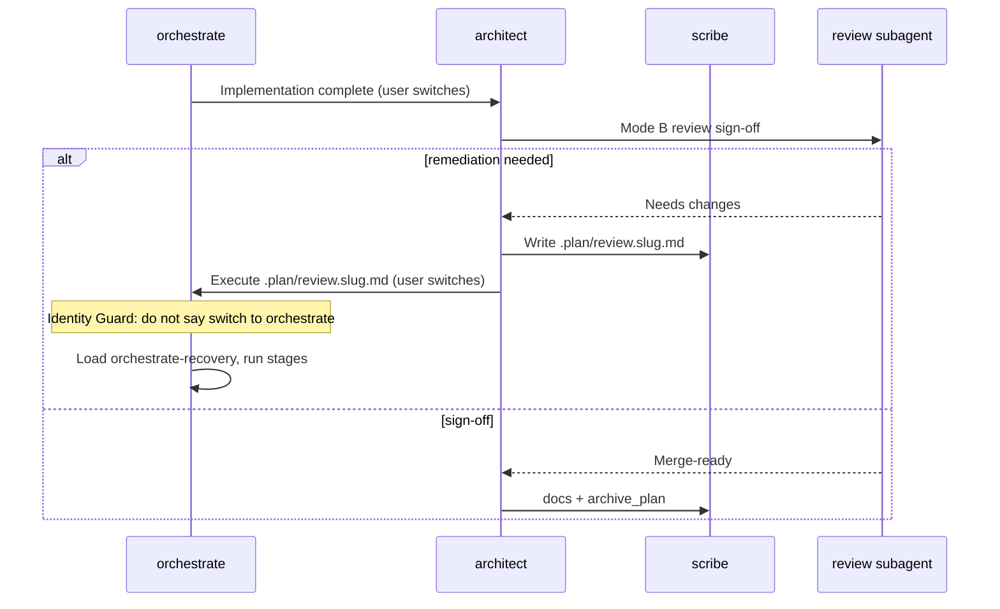

# 2026-05-15 — Architect review guards and agent handoff identity

**Cursor chat created:** 2026-05-15 (Friday, 15 May 2026, 18:47 UTC+1 — first user message timestamp in transcript `e0139dee-8193-4c42-acc8-fbdc52d584a7`).

**Work finalized in chat:** 2026-05-15 (same session; implementation and review doc authoring completed before follow-up doc requests).

**Session scope:** Stop architect from triggering implementation work during review/planning (especially invoking `refactor` after returning from orchestrate). Preserve read-only planning specialists’ ability to use shell for discovery without file mutation. Fix stale chat context after UI agent switches so orchestrate does not repeat “Switch to orchestrate” and architect does not repeat “Switch to architect” when already active.

**Status:** Designed, implemented, and finalized in the Cursor chat above. **Verify on disk before merge** — at last check the live repo did **not** contain these edits. This document is the authoritative re-apply spec for another AI or operator.

**Naming:** Prefix `2026-05-15-` uses the **Cursor chat creation date** (ISO date, then slug) so it sorts chronologically in `TO REVIEW/`.

**Explicit non-goal:** Do **not** load `orchestrate-execution` (or other orchestrator skills) on architect when switching back. Handoff is artifact-path + identity guard, not skill cross-loading.

---

## Executive summary

| Area | Outcome |
| --- | --- |
| Root cause (review incident) | Architect in Mode B (or confused context) Tasked `refactor` / behaved like orchestrator; `refactor` skill kept but routing tightened |
| Root cause (handoff loop) | Agent UI switches; conversation history retains prior agent’s “Switch to …” text; new agent repeats stale instruction |
| Mode B routing | Architect may Task only `review`, `document`, `scribe` after orchestrate handoff — never `refactor`, `debugger`, `strategist`, `designer`, or execution agents |
| Mode A `refactor` | Kept for explicit Refactor plans (option 3 / `@refactor`); not for post-implementation review |
| Bash policy (final) | **Not** shellless — read-only agents keep `bash: true` with granular `permission.bash`: allow discovery, deny mutations, `*` → `ask` |
| Handoff identity | **Agent Identity Guard** on both `architect` and `orchestrate` |
| Validation | Extended `scripts/validate-opencode-config.sh` |
| Shell scripts | Repo-root `.gitattributes`: `*.sh text eol=lf` |

### Iteration note (important for re-apply)

This chat went through two bash-policy iterations:

1. **Intermediate (superseded):** Set `bash: false` on all read-only planning/review agents. Operator rejected — debugger and others need `rg` / `git diff` when Claude Context is insufficient.
2. **Final:** Restore `bash: true` and add **`permission.bash` read-only allowlist** per [OpenCode permissions](https://dev.opencode.ai/docs/permissions). Apply **final** design only.

---

## Problems reported (operator)

### 1. Architect invoked refactor during review

After orchestrate completed work and user returned to architect for review, architect started implementation-style behaviour — including initiating `refactor` — and repo files were touched. Expected: review produces a remediation **plan** (`.plan/review.<slug>.md`); orchestrate executes fixes.

Example architect output (correct content, wrong if orchestrate repeats it):

```text
I'm the Architect — I can't apply code fixes directly. The review artifact is ready at
.plan/review.centralized-navigation.md with all 5 issues documented.
Switch to orchestrate to apply the fixes.
```

### 2. Orchestrate did not recognize it was already active

User switched to orchestrate to apply review fixes. Orchestrate again told them to switch to orchestrate instead of executing `.plan/review.<slug>.md`.

### 3. Operator concern: blinded planning specialists

Shellless read-only agents cannot `rg` / `git diff` when MCP index fails — risks hallucination. **Final:** guarded read-only bash.

---

## Architecture (handoff flow)



---

## Files to change (complete list)

| File | Change |
| --- | --- |
| `agents/architect.md` | Frontmatter `permission.bash`; Agent Identity Guard; Mode B guard; refactor Mode A-only; Hard Rules 11–13 |
| `agents/orchestrate.md` | Agent Identity Guard; review remediation routing; bootstrap step 0; Hard Rules renumber |
| `agents/debugger.md` | `permission.bash` block; Claude Context / Hard Rules prose |
| `agents/refactor.md` | Same |
| `agents/review.md` | Same |
| `agents/strategist.md` | Same |
| `agents/document.md` | Same |
| `agents/designer.md` | Same |
| `agents/security-reviewer.md` | Same + Hard Rule 2 tweak |
| `agents/performance-reviewer.md` | Same + Hard Rule 2 tweak |
| `agents/doc-reviewer.md` | Same + Hard Rule 2 tweak |
| `skills/architect-plan/SKILL.md` | Refactor Mode A-only; MCP/shell fallback |
| `skills/architect-review/SKILL.md` | Agent Identity Guard; deny list; remediation handoff wording |
| `skills/orchestrate-execution/SKILL.md` | Agent Identity Guard; bootstrap step 0; Hard rule 14 |
| `skills/orchestrate-recovery/SKILL.md` | Review artifact recovery bullets |
| `skills/refactor/SKILL.md` | MCP/shell fallback wording |
| `skills/review/SKILL.md` | Specialist delegation + MCP/shell fallback |
| `skills/strategist/SKILL.md` | Gaps + MCP policy |
| `skills/handoff/SKILL.md` | Architect bash guard note |
| `docs/RUNBOOK.md` | Guarded bash + Mode A/B routing |
| `scripts/validate-opencode-config.sh` | Guarded-bash + Mode B checks |
| `.gitattributes` (repo root) | `*.sh text eol=lf` |

---

## Shared snippet: read-only `permission.bash` block

Insert **after** `edit: deny` in frontmatter for every agent listed above (except orchestrate — it keeps `bash: false`).

```yaml
  bash:
    "*": ask
    "pwd": allow
    "ls": allow
    "ls *": allow
    "find": allow
    "find *": allow
    "rg": allow
    "rg *": allow
    "grep": allow
    "grep *": allow
    "sed -n *": allow
    "git status": allow
    "git status *": allow
    "git diff": allow
    "git diff *": allow
    "git show": allow
    "git show *": allow
    "git log": allow
    "git log *": allow
    "git ls-files": allow
    "git ls-files *": allow
    "git grep": allow
    "git grep *": allow
    "rm *": deny
    "mv *": deny
    "cp *": deny
    "mkdir *": deny
    "touch *": deny
    "chmod *": deny
    "git add *": deny
    "git commit *": deny
    "git push *": deny
    "git reset *": deny
    "git checkout *": deny
    "git restore *": deny
    "git clean *": deny
    "git apply *": deny
    "sed -i *": deny
    "*>*": deny
    "*>>*": deny
    "*| tee *": deny
```

Ensure `tools.bash: true` remains on those agents.

---

## 1. `agents/architect.md`

### 1.1 Frontmatter — replace `permission:` block

**Before (baseline):**

```yaml
permission:
  edit: deny
  skill: { "architect-plan": "allow", "architect-review": "allow", "grill-me": "allow", "handoff": "allow", "to-issues": "allow", "zoom-out": "allow", "caveman": "allow", "setup-skills": "allow" }
  task:
    "*": deny
    strategist: allow
    debugger: allow
    refactor: allow
    review: allow
    document: allow
    designer: allow
    scribe: allow
```

**After:**

```yaml
permission:
  edit: deny
  bash:
    "*": ask
    "pwd": allow
    "ls": allow
    "ls *": allow
    "find": allow
    "find *": allow
    "rg": allow
    "rg *": allow
    "grep": allow
    "grep *": allow
    "sed -n *": allow
    "git status": allow
    "git status *": allow
    "git diff": allow
    "git diff *": allow
    "git show": allow
    "git show *": allow
    "git log": allow
    "git log *": allow
    "git ls-files": allow
    "git ls-files *": allow
    "git grep": allow
    "git grep *": allow
    "rm *": deny
    "mv *": deny
    "cp *": deny
    "mkdir *": deny
    "touch *": deny
    "chmod *": deny
    "git add *": deny
    "git commit *": deny
    "git push *": deny
    "git reset *": deny
    "git checkout *": deny
    "git restore *": deny
    "git clean *": deny
    "git apply *": deny
    "sed -i *": deny
    "*>*": deny
    "*>>*": deny
    "*| tee *": deny
  skill: { "architect-plan": "allow", "architect-review": "allow", "grill-me": "allow", "handoff": "allow", "to-issues": "allow", "zoom-out": "allow", "caveman": "allow", "setup-skills": "allow" }
  task:
    "*": deny
    strategist: allow
    debugger: allow
    refactor: allow
    review: allow
    document: allow
    designer: allow
    scribe: allow
```

Note: `refactor: allow` stays in **task** permissions for Mode A; Mode B guard prevents Tasking it during review.

### 1.2 Insert after opening paragraph (before `## Skill routing`)

```markdown
## Agent Identity Guard

If the current active agent is `architect`, treat yourself as Architect even when earlier conversation text says "I'm Orchestrate" or "Switch to architect." Agent switching may preserve stale chat context; your own agent file and current user request are authoritative.

- Never tell the user to switch to `architect` while you are already running as `architect`.
- If the latest user message says they switched back to architect, asks for review/sign-off/docs, or includes an orchestrate completion handoff, load `architect-review` and proceed with Mode B.
- If stale orchestrate output says "Switch to architect" and includes an executed artifact path or completion summary, interpret that as the handoff payload, not as an instruction to repeat.
```

### 1.3 Skill routing — expand Mode B bullet

**Replace:**

```markdown
- **Mode B — post-implementation** (user says implementation done, orchestrate completed, ready for review / docs): load **`architect-review`** only. Do **not** load `architect-plan` or `grill-me` for this path unless the user switches back to new planning.
```

**With:**

```markdown
- **Mode B — post-implementation** (user says implementation done, orchestrate completed, switched back from orchestrate, ready for review / docs, or provides an orchestrate completion handoff): load **`architect-review`** only. Do **not** load `architect-plan` or `grill-me` for this path unless the user switches back to new planning.
```

### 1.4 Claude Context Readiness Gate — replace fallback bullets

**Replace:**

```markdown
- Only if `claude-context` is unavailable, errors, or indexing fails after retry may you fall back to bash / glob / `rg` for discovery. When you do, record `MCP_FALLBACK: claude-context unavailable or indexing failed — <error>` in the plan `Context` or `Gaps`.
- Do not use bash, glob, or `rg` as the first discovery step when `claude-context` is configured and healthy.
```

**With:**

```markdown
- If `claude-context` is unavailable, errors, or indexing fails after retry, you may use only read-only shell discovery allowed by `permission.bash` (for example `rg`, `find`, `git diff`, `git status`). Record `MCP_FALLBACK: claude-context unavailable or indexing failed — <error>` in the plan `Context` or `Gaps`.
- Shell is for read-only discovery only. Never use shell to create, edit, move, delete, format, or apply files.
- Do not use bash, glob, or `rg` as the first discovery step when `claude-context` is configured and healthy.
```

### 1.5 Skill dispatch hints — extend refactor line

**Replace:**

```markdown
- `debugger`, `refactor`, `review`, `document`, `designer` — `load: full` when drafting the **first** version of specialist output for an artifact; `load: minimal` on iteration passes in the same session.
```

**With:**

```markdown
- `debugger`, `refactor`, `review`, `document`, `designer` — `load: full` when drafting the **first** version of specialist output for an artifact; `load: minimal` on iteration passes in the same session. **`refactor` is allowed only for Mode A when the user explicitly selected Refactor / option 3 or explicitly requested `@refactor`; never invoke it during Mode B review/sign-off.**
```

### 1.6 When Invoking Subagents — add Mode B guard

**Insert after the strategist bullet:**

```markdown
- **Mode B guard:** When operating from an orchestrate handoff / post-implementation review, you may Task only `review`, `document`, and `scribe`. Do not Task `refactor`, `debugger`, `strategist`, or `designer` in Mode B.
```

### 1.7 When to Delegate to Specialists — refactor line

**Replace:**

```markdown
- **Refactor** (option 3) → invoke `refactor`, receive plan content, pass to scribe.
```

**With:**

```markdown
- **Refactor** (option 3 only, or explicit `@refactor`) → invoke `refactor`, receive plan content, pass to scribe.
```

### 1.8 Hard Rules — replace rules 6, 11–12 and add 11–13

**Replace rule 6:**

```markdown
6. You may **only** invoke: `strategist`, `debugger`, `refactor`, `review`, `document`, `designer`, and `scribe`. Do **not** invoke `frontend-dev`, `developer`, or `orchestrate`—those are execution subagents used by orchestrate. **Mode B is narrower:** after an orchestrate handoff for review/docs, you may invoke only `review`, `document`, and `scribe`.
```

**Replace rule 11:**

```markdown
11. **Claude Context readiness.** Before any planning discovery, enforce the Claude Context readiness gate above. If MCP fails, use only read-only shell discovery allowed by `permission.bash`; never use shell for mutations.
```

**Add after rule 10 (archive gate), renumber subsequent rules:**

```markdown
11. **Current-agent truth:** If you are already architect, never prompt "Switch to architect." If previous orchestrate text did so, proceed from its artifact path / completion summary instead.
12. **Claude Context readiness.** … (as above)
13. **Pre-planning interview.** … (existing rule 12 content)
```

---

## 2. `agents/orchestrate.md`

### 2.1 Insert after opening paragraph

```markdown
## Agent Identity Guard

If the current active agent is `orchestrate`, treat yourself as Orchestrate even when earlier conversation text says "I'm the Architect" or "Switch to orchestrate." Agent switching may preserve stale chat context; your own agent file and current user request are authoritative.

- Never tell the user to switch to `orchestrate` while you are already running as `orchestrate`.
- If the latest user message says they switched to orchestrate, asks you to apply fixes, or references a `.plan/review.<slug>.md` remediation artifact, load `orchestrate-recovery` or `orchestrate-execution` as appropriate and proceed with artifact execution.
- If stale architect output says "Switch to orchestrate" and includes a review artifact path, interpret that as the handoff payload, not as an instruction to repeat.
```

### 2.2 Skill routing — insert before Recovery bullet

```markdown
- **Review remediation handoff** (latest user message says they switched from architect to orchestrate, asks to apply review fixes, or provides `.plan/review.<slug>.md`): load **`orchestrate-recovery`** and execute the review artifact flow. Do not ask them to switch agents again.
```

### 2.3 Fresh Context bootstrap — insert step 0

**Before step 1 (`Ask first` preflight), insert:**

```markdown
0. **Handoff override:** If the latest context contains an architect handoff with a concrete `.plan/<type>.<slug>.md` path, especially `.plan/review.<slug>.md`, treat that path as provided and skip the generic "switch to architect/orchestrate" prompts.
```

### 2.4 Hard Rules — add and renumber

**Insert after rule 6:**

```markdown
7. **Current-agent truth:** If you are already orchestrate, never prompt "Switch to orchestrate." If a previous architect message did so, proceed from its artifact path instead.
```

Renumber existing rules 7–8 to 8–9.

---

## 3. Read-only subagent template (`agents/debugger.md` example)

Apply shared `permission.bash` block (see above). Replace Claude Context + Hard Rules section 6 as below. **Replicate for:** `refactor`, `review`, `strategist`, `document`, `designer` (same pattern).

**Replace Claude Context fallback bullets with:**

```markdown
- If `claude-context` is unavailable, errors, or indexing fails after retry, you may use only read-only shell discovery allowed by `permission.bash` (for example `rg`, `find`, `git diff`, `git status`). Mention `MCP_FALLBACK: claude-context unavailable or indexing failed — <error>` in the returned markdown when this happens.
- Shell is for read-only discovery only. Never use shell to create, edit, move, delete, format, or apply files.
- Do not use bash, glob, or `rg` as the first discovery step when `claude-context` is configured and healthy.
```

**Replace Hard Rule 6 with:**

```markdown
6. Before any discovery, enforce the Claude Context readiness gate above. If MCP fails, use only read-only shell discovery allowed by `permission.bash`; never use shell for mutations.
```

### 3.1 Nested reviewers (`security-reviewer`, `performance-reviewer`, `doc-reviewer`)

Add shared `permission.bash` block. Extend Hard Rule 2:

```markdown
2. No file writes; read-only analysis. Shell is for read-only discovery only and must never create, edit, move, delete, format, or apply files.
```

---

## 4. `skills/architect-review/SKILL.md`

### 4.1 Insert after Mode B intro paragraph

```markdown
## Agent Identity Guard

If you are currently running as `architect`, earlier chat text from orchestrate is only handoff context. Do not repeat orchestrate's "Switch to architect" prompt. If the latest context includes an executed artifact path, verifier pass, or completion summary, proceed with Mode B review and documentation.
```

### 4.2 First-Turn Behavior — add bullet

```markdown
- If user says they switched back to architect, or stale orchestrate output says "Switch to architect", treat the orchestrate completion summary and artifact path as provided handoff context.
```

### 4.3 Responsibility boundaries — replace invoke line

**Replace:**

```markdown
You may **only** invoke: `review`, `document`, and `scribe` in this mode (plus any specialist already specified in agent rules for remediation flows). Do **not** invoke `frontend-dev`, `developer`, or `orchestrate` for review/docs authoring—user switches to orchestrate for remediation execution when needed.
```

**With:**

```markdown
You may **only** invoke: `review`, `document`, and `scribe` in this mode. Do **not** invoke `refactor`, `debugger`, `strategist`, `designer`, `frontend-dev`, `developer`, or `orchestrate` for review/docs authoring—user switches to orchestrate for remediation execution when needed.
```

### 4.4 Supplementary Hard Rules — add

```markdown
- **No implementation.** If the review finds code changes are needed, create/update a review remediation artifact through `scribe`; never perform the changes or invoke planning/execution specialists to perform them.
```

### 4.5 Completion Flow step 2 — replace handoff text

**Replace:**

```markdown
2. **If remediation needed:** Invoke `scribe` to write `.plan/review.<slug>.md` with the review plan. Prompt user: "Switch to `orchestrate` to apply fixes."
```

**With:**

```markdown
2. **If remediation needed:** Invoke `scribe` to write `.plan/review.<slug>.md` with the review plan. Prompt user: "In `orchestrate`, execute `.plan/review.<slug>.md` to apply the review fixes." Include the exact artifact path once. Do not phrase this as if architect can apply the fixes.
```

---

## 5. `skills/architect-plan/SKILL.md`

### 5.1 Claude Context Readiness Gate

**Replace fallback lines with:**

```markdown
- If `claude-context` is unavailable, errors, or indexing fails after retry, architect and planning specialists may use only read-only shell discovery allowed by their `permission.bash` policies (for example `rg`, `find`, `git diff`, `git status`). Record `MCP_FALLBACK: claude-context unavailable or indexing failed — <error>` in the returned plan `Context` or `Gaps`.
- Do not begin Step 1 investigation with bash, glob, or `rg` when `claude-context` is configured and healthy.
```

### 5.2 Supplementary Hard Rule 12

**Replace with:**

```markdown
12. **Claude Context readiness first.** Before any planning discovery, enforce the Claude Context readiness gate above. If MCP fails, use only read-only shell discovery allowed by `permission.bash`; never use shell for mutations.
```

### 5.3 Specialist Delegation — Refactor line

**Replace:**

```markdown
- **Refactor (option 3):** invoke `refactor` subagent for behavior-preserving plan draft. Pass refactor output to scribe.
```

**With:**

```markdown
- **Refactor (option 3 only, or explicit `@refactor`):** invoke `refactor` subagent for behavior-preserving plan draft. Pass refactor output to scribe. Do not invoke `refactor` during post-implementation review/sign-off; that path uses `architect-review`.
```

---

## 6. `skills/orchestrate-execution/SKILL.md`

### 6.1 Insert after `## Orchestrate (execution)`

```markdown
## Agent Identity Guard

If you are currently running as `orchestrate`, earlier chat text from architect is only handoff context. Do not repeat architect's "Switch to orchestrate" prompt. If the latest context includes a `.plan/review.<slug>.md` remediation artifact or the user says they already switched to orchestrate, execute the artifact flow.
```

### 6.2 Supplementary Hard Rules — add rule 14

```markdown
14. **Current-agent truth:** Never tell the user to switch to `orchestrate` while running as `orchestrate`; stale handoff text is not authoritative.
```

### 6.3 Session Bootstrap — insert step 0

```markdown
0. If the latest context contains an architect handoff with a concrete `.plan/<type>.<slug>.md` path, treat that artifact path as provided and skip generic plan selection. For `.plan/review.<slug>.md`, follow the review remediation flow in `orchestrate-recovery`.
```

---

## 7. `skills/orchestrate-recovery/SKILL.md`

### 7.1 Review Artifact Recovery — prepend bullets

**Insert at start of section (before `on verifier fail`):**

```markdown
- treat the artifact path as the selected executable plan, even if prior context includes "Switch to orchestrate"
- do not ask the user to switch to orchestrate again when you are already orchestrate
- read the review artifact and dispatch stages/tasks by its remediation instructions
```

---

## 8. `skills/refactor/SKILL.md` and `skills/review/SKILL.md`

### 8.1 `skills/refactor/SKILL.md` — MCP Usage Policy

**Replace shell fallback paragraph with:**

```markdown
- `claude-context` for discovering files to refactor and populating `FilesToChange` with evidence. If MCP fails, use only read-only shell discovery allowed by `permission.bash`; never use shell for mutations.

If `claude-context` is unavailable, errors, or indexing still fails after retry, you may use read-only shell discovery and should note `MCP_FALLBACK: claude-context unavailable or indexing failed — <error>` in the returned markdown.
```

### 8.2 `skills/review/SKILL.md` — Specialist delegation step 2

**Replace:**

```markdown
   - From `git diff --name-only` (or file list), decide which specialists add signal:
```

**With:**

```markdown
   - From supplied PR/change context or parent-provided changed-file evidence, decide which specialists add signal:
```

**Replace MCP Usage Policy shell fallback with same pattern as refactor skill.**

---

## 9. `skills/strategist/SKILL.md`

### 9.1 Gaps section

**Replace MCP fallback line with:**

```markdown
- If you used read-only shell discovery because `claude-context` failed: `MCP_FALLBACK: claude-context unavailable — <error summary>`
```

### 9.2 MCP Usage Policy items 2–4

```markdown
2. Always use `claude-context` MCP (`search_code`, `find_files`) for code/file discovery when it is available and ready. Do **not** use bash (`grep`, `rg`, `find`, glob) first when `claude-context` is healthy.
3. If `claude-context` returns an error, is unreachable, or indexing still fails after retry, you may use only read-only shell discovery allowed by `permission.bash`. When you do, add `MCP_FALLBACK: claude-context unavailable or indexing failed — <error>` to **Gaps**.
4. Never use shell for mutations.
```

---

## 10. `skills/handoff/SKILL.md`

**Replace architect/orchestrate paragraph with:**

```markdown
**Orchestrate** has `bash: false` — do not rely on `mktemp`. Return the handoff body in chat, or ask the user to approve a `scribe` write to an allowed markdown path.

For architect, prefer `scribe` for any persisted handoff under `.plan/` or `docs/agents/`; otherwise return the content in chat. Architect shell is guarded for read-only discovery, so do not use shell redirects to persist handoffs.
```

---

## 11. `docs/RUNBOOK.md` — key paragraph replacements

**Primary planning mode bullet — replace opening sentence with:**

```markdown
- **Primary planning mode** (`architect`) — read-only with guarded shell discovery: … In Mode A … `refactor` is only for explicit Refactor plans. In Mode B … only `review`, `document`, and `scribe`. …
```

**Planning specialists bullet:**

```markdown
- **Planning specialists** … read-only subagents of architect with guarded shell discovery; …
```

**Both primaries paragraph:**

```markdown
Both primaries (`architect`, `orchestrate`) are non-writing (`edit: deny`). Architect has a read-only bash allowlist for discovery; mutating shell commands are denied and unknown shell commands ask. Only `scribe` writes …
```

**Permission conventions — architect subagents:**

```markdown
- **Architect subagents** … `edit: deny`, and a read-only `permission.bash` allowlist — they cannot invoke scribe or any other agent, and shell mutations are denied.
```

**MCP policy — claude-context bullet:**

```markdown
- **`claude-context`**: … may fall back only to read-only shell discovery when MCP unavailable, with `MCP_FALLBACK` recorded.
```

---

## 12. `scripts/validate-opencode-config.sh` — full replacement

Replace entire file with (LF line endings; `chmod +x`):

```bash
#!/usr/bin/env bash
# Validates agent files vs opencode.json and skills vs agent permissions.
set -euo pipefail

ROOT="$(cd "$(dirname "$0")/.." && pwd)"
cd "$ROOT"

ERR=0

if ! python3 -m json.tool opencode.json >/dev/null 2>&1; then
  echo "ERROR: opencode.json is not valid JSON"
  exit 1
fi

echo "Checking agents/*.md have keys in opencode.json agent block..."
for f in agents/*.md; do
  [[ -f "$f" ]] || continue
  base=$(basename "$f" .md)
  if ! grep -q "\"$base\"" opencode.json; then
    echo "  MISSING: agent key for $base"
    ERR=1
  fi
done

echo "Checking skills referenced in agents exist..."
while IFS= read -r line; do
  if [[ "$line" =~ \"([a-z0-9-]+)\"[[:space:]]*:[[:space:]]*\"allow\" ]]; then
    sk="${BASH_REMATCH[1]}"
    if [[ "$sk" == "*" ]]; then continue; fi
    if [[ ! -f "skills/$sk/SKILL.md" ]]; then
      echo "  MISSING skill: skills/$sk/SKILL.md (referenced in agents)"
      ERR=1
    fi
  fi
done < <(grep -h 'skill:' agents/*.md 2>/dev/null || true)

echo "Checking read-only planning/review agents have guarded bash..."
READONLY_GUARDED_BASH_AGENTS=(
  architect
  strategist
  debugger
  refactor
  review
  document
  designer
  security-reviewer
  performance-reviewer
  doc-reviewer
)
for agent in "${READONLY_GUARDED_BASH_AGENTS[@]}"; do
  f="agents/$agent.md"
  if [[ ! -f "$f" ]]; then
    echo "  MISSING: expected read-only agent file $f"
    ERR=1
    continue
  fi
  fm=$(awk '{sub(/\r$/,"")} BEGIN{n=0} /^---$/{n++; next} n==1 {print}' "$f")
  if ! echo "$fm" | grep -q '^[[:space:]]*edit:[[:space:]]*deny[[:space:]]*$'; then
    echo "  UNSAFE: $f missing edit: deny"
    ERR=1
  fi
  if ! echo "$fm" | grep -q '^[[:space:]]*bash:[[:space:]]*true[[:space:]]*$'; then
    echo "  UNSAFE: $f should keep bash: true for read-only discovery"
    ERR=1
  fi
  for required in \
    '"*": ask' \
    '"rg *": allow' \
    '"find *": allow' \
    '"git diff *": allow' \
    '"rm *": deny' \
    '"mv *": deny' \
    '"git add *": deny' \
    '"git commit *": deny' \
    '"git push *": deny' \
    '"git reset *": deny' \
    '"git checkout *": deny' \
    '"git restore *": deny' \
    '"git clean *": deny' \
    '"git apply *": deny' \
    '"*>*": deny' \
    '"*>>*": deny'
  do
    if ! echo "$fm" | grep -Fq "$required"; then
      echo "  UNSAFE: $f missing bash guard $required"
      ERR=1
    fi
  done
  if echo "$fm" | grep -q '^[[:space:]]*task:[[:space:]]*{[[:space:]]*"*":[[:space:]]*allow'; then
    echo "  UNSAFE: $f allows wildcard task delegation"
    ERR=1
  fi
done

echo "Checking architect Mode B cannot route to refactor..."
if ! grep -q 'Mode B guard' agents/architect.md; then
  echo "  MISSING: architect Mode B guard"
  ERR=1
fi
if grep -q 'plus any specialist already specified' skills/architect-review/SKILL.md; then
  echo "  UNSAFE: architect-review allows extra specialists in Mode B"
  ERR=1
fi

if [[ $ERR -ne 0 ]]; then
  echo "validate-opencode-config: FAILED"
  exit 1
fi
echo "validate-opencode-config: OK"
exit 0
```

Post-write:

```bash
python3 -c "from pathlib import Path; p=Path('scripts/validate-opencode-config.sh'); p.write_bytes(p.read_bytes().replace(b'\r\n', b'\n'))"
chmod +x scripts/validate-opencode-config.sh
scripts/validate-opencode-config.sh
```

---

## 13. `.gitattributes` (repo root, new file)

```
*.sh text eol=lf
```

---

## Operator FAQ

### Should architect load orchestrator skills when switching back?

**No.** Load `architect-review` only.

### Does OpenCode tell the model which agent is active?

The UI switches agents; the model still sees full conversation history. **Identity guards** instruct the active agent to trust its own agent file over stale messages.

### Is `refactor` removed?

**No.** Mode A planning specialist only; forbidden in Mode B.

---

## Verification checklist (after re-apply)

```bash
scripts/validate-opencode-config.sh
git diff --check
rg 'Agent Identity Guard' agents/architect.md agents/orchestrate.md
rg 'Mode B guard' agents/architect.md
rg 'execute `.plan/review' skills/architect-review/SKILL.md
rg 'permission\.bash' agents/architect.md agents/debugger.md agents/refactor.md
```

Behavioural smoke tests:

1. Architect Mode B remediation → `.plan/review.*.md`, execute-path prompt, **no** `refactor` Task.
2. Switch to orchestrate with review path → stage loop starts, **no** “Switch to orchestrate”.
3. Switch back to architect after orchestrate → Mode B review/docs, **no** “Switch to architect”.
4. Debugger plan draft → can `rg` / `git diff` when MCP down; `git commit` denied.

---

## Relationship to other `TO REVIEW` docs

| Doc | Relationship |
| --- | --- |
| `2026-06-01-architect-orchestrator-session-todos.md` | Complementary — session todo sync |
| `2026-06-01-subagent-bash-permissions-and-orchestrator-delegation.md` | Execution-lane bash; this doc is **read-only** planning/review bash |
| `2026-06-01-unattended-execution-permissions-and-opencode-config-access.md` | May supersede granular lists on execution agents |

---

## Current on-disk check

At doc expansion time, baseline repo still lacked these guards. Re-apply all sections above, then run verification checklist.
