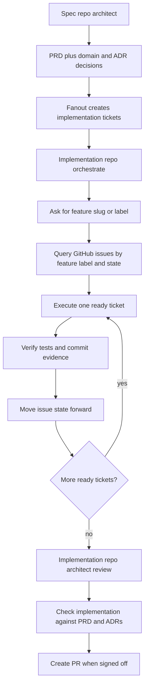

# 2026-05-16 — GitHub Issue–Backed Execution (plan implementation)

## Document metadata

| Field | Value |
| --- | --- |
| **Filename date** | **2026-05-16** — date the **Cursor chat was created** (filesystem birth time of the session transcript), not the date of later follow-up messages in the same thread. |
| **Implementation completed** | **2026-06-01** ~19:19 (all six plan todos marked done in that session). |
| **Cursor chat transcript** | `0b06ebd3-1262-42fc-91a7-173cfca23dae` → `.cursor/projects/Users-robo-config-opencode/agent-transcripts/0b06ebd3-1262-42fc-91a7-173cfca23dae/0b06ebd3-1262-42fc-91a7-173cfca23dae.jsonl` |
| **Source plan** | `github-issue-execution_8fcfb0d1.plan.md` (Cursor plan; **not edited** in-repo) |
| **Purpose of this doc** | Full reconstruction guide for another AI: what changed, why, and **copy-pasteable snippets** recovered from the transcript. |

**Status:** Implementation was finalized in chat on **2026-06-01**. **Re-apply to `main` before use** — many paths below were **not** present on a slim `main` checkout when this doc was last verified (see §10).

**Related TO REVIEW:**

- [`2026-05-19-issue-backed-workflow-orchestrate-handoff.md`](2026-05-19-issue-backed-workflow-orchestrate-handoff.md) — `ready-for-agent` vs manual orchestrate switch
- [`2026-05-19-spec-fanout-bin-tooling-and-prerequisites.md`](2026-05-19-spec-fanout-bin-tooling-and-prerequisites.md) — fanout prerequisites
- [`2026-06-01-spec-impl-issue-workflow-split.md`](2026-06-01-spec-impl-issue-workflow-split.md) — may supersede `opencode-task-json` body shape
- [`2026-06-01-feature-pipeline-and-architect-front-door.md`](2026-06-01-feature-pipeline-and-architect-front-door.md) — repo-aware architect menu (earlier edits in same chat)

---

## Executive summary

| Topic | Outcome |
| --- | --- |
| **Paradigm** | Spec-driven features: **GitHub child issues** (after `bin/fanout`) = **primary execution queue**; **`.plan/`** kept for local/debug/refactor/review/design/recovery. |
| **PRD + fanout** | `tickets: []` in PRD YAML → **one issue per ticket**, topo-sorted by `depends_on`. |
| **Triage** | New states: `in-progress`, `ready-for-review`, `blocked`, `done`. |
| **Orchestrate** | Startup **(A)** `.plan`, **(B)** GitHub `feature:<slug>`, **(C)** architect; skill **`github-issue-run`**. |
| **Executors** | `execution_mode: github_issue` + `opencode_meta` for developer / frontend-dev / verifier. |
| **Architect** | **Mode F** — sign off `feature:<slug>` vs PRD; skip `archive_plan` when GitHub-only. |
| **Docs** | README + RUNBOOK GitHub-first wording; `docs/smoke/github-issue-execution.md`. |

---

## 1. Target behavior



---

## 2. Plan todos (all completed 2026-06-01)

| ID | Requirement |
| --- | --- |
| `schema-fanout` | PRD `tickets:` + `bin/fanout` one issue per ticket |
| `issue-lifecycle` | Triage labels + transitions |
| `orchestrate-intake` | GitHub feature backlog beside `.plan` |
| `executor-contract` | Issue-backed developer / frontend-dev / verifier |
| `architect-review` | Mode F feature sign-off |
| `docs-update` | README, RUNBOOK, smoke doc |

---

## 3. File manifest

### New files

| Path |
| --- |
| `templates/spec-repo/bin/lib/toposort_tickets.py` |
| `skills/github-issue-run/SKILL.md` |
| `skills/github-issue-run/lib/next-runnable-issue.sh` |
| `skills/github-issue-run/lib/issue-state-transition.sh` |
| `docs/smoke/github-issue-execution.md` |

### Rewritten / heavily updated

| Path |
| --- |
| `templates/spec-repo/docs/prd/_template.md` |
| `templates/spec-repo/bin/fanout` |
| `templates/spec-repo/skills/fanout-issues/SKILL.md` |

### Patched (StrReplace in transcript)

| Path | Patches |
| --- | --- |
| `docs/agents/triage-labels.md` | 2 |
| `skills/triage/SKILL.md` | 2 |
| `skills/triage/lib/triage.sh` | 1 |
| `skills/setup-skills/templates/triage-labels.md` | 1 (Write) |
| `templates/spec-repo/.github/labels.yml` | 1 |
| `agents/orchestrate.md` | 4 |
| `skills/orchestrate-execution/SKILL.md` | 2 (incl. large GitHub loop) |
| `agents/developer.md` | 2 |
| `skills/developer/SKILL.md` | 3 |
| `agents/frontend-dev.md` | 2 |
| `skills/frontend-dev/SKILL.md` | 1 |
| `agents/verifier.md` | 1 |
| `skills/verifier/SKILL.md` | 3 |
| `agents/architect.md` | 7 |
| `skills/architect-review/SKILL.md` | 4 (incl. Mode F insert) |
| `README.md` | Multiple (GitHub-first `Building from spec` section) |
| `docs/RUNBOOK.md` | Multiple (canonical flow steps 3–20) |

---

## 4. Issue body contract (fanout output)

Human-readable header + machine block:

```markdown
Parent PRD: https://github.com/org/spec-repo/issues/123

## OpenCode task (machine-readable)
```opencode-task-json
{"task_id":"api-org-crud","depends_on":[],"owner":"developer","commit_message":"feat(api): add organization CRUD","acceptance":["…"],"test_commands":["go test ./internal/org/..."]}
```

**Blocked by:** #42
(or **Blocked by:** (none))

## Description

…optional ticket body from PRD…

---
Branch suggestion: feature/my-feature
```

**Runnable rule:** `next-runnable-issue.sh` skips issues where any `**Blocked by:** #n` issue is still **OPEN**.

---

## 5. Orchestrate ↔ child Task contract

Include in every **developer** / **frontend-dev** / **verifier** Task when executing a ticket:

```text
load: full
execution_mode: github_issue
issue_number: <n>
repo: owner/repo
title: <from JSON>
opencode_meta: <verbatim JSON from opencode-task-json>
```

**Developer commit:** `opencode_meta.commit_message` + `Refs: #<issue_number>`.

**Completion report fields (GitHub mode):** `plan_file: github:#<n>`, `stage_id: issue-<n>`, `git_commit`, `tests_run`, `acceptance_checks`.

---

## 6. Operator workflow

**Spec:** `grill-me` → `to-prd` → approve → fill `tickets:` → `bin/fanout <slug>`.

**Impl (default):** `orchestrate` → **(B)** feature slug → loop until no runnable issues → `architect` **Mode F** (`SPEC_REPO` optional).

**Impl (alternate):** `bin/feature-context` → architect `.plan` → orchestrate **(A)**.

---

## 7. On-disk verification (re-check before merge)

| Path | On slim `main`? |
| --- | --- |
| `skills/github-issue-run/` | Often **missing** |
| `docs/smoke/github-issue-execution.md` | Often **missing** |
| Expanded README | Often **reverted** (~38 lines) |
| `agents/architect.md` Mode F | Often **missing** |

**Recovery:** Re-apply Appendix A–D from this doc, or replay transcript `0b06ebd3-…` Write/StrReplace operations in order.

---

## Appendix A — `templates/spec-repo/bin/lib/toposort_tickets.py` (full)

```python
#!/usr/bin/env python3
"""Topological sort of PRD tickets by depends_on (task ids). Print one id per line."""
import json
import sys


def main() -> None:
    data = json.load(sys.stdin)
    if not isinstance(data, list):
        print("tickets must be a JSON array", file=sys.stderr)
        sys.exit(1)
    ids = {t["id"]: t for t in data if "id" in t}
    order: list[str] = []
    remaining = set(ids)
    while remaining:
        progressed = False
        for tid in list(remaining):
            deps = set(ids[tid].get("depends_on") or [])
            unknown = deps - set(ids)
            if unknown:
                print(f"unknown depends_on for {tid}: {unknown}", file=sys.stderr)
                sys.exit(2)
            if deps.issubset(set(order)):
                order.append(tid)
                remaining.remove(tid)
                progressed = True
        if not progressed:
            print("cycle or unsatisfiable depends_on in tickets", file=sys.stderr)
            sys.exit(3)
    print("\n".join(order))


if __name__ == "__main__":
    main()
```

---

## Appendix B — `templates/spec-repo/bin/fanout` (full)

```bash
#!/usr/bin/env bash
# Create child issues from PRD frontmatter (run inside spec repo).
# Prefers `tickets` (multiple issues per repo); falls back to legacy `slices`.
set -euo pipefail
SLUG="${1:?slug required}"
BIN_DIR="$(cd "$(dirname "$0")" && pwd)"
ROOT="$(cd "$BIN_DIR/.." && pwd)"
PRD_PATH="${ROOT}/docs/prd/${SLUG}.md"
TOPOSORT="${BIN_DIR}/lib/toposort_tickets.py"
[[ -f "$PRD_PATH" ]] || { echo "missing $PRD_PATH" >&2; exit 2; }
PARENT_URL=$(yq -r '.parent_issue // ""' "$PRD_PATH")
[[ -n "$PARENT_URL" ]] || { echo "parent_issue empty in frontmatter" >&2; exit 3; }

fanout_legacy_slices() {
  while IFS= read -r KEY; do
    [[ -z "$KEY" ]] && continue
    TITLE=$(yq -r ".slices[\"${KEY}\"].title // \"\"" "$PRD_PATH")
    BODY=$(yq -r ".slices[\"${KEY}\"].body // \"\"" "$PRD_PATH")
    [[ -n "$TITLE" ]] || { echo "missing title for slice ${KEY}" >&2; exit 4; }
    META_JSON=$(jq -nc \
      --arg tid "legacy-$(echo "$KEY" | tr '/' '-')" \
      --arg owner "developer" \
      --arg cm "chore: slice for ${SLUG}" \
      --argjson acc '["See issue body"]' \
      --argjson tc '["See repository README for test commands"]' \
      '{task_id:$tid,depends_on:[],owner:$owner,commit_message:$cm,acceptance:$acc,test_commands:$tc}')
    ISSUE_BODY="$(build_issue_body "$PARENT_URL" "$SLUG" "$META_JSON" "**Blocked by:** (none)" "$BODY")"
    gh issue create \
      --repo "$KEY" \
      --title "$TITLE" \
      --body "$ISSUE_BODY" \
      --label "feature:${SLUG},state:ready-for-agent,mode:afk,category:feature"
    echo "Created child on ${KEY}"
  done < <(yq -r '.slices | keys | .[]' "$PRD_PATH")
}

build_issue_body() {
  local parent="$1" slug="$2" meta_json="$3" blocked_line="$4" extra_md="$5"
  cat <<EOF
Parent PRD: ${parent}

## OpenCode task (machine-readable)
\`\`\`opencode-task-json
${meta_json}
\`\`\`

${blocked_line}

## Description

${extra_md}

---
Branch suggestion: feature/${slug}
EOF
}

fanout_tickets() {
  [[ -f "$TOPOSORT" ]] || { echo "missing $TOPOSORT" >&2; exit 6; }
  local TMP
  TMP=$(mktemp)
  yq -o=json '.tickets' "$PRD_PATH" >"$TMP"
  declare -A TASK_TO_NUM=()
  while IFS= read -r TID; do
    [[ -z "$TID" ]] && continue
    REPO=$(jq -r --arg id "$TID" '.[] | select(.id==$id) | .repo' "$TMP")
    TITLE=$(jq -r --arg id "$TID" '.[] | select(.id==$id) | .title' "$TMP")
    OWNER=$(jq -r --arg id "$TID" '.[] | select(.id==$id) | .owner' "$TMP")
    MODE=$(jq -r --arg id "$TID" '.[] | select(.id==$id) | (.mode // "afk")' "$TMP")
    CM=$(jq -r --arg id "$TID" '.[] | select(.id==$id) | .commit_message' "$TMP")
    ACC=$(jq -c --arg id "$TID" '.[] | select(.id==$id) | (.acceptance // [])' "$TMP")
    TC=$(jq -c --arg id "$TID" '.[] | select(.id==$id) | (.test_commands // [])' "$TMP")
    EXTRA=$(jq -r --arg id "$TID" '.[] | select(.id==$id) | (.body // "")' "$TMP")
    DEPS=$(jq -c --arg id "$TID" '.[] | select(.id==$id) | (.depends_on // [])' "$TMP")

    local BLOCKED_LINE=""
    local DEP_ISSUES=()
    while IFS= read -r dep_id; do
      [[ -z "$dep_id" ]] && continue
      local n="${TASK_TO_NUM[$dep_id]:-}"
      if [[ -n "$n" ]]; then
        DEP_ISSUES+=("#$n")
      fi
    done < <(echo "$DEPS" | jq -r '.[]?')

    if [[ ${#DEP_ISSUES[@]} -gt 0 ]]; then
      BLOCKED_LINE="**Blocked by:** $(IFS=', '; echo "${DEP_ISSUES[*]}")"
    else
      BLOCKED_LINE="**Blocked by:** (none)"
    fi

    META_JSON=$(jq -nc \
      --arg tid "$TID" \
      --arg owner "$OWNER" \
      --arg cm "$CM" \
      --argjson acc "$ACC" \
      --argjson tc "$TC" \
      --argjson deps "$DEPS" \
      '{task_id:$tid,depends_on:$deps,owner:$owner,commit_message:$cm,acceptance:$acc,test_commands:$tc}')

    ISSUE_BODY="$(build_issue_body "$PARENT_URL" "$SLUG" "$META_JSON" "$BLOCKED_LINE" "$EXTRA")"

    MODE_LABEL="mode:afk"
    [[ "${MODE}" == "hitl" ]] && MODE_LABEL="mode:hitl"

    URL=$(gh issue create \
      --repo "$REPO" \
      --title "$TITLE" \
      --body "$ISSUE_BODY" \
      --label "feature:${SLUG},state:ready-for-agent,${MODE_LABEL},category:feature" \
      --json url -q .url)
    NUM=$(echo "$URL" | sed -E 's#.*/issues/##')
    TASK_TO_NUM["$TID"]="$NUM"
    echo "Created #$NUM on $REPO ($TID)"
  done < <(python3 "$TOPOSORT" <"$TMP")
  rm -f "$TMP"
}

TICKET_COUNT=$(yq '.tickets // [] | length' "$PRD_PATH")
if [[ "${TICKET_COUNT}" -gt 0 ]]; then
  fanout_tickets
else
  fanout_legacy_slices
fi
```

After install: `chmod +x templates/spec-repo/bin/fanout`.

---

## Appendix C — `skills/github-issue-run/lib/next-runnable-issue.sh` (full)

```bash
#!/usr/bin/env bash
# Emit JSON for the next runnable OpenCode child issue in the current repo, or nothing.
# Runnable = open, has state:ready-for-agent + feature:<slug>, and every **Blocked by:** #n is CLOSED.
# Usage: next-runnable-issue.sh <feature_slug_without_prefix>
set -euo pipefail
SLUG="${1:?feature slug required}"
REPO=$(gh repo view --json nameWithOwner -q .nameWithOwner)
FEAT="feature:${SLUG}"

RAW=$(gh issue list --repo "$REPO" -L 200 --label "$FEAT" --label state:ready-for-agent --state open --json number,title,body 2>/dev/null || true)
[[ -n "$RAW" ]] || exit 1
LIST=$(echo "$RAW" | jq 'sort_by(.number)')
[[ "$LIST" != "[]" ]] || exit 1

is_blocked_open() {
  local body="$1"
  local line
  line=$(echo "$body" | grep '^\*\*Blocked by:\*\*' | head -1 || true)
  [[ -n "$line" ]] || return 1
  if echo "$line" | grep -q '(none)'; then
    return 1
  fi
  local deps
  deps=$(echo "$line" | grep -oE '#[0-9]+' | tr -d '#' || true)
  [[ -n "$deps" ]] || return 1
  local d st
  while IFS= read -r d; do
    [[ -z "$d" ]] && continue
    st=$(gh issue view "$d" --repo "$REPO" --json state -q .state 2>/dev/null || echo OPEN)
    if [[ "$st" != "CLOSED" ]]; then
      return 0
    fi
  done <<< "$(printf '%s\n' $deps)"
  return 1
}

extract_meta() {
  local body="$1"
  echo "$body" | sed -n '/```opencode-task-json/,/```/p' | sed '1d;$d' | jq -c . 2>/dev/null || echo null
}

while IFS= read -r row; do
  body=$(echo "$row" | jq -r .body)
  if is_blocked_open "$body"; then
    continue
  fi
  meta=$(extract_meta "$body")
  jq -nc --argjson row "$row" --argjson meta "${meta}" \
    --arg rep "$REPO" \
    '{number: $row.number, title: $row.title, body: $row.body, opencode_meta: $meta, repo: $rep}'
  exit 0
done < <(echo "$LIST" | jq -c '.[]')

exit 1
```

---

## Appendix D — `skills/github-issue-run/lib/issue-state-transition.sh` (full)

```bash
#!/usr/bin/env bash
# Swap exactly one state:* label on a GitHub issue (requires gh).
# Usage: issue-state-transition.sh <repo> <issue_number> <new_state_label>
set -euo pipefail
REPO="${1:?repo owner/name}"
NUM="${2:?issue number}"
NEW="${3:?new state label e.g. state:in-progress}"

STATE_LABELS=(
  state:needs-triage
  state:needs-info
  state:ready-for-agent
  state:in-progress
  state:ready-for-review
  state:blocked
  state:done
  state:ready-for-human
  state:wontfix
)

for l in "${STATE_LABELS[@]}"; do
  gh issue edit "$NUM" --repo "$REPO" --remove-label "$l" 2>/dev/null || true
done
gh issue edit "$NUM" --repo "$REPO" --add-label "$NEW"
echo "OK: $REPO#$NUM -> $NEW"
```

`chmod +x` both scripts under `skills/github-issue-run/lib/`.

---

## Appendix E — `skills/orchestrate-execution/SKILL.md` — insert **GitHub feature backlog loop**

Insert this section **before** `## Stage Loop` (and update Fresh Context plan picker to offer **A / B / C**).

```markdown
## GitHub feature backlog loop (no `.plan` artifact)

Use this path after spec `fanout` created child issues in this repo (`feature:<slug>`, `state:ready-for-agent`, `opencode-task-json` body block). **You have no `bash` tool** — delegate every `gh` invocation and helper script to **`developer`** via Task (`load: minimal` for pure shell, `load: full` for implementation).

### Config path for helper scripts

`"${OPENCODE_CONFIG:-$HOME/.config/opencode}/skills/github-issue-run/lib/<script>.sh"`

### Loop

1. Obtain kebab-case **feature slug** from the user if missing.
2. Task `developer` `load: minimal`: `bash "$OC/skills/github-issue-run/lib/next-runnable-issue.sh" "<slug>"` — capture stdout JSON.
3. Task `developer` `load: minimal`: `issue-state-transition.sh "<repo>" "<number>" state:in-progress`
4. Task `developer` or `frontend-dev` per `opencode_meta.owner` with `load: full` and **GitHub issue contract** (`execution_mode: github_issue`, …).
5. Task `verifier` `load: full` with same contract + completion report.
6. Grade per **Child Report Grading Gate**; require `git_commit` with `Refs: #n`.
7. On PASS: `state:ready-for-review` + optional `gh issue comment`.
8. On FAIL: `state:blocked` or `helper` / **orchestrate-recovery**.
9. Repeat from step 2.

### Exit when queue empty

Prompt: **Switch to `architect` for feature sign-off** (Mode F).
```

**Fresh Context picker (add to same skill):**

```markdown
Ask the user:
- **(A)** Run a local `.plan` artifact?
- **(B)** Work from a GitHub `feature:<slug>` backlog in this repo?
- **(C)** Hand back to `architect` (e.g. feature sign-off when backlog is done)?
```

---

## Appendix F — `agents/orchestrate.md` — permission + routing snippets

**`permission.skill` — add:**

```yaml
skill: { "orchestrate-execution": "allow", "orchestrate-recovery": "allow", "github-issue-run": "allow", ... }
```

**Skill routing — add bullet:**

```markdown
- **GitHub feature backlog** (spec fanout child issues, no local `.plan`): load **`github-issue-run`** together with **`orchestrate-execution`** when the user chooses GitHub execution or provides a `feature:<slug>` / kebab slug. Delegate all `gh` and shell scripts to **`developer`** via Task (you have no `bash`).
```

---

## Appendix G — `agents/developer.md` — Hard Rules replacement

Replace the old “Require an artifact file only” block with:

```markdown
## Hard Rules

1. **Start contract:** Either (a) explicit `.plan/<type>.<slug>.md` path, **or** (b) **`execution_mode: github_issue`** with `issue_number`, `repo`, and `opencode_meta` (JSON: task_id, commit_message, acceptance, test_commands, owner). Do not start without one of these.
2. **Plan mode:** Anchor on the artifact only. Load only the artifact and files listed in `FilesToChange` for your assigned stage(s).
3. **GitHub issue mode:** Treat `opencode_meta.acceptance` as acceptance criteria, `opencode_meta.test_commands` as mandatory checks, and `opencode_meta.commit_message` as the required one-line commit subject (append `Refs: #<issue_number>`).
4. No redesign. Follow the plan or issue contract exactly.
…
```

**Responsibilities — add:**

```markdown
- Execute assigned stages from `.plan/...` where `Owner: developer`, **or** a single **GitHub issue** when the parent passes **`execution_mode: github_issue`**.
```

---

## Appendix H — `skills/architect-review/SKILL.md` — **Mode F** (full insert at top)

Insert **before** `## Mode B`:

```markdown
## Mode F — GitHub feature sign-off (issue-backed execution)

Use when signing off **`feature:<slug>`** tickets vs PRD/ADRs (no `.plan/feature.*` required).

### Data collection

```bash
gh issue list -l "feature:<slug>" --state all -L 200 --json number,title,url,labels,body
```

PRD: **`$SPEC_REPO/docs/prd/<slug>.md`** when `SPEC_REPO` is set.

Parse **`opencode-task-json`** per issue; collect commit SHAs from comments.

### Checklist

- Every PRD `ticket.id` for this repo → closed issue (or deferral)
- Acceptance met; commits reference `#n`
- Drift vs PRD/ADRs

### Subagents

`review` → remediation or `document` + `scribe` → **`archive_plan` only if a `.plan` was executed**; else state `No archive_plan: issue-backed execution only.`
```

Also update frontmatter `description` / `roleReminder` to mention Mode F.

---

## Appendix I — `agents/architect.md` — key additions

```yaml
permission:
  skill:
    architect-plan: allow
    architect-review: allow
    github-issue-run: allow   # NEW
```

```markdown
- **Mode F — GitHub feature sign-off:** load **`architect-review`** (Mode F). User asks sign off `feature:<slug>` or orchestrate reports backlog exhausted with no `.plan`.
- **Hard Rule 10 (Mode F exception):** skip `archive_plan` when execution was GitHub-only.
```

---

## Appendix J — Triage: `docs/agents/triage-labels.md` state table rows

Add rows:

| Label | Meaning |
| --- | --- |
| `state:in-progress` | Agent is actively executing this issue |
| `state:ready-for-review` | Implementation complete; awaiting sign-off |
| `state:blocked` | Blocked on dependency or external input |
| `state:done` | Accepted / verified |

**`skills/triage/lib/triage.sh` — extend `remove_state_labels`:**

```bash
for l in state:needs-triage state:needs-info state:ready-for-agent \
  state:in-progress state:ready-for-review state:blocked state:done \
  state:ready-for-human state:wontfix; do
```

---

## Appendix K — `templates/spec-repo/docs/prd/_template.md`

See transcript Write in chat `0b06ebd3-…` (full file ~90 lines): frontmatter `tickets: []`, `slices: {}`, ticket field table, YAML example with two tickets and `depends_on`.

---

## Appendix L — `skills/github-issue-run/SKILL.md` (full)

See `/tmp` export from transcript or reconstruct from Appendix C–E plus:

- Preconditions: `gh`, `opencode-task-json` in issue body
- Discovery: `OC="${OPENCODE_CONFIG:-$HOME/.config/opencode}"` + `next-runnable-issue.sh`
- State transition table (in-progress / ready-for-review / done / blocked)
- Execution loop steps 1–7
- Compatibility: fall back to `.plan` if script missing

---

## Appendix M — `docs/smoke/github-issue-execution.md` (full)

```markdown
# Smoke: GitHub issue–backed execution

## 1. Fanout creates multiple issues per repo
## 2. next-runnable-issue.sh returns JSON
## 3. Commit references #n
## 4. Verifier with execution_mode: github_issue
## 5. Architect Mode F vs PRD
```

(Full text in Appendix section of prior revision — five numbered checks with bash examples.)

---

## Appendix N — README / RUNBOOK (search-replace targets)

**README:** Replace `### Building from a plan` (`.plan`-first) with **`### Building from spec (recommended): GitHub tickets first`** plus **`### Building from a local .plan (alternate)`** and updated mermaid in `## How to operate`.

**RUNBOOK:** Replace canonical flow step 3+ with dual path (GitHub-first vs `.plan`); steps 13–20 for queue selection **(A)(B)(C)**; link `docs/smoke/github-issue-execution.md`.

Exact `new_string` bodies: grep transcript jsonl for `GitHub-first, spec fanout` and `Implementation features:** two supported paths`.

---

## Appendix O — Transcript replay for another AI

```python
# Pseudocode: rebuild files from 0b06ebd3-1262-42fc-91a7-173cfca23dae.jsonl
for event in transcript:
    if tool == "Write" and path under ~/.config/opencode:
        write(path, contents)
    if tool == "StrReplace":
        read(path); replace(old, new)
# Then: chmod +x skills/github-issue-run/lib/*.sh templates/spec-repo/bin/fanout
```

---

*End of record. Filename **`2026-05-16-…`** = Cursor chat **created** 2026-05-16; implementation **completed** 2026-06-01.*
