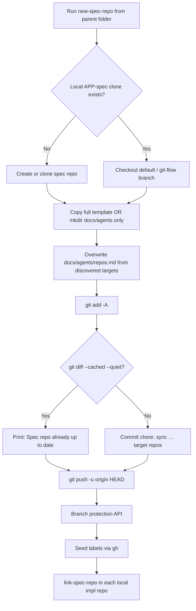

# 2026-05-17 — `new-spec-repo` Spec-Repo Change Expectations (When Commits Happen)

**Cursor chat created:** 2026-05-17 (~13:53 local, per transcript file `birth` time).

**Work completed in this chat:** 2026-05-17 — behavioral Q&A about `~/.config/opencode/bin/new-spec-repo` plus this TO REVIEW record. **No application code or shell scripts were edited in this session.**

**Session scope:** Clarify whether rerunning `new-spec-repo` from an app parent folder (e.g. `mycelia-tree/`) should produce tracked git changes in the spec repo (`mycelia-tree-spec`). Document against the script as it existed when read at session time, validated by a real operator run (`commit 1dc20ab`, `docs/agents/repos.md` `+4/-2`).

**Status:** Clarification and documentation finalized. If `bin/new-spec-repo` was later replaced by `bin/setup-project` / `bin/stack/create_or_sync_spec.sh`, port the **same behavioral contract** described here into the active entrypoint.

**Cursor transcript ID:** `ba70dd01-ca6c-41ad-986f-f68042e22be7` (for cross-checking chat turns).

---

## Executive summary

| Question | Answer |
|----------|--------|
| Should every rerun commit to the spec repo? | **No** — only when staged content differs after `git add -A` |
| What file usually changes? | `<app>-spec/docs/agents/repos.md` (regenerated routing list) |
| Can GitHub change without a spec-repo commit? | **Yes** — label seeding, branch protection (API only) |
| Can impl repos change without a spec-repo commit? | **Yes** — `link-spec-repo` runs in sibling folders |
| Does rerun wipe PRDs / ADRs / prototypes? | **No** — existing-spec path only regenerates routing config |
| Was the `mycelia-tree` run abnormal? | **No** — one-file sync commit matches script design |

---

## Problem reported

Operator ran from the **`mycelia-tree`** parent folder (siblings: `mycelia-tree-spec`, `mycelia-tree-api`, `mycelia-tree-web`):

```text
robo@MacBookPro mycelia-tree % ~/.config/opencode/bin/new-spec-repo
Using existing local spec repo mycelia-tree-spec...
Switched to branch 'main'
warning: in the working copy of 'docs/agents/repos.md', LF will be replaced by CRLF the next time Git touches it
[main 1dc20ab] chore: sync mycelia-tree-spec target repos
 1 file changed, 4 insertions(+), 2 deletions(-)
Enumerating objects: 9, done.
...
To github.com:roborew/mycelia-tree-spec.git
   5503ffa..1dc20ab  HEAD -> main
branch 'main' set up to track 'origin/main'.
Branch protection on default branch...
Seeding labels into roborew/mycelia-tree-spec...
... (labels for spec, mycelia-tree-api, mycelia-tree-web) ...
Linking local implementation repos to roborew/mycelia-tree-spec...
Linking mycelia-tree-api...
bin/feature-context already exists — not overwriting.
Linking mycelia-tree-web...
bin/feature-context already exists — not overwriting.
Done. Spec repo: https://github.com/roborew/mycelia-tree-spec
```

**Question:** Would I expect to see any changes in the spec repo when running this task?

**Answer finalized in chat:** **Sometimes yes, sometimes no.** A commit is expected when regenerated `docs/agents/repos.md` (or anything else picked up by `git add -A`) differs from the last commit. The observed `+4/-2` on `repos.md` is normal.

---

## Decision flow (spec-repo git changes)



---

## What this chat did **not** implement

Another AI restoring **only this chat** should **not** expect to apply code diffs. This session:

- Read and explained `bin/new-spec-repo`
- Produced this TO REVIEW document
- Did **not** modify `bin/new-spec-repo`, `bin/link-spec-repo`, README, or templates

Prior sessions implemented the underlying automation and fixes:

| Date | Doc | What was built |
|------|-----|----------------|
| 2026-05-17 (earlier chat) | `2026-05-17-readme-web-mobile-naming-and-new-spec-repo-automation.md` | Create-or-sync, sibling discovery, auto-link, push `HEAD`, branch-protection JSON |
| 2026-05-18 | `2026-05-18-new-spec-repo-git-flow-main-develop.md` | `main`/`develop` checkout; never `master`; `gh --jq` fix |
| Later | `2026-05-19-spec-central-stack-workflow-implementation.md` | Consolidation into `setup-project` / `bin/stack/` |

---

## Reference implementation — `bin/new-spec-repo` (as read in this chat)

**Path at session time:** `~/.config/opencode/bin/new-spec-repo`

**Verify on disk:** If missing, search `create_or_sync_spec.sh` or a deprecation shim that `exec`s `setup-project`.

Below is the **full script content** read during this session (195 lines). Recreate or audit behavior against this source of truth.

```bash
#!/usr/bin/env bash
# Create or sync an application spec repo from templates/spec-repo.
# Run from the parent folder that contains cloned implementation repos.
# Usage:
#   GH_ORG=roborew new-spec-repo                 # app slug = current folder; targets = sibling git dirs
#   GH_ORG=roborew new-spec-repo <app-slug>      # targets = sibling git dirs
#   GH_ORG=roborew new-spec-repo <app-slug> [target-repo ...]
#   target-repo: local folder name (e.g. app-web, app-mobile, app-api) or full owner/repo
set -euo pipefail

ORG="${GH_ORG:-roborew}"
ROOT="$(cd "$(dirname "$0")/.." && pwd)"
PARENT_DIR="$(pwd)"

if [[ $# -gt 0 ]]; then
  APP="$1"
  shift || true
else
  APP="$(basename "$PARENT_DIR")"
fi

SPEC_NAME="${APP}-spec"
SPEC_REPO="${ORG}/${SPEC_NAME}"
TARGETS=("$@")

discover_targets() {
  local spec_name="$1"
  local dir

  for dir in */; do
    dir="${dir%/}"
    [[ "$dir" == "$spec_name" ]] && continue
    [[ "$dir" == .* ]] && continue
    [[ -d "$dir/.git" ]] || continue
    printf '%s\n' "$dir"
  done
}

normalize_repo() {
  local target="$1"
  if [[ "$target" == */* ]]; then
    printf '%s\n' "$target"
  else
    printf '%s/%s\n' "$ORG" "$target"
  fi
}

local_dir_for_target() {
  local target="$1"
  if [[ "$target" == */* ]]; then
    printf '%s\n' "${target##*/}"
  else
    printf '%s\n' "$target"
  fi
}

if [[ ${#TARGETS[@]} -eq 0 ]]; then
  TARGETS=()
  while IFS= read -r target; do
    [[ -z "$target" ]] && continue
    TARGETS+=("$target")
  done < <(discover_targets "$SPEC_NAME")
fi

if [[ ${#TARGETS[@]} -eq 0 ]]; then
  echo "WARN: no implementation repo folders discovered under ${PARENT_DIR}" >&2
  echo "      Clone repos as siblings here, or pass target repo names explicitly." >&2
fi

CREATED_SPEC=false
if [[ -d "${SPEC_NAME}/.git" ]]; then
  echo "Using existing local spec repo ${SPEC_NAME}..."
elif gh repo view "$SPEC_REPO" &>/dev/null; then
  echo "Cloning existing ${SPEC_REPO}..."
  gh repo clone "$SPEC_REPO" "$SPEC_NAME"
else
  echo "Creating ${SPEC_REPO}..."
  gh repo create "$SPEC_REPO" --private --description "Spec repo: PRDs + parent issues for ${APP}" --clone
  CREATED_SPEC=true
fi

cd "${SPEC_NAME}"

DEFAULT_BRANCH=""
if [[ "$CREATED_SPEC" != "true" ]]; then
  DEFAULT_BRANCH="$(gh repo view "$SPEC_REPO" --json defaultBranchRef --jq .defaultBranchRef.name)"
  if [[ -n "$DEFAULT_BRANCH" ]]; then
    if ! git diff --quiet || ! git diff --cached --quiet; then
      echo "Spec repo ${SPEC_NAME} has uncommitted changes; commit or stash them before syncing." >&2
      exit 1
    fi

    git fetch origin "$DEFAULT_BRANCH" >/dev/null 2>&1 || true
    if git show-ref --verify --quiet "refs/heads/${DEFAULT_BRANCH}"; then
      git switch "$DEFAULT_BRANCH" >/dev/null
    else
      git switch -c "$DEFAULT_BRANCH" "origin/${DEFAULT_BRANCH}" >/dev/null
    fi
    git pull --ff-only origin "$DEFAULT_BRANCH" >/dev/null 2>&1 || true
  fi
fi

if [[ "$CREATED_SPEC" == "true" ]]; then
  echo "Copying scaffold from ${ROOT}/templates/spec-repo ..."
  cp -R "${ROOT}/templates/spec-repo/." .
else
  mkdir -p docs/agents
fi

{
  echo "# Generated by new-spec-repo."
  echo "# This file is routing configuration; rerunning the script replaces this list."
  echo "repos:"
  for target in "${TARGETS[@]}"; do
    full="$(normalize_repo "$target")"
    echo "  - name: ${full}"
    echo "    role: target"
  done
} > docs/agents/repos.md

git add -A
if git diff --cached --quiet; then
  echo "Spec repo already up to date."
else
  if [[ "$CREATED_SPEC" == "true" ]]; then
    git commit -m "chore: bootstrap ${SPEC_NAME} scaffold" || true
  else
    git commit -m "chore: sync ${SPEC_NAME} target repos" || true
  fi
fi
git push -u origin HEAD || true

echo "Branch protection on default branch..."
DEFAULT_BRANCH="${DEFAULT_BRANCH:-$(gh repo view "$SPEC_REPO" --json defaultBranchRef --jq .defaultBranchRef.name)}"
gh api -X PUT "repos/${SPEC_REPO}/branches/${DEFAULT_BRANCH}/protection" \
  --input - >/dev/null 2>&1 <<'JSON' || echo "(branch protection skipped — adjust permissions)"
{
  "required_status_checks": null,
  "enforce_admins": false,
  "required_pull_request_reviews": {
    "required_approving_review_count": 0,
    "dismiss_stale_reviews": true
  },
  "restrictions": null,
  "allow_force_pushes": false,
  "allow_deletions": false,
  "required_linear_history": true
}
JSON

seed_one() {
  local repo="$1"
  yq -o=json '.[]' .github/labels.yml 2>/dev/null | jq -c '.' | while read -r row; do
    name=$(echo "$row" | jq -r .name)
    color=$(echo "$row" | jq -r .color)
    desc=$(echo "$row" | jq -r '.description // ""')
    gh label create "$name" --repo "$repo" --color "$color" --description "$desc" --force 2>/dev/null || true
  done
}

if command -v yq &>/dev/null && command -v jq &>/dev/null; then
  echo "Seeding labels into ${SPEC_REPO}..."
  seed_one "$SPEC_REPO"
  while IFS= read -r r; do
    [[ -z "$r" ]] && continue
    echo "Seeding labels into ${r}..."
    seed_one "$r"
  done < <(yq -r '.repos[].name' docs/agents/repos.md 2>/dev/null || true)
else
  echo "WARN: install yq + jq to seed labels from .github/labels.yml" >&2
fi

echo ""
echo "Linking local implementation repos to ${SPEC_REPO}..."
for target in "${TARGETS[@]}"; do
  local_dir="$(local_dir_for_target "$target")"
  if [[ -d "${PARENT_DIR}/${local_dir}" ]]; then
    echo "Linking ${local_dir}..."
    (cd "${PARENT_DIR}/${local_dir}" && "${ROOT}/bin/link-spec-repo" "$SPEC_REPO")
  else
    echo "WARN: local directory ${local_dir} not found; skipped link-spec-repo" >&2
  fi
done

echo ""
echo "=== GitHub Project (optional) ==="
echo "Create a Project v2 board in the browser: https://github.com/orgs/${ORG}/projects — link repos ${SPEC_REPO} ${TARGETS[*]:-}"
echo "Automated field setup is not fully available via gh in all versions; enable **Auto-add to project** per repo in project settings."
echo ""
echo "=== LABEL_SYNC_PAT ==="
echo "Add a fine-grained PAT (Issues: write) for sibling repos:"
echo "  gh secret set LABEL_SYNC_PAT --repo ${SPEC_REPO}"
echo ""
echo "Done. Spec repo: https://github.com/${SPEC_REPO}"
```

### Critical sections (commit vs no-commit)

**1. Target discovery** — sibling folders with `.git`, excluding `${APP}-spec` and dot-dirs:

```bash
discover_targets() {
  local spec_name="$1"
  local dir
  for dir in */; do
    dir="${dir%/}"
    [[ "$dir" == "$spec_name" ]] && continue
    [[ "$dir" == .* ]] && continue
    [[ -d "$dir/.git" ]] || continue
    printf '%s\n' "$dir"
  done
}
```

**2. Existing spec — routing only, not full template re-copy:**

```bash
if [[ "$CREATED_SPEC" == "true" ]]; then
  cp -R "${ROOT}/templates/spec-repo/." .
else
  mkdir -p docs/agents
fi
```

**3. Always overwrite routing file** (even when content may end up identical):

```bash
{
  echo "# Generated by new-spec-repo."
  echo "# This file is routing configuration; rerunning the script replaces this list."
  echo "repos:"
  for target in "${TARGETS[@]}"; do
    full="$(normalize_repo "$target")"
    echo "  - name: ${full}"
    echo "    role: target"
  done
} > docs/agents/repos.md
```

**4. Commit gate** — the sole determinant of a spec-repo commit:

```bash
git add -A
if git diff --cached --quiet; then
  echo "Spec repo already up to date."
else
  git commit -m "chore: sync ${SPEC_NAME} target repos" || true
fi
git push -u origin HEAD || true
```

**⚠️ `git add -A` stages all tracked/untracked changes**, not only `repos.md`. Unrelated dirty files in the spec repo can be swept into the sync commit.

**5. Dirty-tree guard** (existing spec only):

```bash
if ! git diff --quiet || ! git diff --cached --quiet; then
  echo "Spec repo ${SPEC_NAME} has uncommitted changes; commit or stash them before syncing." >&2
  exit 1
fi
```

---

## Expected `docs/agents/repos.md` shape (after `mycelia-tree` run)

```yaml
# Generated by new-spec-repo.
# This file is routing configuration; rerunning the script replaces this list.
repos:
  - name: roborew/mycelia-tree-api
    role: target
  - name: roborew/mycelia-tree-web
    role: target
```

The `+4/-2` diff in the operator run indicates the normalized list changed vs the previous commit (e.g. repo rename, new sibling, or `GH_ORG`/name normalization) — not duplicate lines. The script **replaces** the file; it does not append.

---

## Side effects without spec-repo file changes

| Step | Mechanism | Spec-repo git impact |
|------|-----------|----------------------|
| Label seeding | `gh label create … --force` from `.github/labels.yml` | None |
| Branch protection | `gh api PUT …/branches/{default}/protection` | None |
| `link-spec-repo` | Subshell in each impl repo | None in spec repo |
| Project / PAT reminders | `echo` only | None |

### `bin/link-spec-repo` (invoked by `new-spec-repo`; not edited in this chat)

Run **inside** each implementation repo. Typical behavior (from upgrade-plan / CRLF session docs):

```bash
# Pseudocode contract — verify against templates/bin or active stack script
# Usage: link-spec-repo <owner/app-spec>
# 1. Write docs/agents/issue-tracker.md with SPEC_REPO=<spec>
# 2. Copy bin/feature-context from opencode templates if missing
#    (if exists: print "bin/feature-context already exists — not overwriting.")
# 3. Append tmp/, .research/, etc. to .gitignore if absent
```

Operator output confirming idempotent link:

```text
Linking mycelia-tree-api...
bin/feature-context already exists — not overwriting.
Linked SPEC_REPO=roborew/mycelia-tree-spec
```

---

## Trigger matrix (when spec-repo commits happen)

| Trigger | Commit? | Typical diff |
|---------|---------|--------------|
| New sibling git folder cloned under parent | Yes | New `repos:` entry |
| Local folder renamed (`*-frontend` → `*-web`) | Yes | `name:` lines updated |
| Same siblings, identical regenerated `repos.md` | **No** | Prints `Spec repo already up to date.` |
| First-time spec create (`CREATED_SPEC=true`) | Yes | Full scaffold + bootstrap commit |
| Uncommitted PRD edits left dirty before sync | **Abort** | Script exits before rewrite |
| Unrelated dirty files + changed `repos.md` | Yes | May include non-routing files via `git add -A` |

---

## Operator checklist

```bash
# 1. Run from PARENT folder (not inside spec repo)
cd /path/to/mycelia-tree
export GH_ORG=roborew   # optional; default roborew
~/.config/opencode/bin/new-spec-repo

# 2. Inspect spec repo
cd mycelia-tree-spec
git branch --show-current          # expect main or develop (see git-flow doc)
git log -1 --oneline               # e.g. 1dc20ab chore: sync mycelia-tree-spec target repos
git show --stat HEAD               # expect docs/agents/repos.md when targets changed
cat docs/agents/repos.md

# 3. Idempotent rerun — expect no new commit if routing unchanged
cd /path/to/mycelia-tree
~/.config/opencode/bin/new-spec-repo
# → "Spec repo already up to date." (labels/linking may still run)
```

---

## Recreate instructions for another AI

### If restoring **this chat only** (documentation)

1. Create `TO REVIEW/2026-05-17-new-spec-repo-spec-repo-change-expectations.md` with this content.
2. **Do not** change `bin/new-spec-repo` unless a separate TO REVIEW doc for 2026-05-17/18 implementation is also in scope.

### If restoring **underlying `new-spec-repo` behavior** (prior chats)

Apply changes from (in order):

1. `2026-05-17-readme-web-mobile-naming-and-new-spec-repo-automation.md` — create-or-sync, discovery, auto-link, `push HEAD`, protection JSON
2. `2026-05-18-new-spec-repo-git-flow-main-develop.md` — never checkout `master`; prefer `develop`; `gh … --jq '.defaultBranchRef.name'`
3. Optional CRLF: `2026-06-01-link-spec-repo-new-spec-repo-crlf-line-endings.md` — `bin/* text eol=lf` in `.gitattributes`

### Behavioral tests another AI should run

```bash
bash -n bin/new-spec-repo
cd /path/to/APP-parent-with-siblings
~/.config/opencode/bin/new-spec-repo
# Assert: repos.md lists discovered siblings; PRDs untouched
~/.config/opencode/bin/new-spec-repo
# Assert: "Spec repo already up to date." when list unchanged
```

---

## Files touched (this chat)

| File | Change |
|------|--------|
| `TO REVIEW/2026-05-17-new-spec-repo-spec-repo-change-expectations.md` | **Created** — this document |
| `bin/new-spec-repo` | **Read only** — no edits |
| `bin/link-spec-repo` | **Read only** — no edits |

---

## Related docs in `TO REVIEW/`

| Date | Doc | Relationship |
|------|-----|--------------|
| 2026-05-17 | `2026-05-17-readme-web-mobile-naming-and-new-spec-repo-automation.md` | **Implementation** — create-or-sync automation (earlier chat same calendar day) |
| 2026-05-18 | `2026-05-18-new-spec-repo-git-flow-main-develop.md` | Branch policy; explains `Switched to branch 'main'` in operator run |
| 2026-05-19 | `2026-05-19-spec-central-stack-workflow-implementation.md` | `setup-project` consolidation |
| 2026-06-01 | `2026-06-01-link-spec-repo-new-spec-repo-crlf-line-endings.md` | CRLF hardening for `bin/*` |
| 2026-05-18 | `2026-05-18-new-spec-repo-main-default-branch-fix.md` | New-repo `git branch -M main` bootstrap fix (chat created 2026-05-18) |

---

## Chat turn log (for audit)

| Turn | Actor | Outcome |
|------|-------|---------|
| 1 | User | Posted `mycelia-tree` run output; asked if spec repo changes are expected |
| 2 | Assistant | Read `bin/new-spec-repo`; answered **sometimes yes** — commit when `repos.md` diff after `git add -A` |
| 3 | User | Requested TO REVIEW doc with date prefix for sort order |
| 4 | Assistant | Created initial review doc (later renamed to this file) |
| 5+ | User / Assistant | Filename date correction; expanded detail (this revision) |

---

## Suggested commit message (if promoting this doc only)

```text
docs(review): new-spec-repo spec-repo change expectations (2026-05-17 chat)

Record when reruns commit vs no-op, full script reference, and mycelia-tree
validation run for operator FAQ.
```
