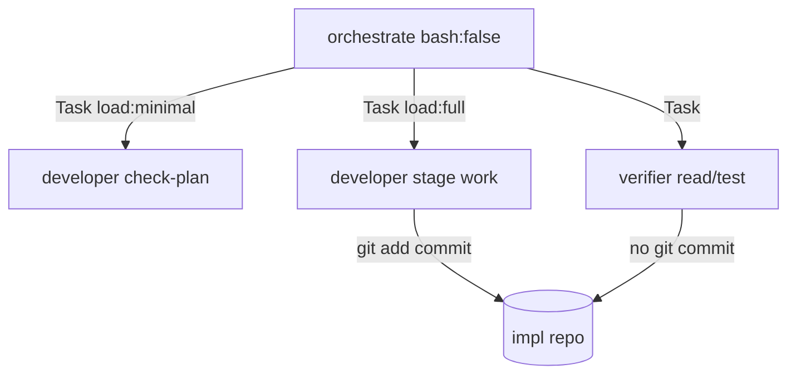

# 2026-05-17 — Subagent bash permissions and orchestrator delegation fix

**Filename date (`YYYY-MM-DD` prefix):** **2026-05-17** — the calendar day this **Cursor chat was created** and all implementation work in that session ran (not the day this markdown was last saved or a later resume turn).

| Field | Date / ID | Source |
| --- | --- | --- |
| Chat created | **2026-05-17**, ~13:47 UTC+1 | First message timestamp + transcript file birth: `2026-05-17 13:47` |
| Session work finalized | **2026-05-17**, ~13:47–13:51 UTC+1 | Message timestamps in transcript |
| This TO REVIEW doc first written | 2026-06-01 | Later resume; does **not** change the filename prefix |
| Cursor transcript | [`67e2c6e5-0a3e-474a-912b-8cee14ef76c8`](67e2c6e5-0a3e-474a-912b-8cee14ef76c8) | `~/.cursor/projects/Users-robo-config-opencode/agent-transcripts/67e2c6e5-0a3e-474a-912b-8cee14ef76c8/67e2c6e5-0a3e-474a-912b-8cee14ef76c8.jsonl` |

If Finder shows **Modified: Jun 1**, that is file-save time — keep **`2026-05-17`** in the name for date-ordered filing with other session records.

**Session scope:** Stop repeated OpenCode **Permission required** prompts during orchestrated implementation work. Execution subagents (`developer`, `frontend-dev`, `senior-dev`, `ux-dev`) needed permission to run normal in-repo shell (especially `git add` / `git commit` and `cd <worktree> && …` chains) without asking the operator on every stage. Clarify why **orchestrate** must not run bash itself, fix a skill/protocol mismatch that made the orchestrator appear “stuck” on **Always allow**, and extend **verifier** read/test bash allows without granting commits.

**Status:** Designed, implemented, and finalized in chat **2026-05-17**. **Verify on disk before merge** — the config repo may have moved on (permissions removed from frontmatter, wildcard `bash: "*": allow`, or skill sections relocated). See [Relationship to later work](#relationship-to-later-work) and [Current on-disk check](#current-on-disk-check).

---

## Executive summary

| Topic | Outcome |
| --- | --- |
| Symptom | `△ Permission required` on commits, tests, and discovery commands during `.plan` / GitHub-issue execution |
| Misconception | “Developers have permissions” referred to **file edit** (`permission.edit`), not **bash** (`permission.bash`) |
| Execution subagents | Expanded `permission.bash` allowlist: `git add` / `git commit`, `cd * && …` compounds, Rails/Ruby test runners, existing npm/go/cargo patterns |
| Verifier | Added full `permission.bash` block: read/test **allow**; `git add` / `git commit` **deny** |
| Orchestrate | **No bash config change** — keep `bash: false`; delegate all shell to subagents via Task |
| Skill fix | `orchestrate-execution`: plan precondition `check-plan.sh` → Task `developer` `load: minimal` |
| Stuck “Always allow” loop | UI approvals apply until **OpenCode restart**; orchestrate cannot “grant” bash it does not have |
| Later evolution | Follow-up chat [`940a773f-367d-477c-a1d6-23bd264d60ba`](940a773f-367d-477c-a1d6-23bd264d60ba) added `check-plan.sh` paths then `bash: { "*": allow }` — see [`2026-06-01-unattended-execution-permissions-and-opencode-config-access.md`](2026-06-01-unattended-execution-permissions-and-opencode-config-access.md) |

---

## 1. Problem reported (operator)

### 1.1 Permission prompts on implementation work

During a BlocShed worktree fix, OpenCode blocked a routine stage commit:

```text
Permission required
Commit the fix
$ cd /Users/robo/.warp/worktrees/BlocShed/cobalt-shimmer && git add app/controllers/publication_users_controller.rb test/controllers/publication_users_controller_test.rb && git commit -m "fix: scope set_publication to current_user's publications in PublicationUsersController" 2>&1
```

### 1.2 Stuck loop on “Always allow”

```text
Always allow
This will allow the following patterns until OpenCode is restarted
- git show *
- grep *
```

Work did not progress because **orchestrate** has no bash tool, **verifier** lacked bash allows, and **developer** did not allow compound `cd && git …` or `git commit`.

---

## 2. Root cause (short)

1. **`permission.edit`** (global + agent) ≠ **`permission.bash`** (per-agent, default `"*": ask`).
2. Allow rules like `git status *` do **not** match `cd /worktree && git add … && git commit …`.
3. **`orchestrate-execution`** told orchestrate to run `check-plan.sh` directly while **`orchestrate`** has `bash: false`.
4. **`verifier`** had `tools.bash: true` but no `permission.bash` block → prompts on `git show`, `grep`, tests.
5. Running sessions cache permission UI until **restart**.

---

## 3. Files changed (this session)

| File | Action |
| --- | --- |
| `agents/developer.md` | Expand `permission.bash` |
| `agents/frontend-dev.md` | Expand `permission.bash` (+ `npx vite`) |
| `agents/senior-dev.md` | Expand `permission.bash` |
| `agents/ux-dev.md` | Expand `permission.bash` (subset) |
| `agents/verifier.md` | **Add** `permission.bash` |
| `skills/orchestrate-execution/SKILL.md` | Delegate `check-plan.sh` to `developer` |
| `agents/orchestrate.md` | **Unchanged** (correct) |
| `agents/architect.md` | **Unchanged** in this session |
| `opencode.json` | **Unchanged** in this session |

---

## 4. Reproducible implementation for another AI

Apply the snippets below to agent frontmatter (YAML between `---` fences) and the skill section. **Pattern order matters:** specific `allow` / `deny` lines before wildcard `"*": ask` where your OpenCode build uses first-match semantics.

### 4.1 Global context at session time — `opencode.json`

Edits were allowed globally; bash was **not** configured here:

```json
"permission": {
  "edit": {
    "*": "allow",
    "opencode.json": "ask",
    "*.pem": "deny",
    "*.key": "deny",
    ".env": "deny",
    ".env.*": "deny"
  }
}
```

(Subsequent repo commits may have slimmed this block — check live `opencode.json`.)

### 4.2 `agents/orchestrate.md` — leave as-is

```yaml
tools:
  write: false
  edit: false
  bash: false
  skill: true
permission:
  edit: deny
  skill: { "orchestrate-execution": "allow", "orchestrate-recovery": "allow", ... }
  task:
    "*": deny
    scribe: allow
    worktree-env: allow
    developer: allow
    frontend-dev: allow
    ux-dev: allow
    verifier: allow
    helper: allow
    vision: allow
    senior-dev: allow
    review: allow
```

**Do not** set `bash: true` on orchestrate.

### 4.3 `agents/developer.md` — full `permission.bash` after this session

Insert under existing `permission:` (keep `skill` and `edit` blocks as they were). **Final `bash` block** to merge with pre-existing allows (`pwd`, `ls`, `rg`, `git status`, tests, denies):

```yaml
  bash:
    "*": ask
    "pwd": allow
    "cd * && pwd": allow
    "ls": allow
    "ls *": allow
    "cd * && ls": allow
    "cd * && ls *": allow
    "rg": allow
    "rg *": allow
    "cd * && rg *": allow
    "git status": allow
    "git status *": allow
    "cd * && git status": allow
    "cd * && git status *": allow
    "git diff": allow
    "git diff *": allow
    "cd * && git diff": allow
    "cd * && git diff *": allow
    "git show": allow
    "git show *": allow
    "cd * && git show *": allow
    "git log": allow
    "git log *": allow
    "cd * && git log *": allow
    "git ls-files": allow
    "git ls-files *": allow
    "cd * && git ls-files *": allow
    "git grep": allow
    "git grep *": allow
    "cd * && git grep *": allow
    "git add *": allow
    "cd * && git add *": allow
    "git commit *": allow
    "cd * && git commit *": allow
    "git add * && git commit *": allow
    "cd * && git add * && git commit *": allow
    "npm test": allow
    "npm test *": allow
    "cd * && npm test": allow
    "cd * && npm test *": allow
    "npm run *": allow
    "cd * && npm run *": allow
    "npm install": allow
    "npm install *": allow
    "cd * && npm install": allow
    "cd * && npm install *": allow
    "pnpm *": allow
    "cd * && pnpm *": allow
    "yarn *": allow
    "cd * && yarn *": allow
    "bun *": allow
    "cd * && bun *": allow
    "npx tsc *": allow
    "cd * && npx tsc *": allow
    "python -m pytest *": allow
    "cd * && python -m pytest *": allow
    "pytest *": allow
    "cd * && pytest *": allow
    "go test *": allow
    "cd * && go test *": allow
    "cargo test *": allow
    "cd * && cargo test *": allow
    "bundle exec *": allow
    "cd * && bundle exec *": allow
    "bin/rails *": allow
    "cd * && bin/rails *": allow
    "rails test *": allow
    "cd * && rails test *": allow
    "make test": allow
    "make test *": allow
    "cd * && make test": allow
    "cd * && make test *": allow
    "rm -rf *": deny
    "sudo *": deny
    "chmod 777 *": deny
    "chmod a+rwx *": deny
    "curl *|*sh*": deny
    "wget *|*sh*": deny
```

**Pre-existing `edit` block** at session time (keep unless you intentionally change secret policy):

```yaml
  edit:
    "*": allow
    "opencode.json": ask
    "*.pem": deny
    "*/*.pem": deny
    "**/*.pem": deny
    "*.key": deny
    "*/*.key": deny
    "**/*.key": deny
    ".env": deny
    ".env.*": deny
    "*/.env": deny
    "*/.env.*": deny
    "**/.env": deny
    "**/.env.*": deny
```

### 4.4 `agents/frontend-dev.md` — same as developer plus Vite

Use §4.3 **and** add:

```yaml
    "npx vite *": allow
    "cd * && npx vite *": allow
```

(Omit `go test` / `cargo test` if your copy of frontend-dev never had them; the session patch mirrored developer’s test matrix.)

### 4.5 `agents/senior-dev.md`

Identical bash expansion to §4.3 (escalation lane must commit and test like `developer`).

### 4.6 `agents/ux-dev.md` — prototype subset

Under `permission.bash`, add `cd * &&` variants and git write allows; **do not** add `go test` / `cargo test` / full Rails matrix unless you extend scope:

```yaml
  bash:
    "*": ask
    "pwd": allow
    "cd * && pwd": allow
    "ls": allow
    "ls *": allow
    "cd * && ls": allow
    "cd * && ls *": allow
    "rg": allow
    "rg *": allow
    "cd * && rg *": allow
    "git status": allow
    "git status *": allow
    "cd * && git status": allow
    "cd * && git status *": allow
    "git diff": allow
    "git diff *": allow
    "cd * && git diff": allow
    "cd * && git diff *": allow
    "git add *": allow
    "cd * && git add *": allow
    "git commit *": allow
    "cd * && git commit *": allow
    "git add * && git commit *": allow
    "cd * && git add * && git commit *": allow
    "npm test": allow
    "npm test *": allow
    "cd * && npm test": allow
    "cd * && npm test *": allow
    "npm run *": allow
    "cd * && npm run *": allow
    "pnpm *": allow
    "cd * && pnpm *": allow
    "yarn *": allow
    "cd * && yarn *": allow
    "bun *": allow
    "cd * && bun *": allow
    "rm -rf *": deny
    "sudo *": deny
    "chmod 777 *": deny
    "chmod a+rwx *": deny
    "curl *|*sh*": deny
    "wget *|*sh*": deny
```

(`ux-dev` `edit` at session time restricted writes to `.prototype/**` — leave that block unchanged.)

### 4.7 `agents/verifier.md` — new `permission.bash` (insert after `skill:` line)

```yaml
permission:
  edit: deny
  skill: { "verifier": "allow" }
  bash:
    "*": ask
    "pwd": allow
    "cd * && pwd": allow
    "ls": allow
    "ls *": allow
    "cd * && ls": allow
    "cd * && ls *": allow
    "rg": allow
    "rg *": allow
    "cd * && rg *": allow
    "grep *": allow
    "cd * && grep *": allow
    "git status": allow
    "git status *": allow
    "cd * && git status": allow
    "cd * && git status *": allow
    "git diff": allow
    "git diff *": allow
    "cd * && git diff": allow
    "cd * && git diff *": allow
    "git show": allow
    "git show *": allow
    "cd * && git show *": allow
    "git log": allow
    "git log *": allow
    "cd * && git log *": allow
    "git ls-files": allow
    "git ls-files *": allow
    "cd * && git ls-files *": allow
    "git grep": allow
    "git grep *": allow
    "cd * && git grep *": allow
    "npm test": allow
    "npm test *": allow
    "cd * && npm test": allow
    "cd * && npm test *": allow
    "npm run *": allow
    "cd * && npm run *": allow
    "pnpm *": allow
    "cd * && pnpm *": allow
    "yarn *": allow
    "cd * && yarn *": allow
    "bun *": allow
    "cd * && bun *": allow
    "npx tsc *": allow
    "cd * && npx tsc *": allow
    "python -m pytest *": allow
    "cd * && python -m pytest *": allow
    "pytest *": allow
    "cd * && pytest *": allow
    "go test *": allow
    "cd * && go test *": allow
    "cargo test *": allow
    "cd * && cargo test *": allow
    "bundle exec *": allow
    "cd * && bundle exec *": allow
    "bin/rails *": allow
    "cd * && bin/rails *": allow
    "rails test *": allow
    "cd * && rails test *": allow
    "make test": allow
    "make test *": allow
    "cd * && make test": allow
    "cd * && make test *": allow
    "git add *": deny
    "git commit *": deny
    "rm -rf *": deny
    "sudo *": deny
    "chmod 777 *": deny
    "chmod a+rwx *": deny
    "curl *|*sh*": deny
    "wget *|*sh*": deny
```

### 4.8 `skills/orchestrate-execution/SKILL.md` — Plan precondition (add or replace)

If your skill file has no **Plan precondition** section, insert this block **after** `## Required Inputs` and **before** `## Session Bootstrap` (or before `## Stage Loop`):

```markdown
## Plan precondition (mandatory before the stage loop)

When an artifact path is known (user supplied, handoff, or selected from `.plan/`):

1. Invoke **`developer`** via Task with **`load: minimal`** to run this from the **repository root**:

   `bash skills/orchestrate-execution/lib/check-plan.sh "<artifact_path>"`

   Orchestrate has no `bash` tool; this precondition must be delegated, not run directly.

2. On **non-zero** exit from the delegated command, print the script’s stderr **verbatim**, **do not** start stage execution, and instruct the user to return to **`architect` / `architect-plan`** to repair the plan artifact.

3. On success, continue to **Stage Loop**.
```

**Before (remove this anti-pattern):**

```markdown
1. From the **repository root**, run:

   `bash skills/orchestrate-execution/lib/check-plan.sh "<artifact_path>"`
```

### 4.9 Orchestrate → developer Task prompt (copy-paste template)

When **orchestrate** starts a `.plan` run:

```text
load: minimal

From the repository root of the implementation workspace, run:

bash skills/orchestrate-execution/lib/check-plan.sh ".plan/feature.<slug>.md"

Return exit code and stderr verbatim. Do not implement stages — plan validation only.
```

For GitHub-issue mode, orchestrate already delegates `gh` and helper scripts to `developer` with `load: minimal` per `github-issue-run` (see unattended doc if that skill was added later).

### 4.10 Architect / reviewers — intentional commit deny (session-era planners)

Planning agents such as **`architect`** used read-only bash with explicit commit denial (do **not** copy to `developer`):

```yaml
  bash:
    "*": ask
    "git add *": deny
    "git commit *": deny
```

(Current `architect.md` may have removed inline `permission.bash`; restore only if you want the old guarded model.)

---

## 5. Exact ApplyPatch hunks from transcript (2026-05-17)

These are the **literal** patches applied in order in chat `67e2c6e5-…`. A replayer can apply them with the same diff tool or by hand-merging §4.

### Patch 1 — `agents/developer.md` (excerpt: lines added with `+`)

```diff
+    "cd * && pwd": allow
+    "cd * && ls": allow
+    "cd * && ls *": allow
+    "cd * && rg *": allow
+    "cd * && git status": allow
+    "cd * && git status *": allow
+    "cd * && git diff": allow
+    "cd * && git diff *": allow
+    "cd * && git show *": allow
+    "cd * && git log *": allow
+    "cd * && git ls-files *": allow
+    "cd * && git grep *": allow
+    "git add *": allow
+    "cd * && git add *": allow
+    "git commit *": allow
+    "cd * && git commit *": allow
+    "git add * && git commit *": allow
+    "cd * && git add * && git commit *": allow
+    "cd * && npm test": allow
+    "cd * && npm test *": allow
+    "cd * && npm run *": allow
+    "cd * && npm install": allow
+    "cd * && npm install *": allow
+    "cd * && pnpm *": allow
+    "cd * && yarn *": allow
+    "cd * && bun *": allow
+    "cd * && npx tsc *": allow
+    "cd * && python -m pytest *": allow
+    "cd * && pytest *": allow
+    "cd * && go test *": allow
+    "cd * && cargo test *": allow
+    "bundle exec *": allow
+    "cd * && bundle exec *": allow
+    "bin/rails *": allow
+    "cd * && bin/rails *": allow
+    "rails test *": allow
+    "cd * && rails test *": allow
+    "cd * && make test": allow
+    "cd * && make test *": allow
```

### Patch 2–4 — `frontend-dev.md`, `senior-dev.md`, `ux-dev.md`

Same family as Patch 1; `frontend-dev` adds `npx vite` / `cd * && npx vite`; `ux-dev` stops after `bun` (no go/cargo/rails test lines).

### Patch 5 — `skills/orchestrate-execution/SKILL.md`

```diff
-1. From the **repository root**, run:
+1. Invoke **`developer`** via Task with **`load: minimal`** to run this from the **repository root**:
 ...
+   Orchestrate has no `bash` tool; this precondition must be delegated, not run directly.
-2. On **non-zero** exit, print the script’s stderr
+2. On **non-zero** exit from the delegated command, print the script’s stderr
```

### Patch 6 — `agents/verifier.md`

Inserts entire `bash:` block from §4.7 between `skill:` and `---` / `# Verifier Agent`.

---

## 6. Orchestrator vs subagent



---

## 7. Operator playbook

1. Apply §4 snippets (or transcript patches).
2. **Restart OpenCode** so permission rules and UI “Always allow” cache refresh.
3. Run orchestrate on a `.plan` path; confirm `developer` runs `check-plan.sh` without orchestrate bash.
4. Confirm stage commit command (BlocShed example) runs without prompt.

---

## 8. Acceptance checklist

- [ ] `developer`: `cd <worktree> && git add … && git commit -m "…"` — no prompt after restart
- [ ] `developer`: `bin/rails test …`, `bundle exec …` — no prompt
- [ ] `verifier`: `git show`, `grep`, plan `test_commands` — no prompt
- [ ] `verifier`: `git commit` — denied or blocked
- [ ] `orchestrate`: never invokes bash; Tasks `developer` for `check-plan.sh`
- [ ] `architect`: still cannot commit via bash (if guarded model enabled)

---

## 9. Relationship to later work

| Document / chat | Relationship |
| --- | --- |
| [`2026-06-01-unattended-execution-permissions-and-opencode-config-access.md`](2026-06-01-unattended-execution-permissions-and-opencode-config-access.md) | Supersedes granular lists with `bash: { "*": allow }`, `external_directory`, OpenCode config edit deny |
| Transcript `940a773f-367d-477c-a1d6-23bd264d60ba` | Adds `check-plan.sh` absolute-path allows, then wildcard bash |
| [`2026-05-18-external-directory-permissions.md`](2026-05-18-external-directory-permissions.md) | External paths outside impl cwd |

**This doc** is the canonical record for the **2026-05-17** granular fix + orchestrate delegation.

---

## 10. Current on-disk check

```bash
cd ~/.config/opencode
rg -n 'permission:' agents/developer.md agents/verifier.md
rg -n 'Plan precondition|check-plan' skills/orchestrate-execution/SKILL.md
./scripts/validate-opencode-config.sh 2>/dev/null || true
```

If `permission.bash` is missing from agents, either re-apply §4 or use the unattended wildcard policy from the 2026-06-01 doc.

---

## 11. Conversation trace

| Turn | Topic |
| --- | --- |
| 1 | Why permission checks on `git commit` |
| 2 | Subagents must complete work without constant approval |
| 3 | Granular bash allows + verifier + orchestrate skill fix |
| 4 | Stuck “Always allow”; orchestrate config? → delegate + restart |
| 5 | TO REVIEW doc; filename = chat creation date |
| 6 | Full snippets for AI replay (this section expansion) |

**Unblocked command shape:**

```bash
cd /Users/robo/.warp/worktrees/BlocShed/cobalt-shimmer \
  && git add app/controllers/publication_users_controller.rb test/controllers/publication_users_controller_test.rb \
  && git commit -m "fix: scope set_publication to current_user's publications in PublicationUsersController"
```
