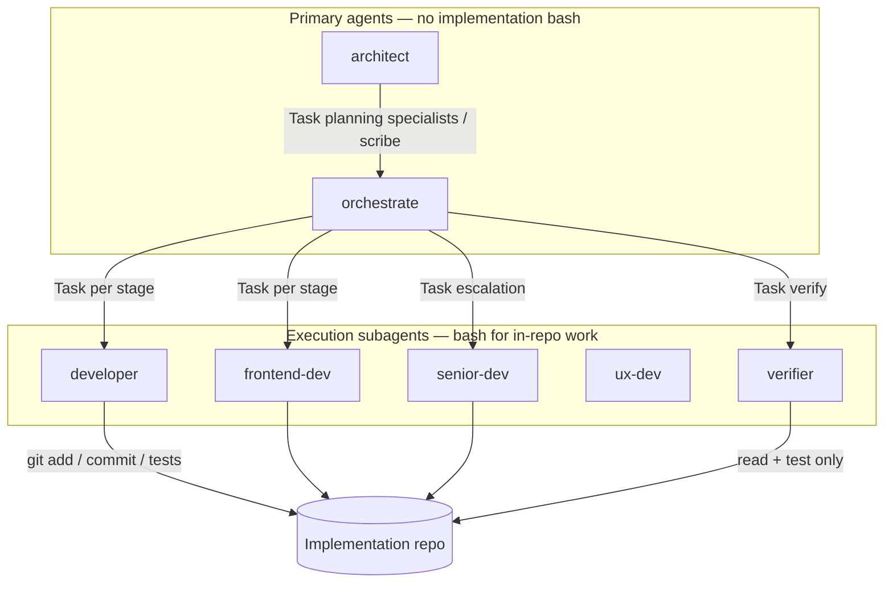

# 2026-05-17 — Subagent bash permissions and orchestrator delegation fix

**Session date:** Work in this chat completed **2026-05-17** (message timestamps ~13:47–13:51 UTC+1). Filename uses that date so `TO REVIEW` sorts by session completion, not the date a summary doc was filed.

**Session scope:** Stop repeated OpenCode **Permission required** prompts during orchestrated implementation work. Execution subagents (`developer`, `frontend-dev`, `senior-dev`, `ux-dev`) needed permission to run normal in-repo shell (especially `git add` / `git commit` and `cd <worktree> && …` chains) without asking the operator on every stage. Clarify why **orchestrate** must not run bash itself, fix a skill/protocol mismatch that made the orchestrator appear “stuck” on **Always allow**, and extend **verifier** read/test bash allows without granting commits.

**Status:** Designed, implemented, and finalized in this chat. **Verify on disk before merge** — the config repo may have moved on (e.g. wildcard unattended bash, slimmer `opencode.json`, or removed per-agent `permission.bash` frontmatter). See [Relationship to later work](#relationship-to-later-work) and [Current on-disk check](#current-on-disk-check).

**Naming:** Prefix `2026-05-17-` keeps this file in date order by **session completion** (ISO date, then slug). Later follow-ups on the same topic may appear under `2026-06-01-*` in this folder.

---

## Executive summary

| Topic | Outcome |
| --- | --- |
| Symptom | `△ Permission required` on commits, tests, and discovery commands during `.plan` / GitHub-issue execution |
| Misconception | “Developers have permissions” referred to **file edit** (`permission.edit`), not **bash** (`permission.bash`) |
| Execution subagents | Expanded `permission.bash` allowlist: `git add` / `git commit`, `cd * && …` compounds, Rails/Ruby test runners, existing npm/go/cargo patterns |
| Verifier | Added read/test bash allowlist; **deny** `git add` / `git commit` (evidence only) |
| Orchestrate | **No config change required** — keep `bash: false`; delegate all shell to subagents via Task |
| Skill fix | `orchestrate-execution`: plan precondition `check-plan.sh` must be Task-delegated to `developer`, not run by orchestrate |
| Stuck “Always allow” loop | UI approvals apply until **OpenCode restart**; orchestrate cannot “grant” bash it does not have |
| Later evolution | Same-day follow-up doc may supersede granular lists with `bash: { "*": allow }` on the execution lane |

---

## 1. Problem reported (operator)

### 1.1 Permission prompts on implementation work

During a BlocShed worktree fix, OpenCode blocked a routine stage commit:

```text
Permission required
Commit the fix
$ cd /Users/robo/.warp/worktrees/BlocShed/cobalt-shimmer && git add app/controllers/publication_users_controller.rb test/controllers/publication_users_controller_test.rb && git commit -m "fix: scope set_publication to current_user's publications in PublicationUsersController" 2>&1
```

Operator expectation: when **architect** or **orchestrate** delegates to **developer** / **frontend-dev**, subagents should complete stages (edit + test + commit) inside the project without constant confirmation.

### 1.2 Stuck loop on “Always allow”

Orchestrator session appeared to loop on prompts such as:

```text
Always allow
This will allow the following patterns until OpenCode is restarted
- git show *
- grep *
```

Operator could approve patterns, but work still did not progress — orchestrate was effectively trying to do shell-shaped work without having bash access, or subagents still hit unmatched command shapes.

---

## 2. Root cause analysis

### 2.1 Edit permissions ≠ bash permissions

Global `opencode.json` (at session time) allowed most edits:

```json
"permission": {
  "edit": {
    "*": "allow",
    "opencode.json": "ask",
    ...
  }
}
```

That does **not** authorize shell. Subagents with `tools.bash: true` still had:

```yaml
permission:
  bash:
    "*": ask
    "git status *": allow
    "git diff *": allow
    ...
```

Anything not explicitly allowed — including `git add`, `git commit`, and `cd … && git add … && git commit …` — triggered **ask**.

### 2.2 Compound commands did not match single-command allows

Allow rules like `git status *` did not match:

```bash
cd /path/to/worktree && git add … && git commit -m "…"
```

So worktree-relative pipelines kept prompting even when “obvious” git subcommands were partially allowlisted.

### 2.3 Orchestrate is intentionally bashless

`agents/orchestrate.md`:

```yaml
tools:
  bash: false
permission:
  edit: deny
  task:
    developer: allow
    frontend-dev: allow
    ...
```

Orchestrate coordinates via **Task** only. It must **not** receive bash permissions; it should delegate shell to `developer` (or peers).

### 2.4 Skill told orchestrate to run bash directly (bug)

`skills/orchestrate-execution/SKILL.md` **Plan precondition** (before fix) said orchestrate should run:

```bash
bash skills/orchestrate-execution/lib/check-plan.sh "<artifact_path>"
```

That contradicted `bash: false` and encouraged permission UI / retry loops instead of:

> Task `developer` with `load: minimal` to run `check-plan.sh` from repo root.

### 2.5 Verifier had bash tool but no allowlist

`verifier` had `tools.bash: true` with only `permission.edit: deny` and no `permission.bash` block — so verification steps using `git show`, `grep`, `rg`, or project test commands could still prompt.

### 2.6 Session cache vs config file changes

OpenCode copy: **“Always allow … until OpenCode is restarted.”** Updating agent markdown on disk does not retroactively fix an already-running session; restart (or new session) is required after permission edits.

---

## 3. Design decisions (this session)

| Decision | Rationale |
| --- | --- |
| Change **execution subagents only** | User wants unattended stage work in impl repos; keep **architect** / **orchestrate** / reviewers read-only or delegation-only |
| Granular allowlist (this session) | Allow normal in-repo git, tests, and `cd &&` chains without opening full `bash: "*": allow` yet |
| Deny dangerous patterns unchanged | `rm -rf *`, `sudo *`, `chmod 777 *`, `curl *\|*sh*` stay **deny** on writers |
| Verifier: read/test allow, commit deny | Verifier gathers evidence; must not commit on behalf of implementation |
| Orchestrate: no bash config | Fix protocol (skill text) + delegation; do not enable bash on primary orchestrator |
| Restart after changes | Required for new rules to apply; clears stale approval loops |

---

## 4. Implementation (this chat)

### 4.1 `agents/developer.md`

Under `permission.bash`, added (non-exhaustive categories):

- **Navigation / discovery:** `cd * && pwd`, `cd * && ls`, `cd * && rg`
- **Git read:** `cd * && git status|diff|show|log|ls-files|grep`
- **Git write (stage commits):** `git add *`, `git commit *`, `git add * && git commit *`, and `cd * && …` variants
- **Tests / package managers:** `cd * && npm|pnpm|yarn|bun|…`, `go test`, `cargo test`, `make test`
- **Rails / Ruby (BlocShed-class repos):** `bundle exec *`, `bin/rails *`, `rails test *` (+ `cd * && …` forms)

Left ` "*": ask` as default for unmatched commands; kept explicit **deny** list for destructive/shell-pipe installs.

### 4.2 `agents/frontend-dev.md`

Same bash expansion pattern as `developer`, plus existing `npx vite *` with `cd * &&` variants.

### 4.3 `agents/senior-dev.md`

Same pattern as `developer` (escalation lane must commit and run tests like primary executor).

### 4.4 `agents/ux-dev.md`

Subset appropriate to prototype lane: git add/commit, `cd * &&` discovery, npm/pnpm/yarn/bun runs; no full backend test matrix required for every ux stage.

### 4.5 `agents/verifier.md`

Added `permission.bash` block:

- **Allow:** read/discovery and test commands (mirror developer read/test patterns, including `grep *`, `git show *`, `cd * && …`)
- **Deny:** `git add *`, `git commit *` (verifier must not mutate git history)

### 4.6 `skills/orchestrate-execution/SKILL.md`

**Plan precondition** updated:

1. Invoke **`developer`** via Task with **`load: minimal`** to run `check-plan.sh`.
2. Explicit note: **Orchestrate has no `bash` tool** — precondition must be delegated, not run directly.
3. On non-zero exit, surface stderr and send operator back to architect to repair the plan artifact.

### 4.7 Agents intentionally not changed

| Agent | Why unchanged |
| --- | --- |
| `orchestrate` | Coordinator; `bash: false` is correct |
| `architect` | Read-only planning; `git add` / `git commit` remain **deny** |
| `helper`, `scribe` (this session) | No bash expansion in this chat slice |
| Review family (`review`, `security-reviewer`, …) | Read-only bash allowlists; commits stay **deny** |

---

## 5. Orchestrator vs subagent — who needs what



**Answer to “does orchestrate need config changes?”**

- **No** — for bash. It needs correct **Task** delegation and an accurate **orchestrate-execution** skill (check-plan via `developer`).
- **Yes** — if orchestrate is still prompting for `git show` / `grep`, the running agent is likely **not** orchestrate’s bash (it has none) but a **child** or a **stale session**; fix subagent bash rules and **restart OpenCode**.

---

## 6. Operator playbook

1. **Pull / sync** `~/.config/opencode` so agent frontmatter and skills match this session (or later unattended policy).
2. **Restart OpenCode** (quit app or start a new session) after permission edits.
3. Start **orchestrate** (or architect → handoff to orchestrate with `.plan` path).
4. Confirm stage commits report `git_commit` hash in child completion reports (orchestrate-execution grading gate).
5. If prompts persist for a **new** command shape, either:
   - add a targeted allow rule to the owning subagent (granular model), or
   - adopt wildcard execution-lane bash per `2026-06-01-unattended-execution-permissions-and-opencode-config-access.md`.

---

## 7. Files touched in this chat

| File | Change |
| --- | --- |
| `agents/developer.md` | Expanded `permission.bash` (git commit, `cd &&`, Rails/Ruby, tests) |
| `agents/frontend-dev.md` | Same |
| `agents/senior-dev.md` | Same |
| `agents/ux-dev.md` | Git commit + prototype-appropriate bash |
| `agents/verifier.md` | New `permission.bash` (read/test allow; commit deny) |
| `skills/orchestrate-execution/SKILL.md` | Delegate `check-plan.sh` to `developer`; document no orchestrate bash |

**Not modified in this chat:**

- `agents/orchestrate.md` (bash stays false)
- `agents/architect.md`
- `opencode.json` global permission block (edit-focused only at session time)

---

## 8. Acceptance checklist

- [ ] `developer` can `cd <worktree> && git add … && git commit -m "…"` without prompt (after restart)
- [ ] `developer` can run project test commands (`bin/rails test`, `npm test`, etc.) without prompt
- [ ] `verifier` can `git show`, `grep`/`rg`, and run plan `test_commands` without prompt
- [ ] `verifier` cannot `git commit` via bash (deny or role-only)
- [ ] `orchestrate` never runs `check-plan.sh` directly; delegates to `developer` `load: minimal`
- [ ] `architect` still cannot commit via bash
- [ ] No recurring “Always allow until restart” loop after one clean restart

---

## 9. Relationship to later work

Same folder, same date — likely **supersedes or extends** this session:

| Document | Relationship |
| --- | --- |
| [`2026-06-01-unattended-execution-permissions-and-opencode-config-access.md`](2026-06-01-unattended-execution-permissions-and-opencode-config-access.md) | Evolves from granular allowlists to `bash: { "*": allow }` on execution/review subagents, `external_directory` policy for `~/.config/opencode/**`, and validator enforcement |
| [`2026-05-18-external-directory-permissions.md`](2026-05-18-external-directory-permissions.md) | Broader external path access when skills live outside impl repo cwd |
| [`2026-06-01-crlf-line-endings-and-architect-bash-permissions.md`](2026-06-01-crlf-line-endings-and-architect-bash-permissions.md) | Separate: architect spec-repo bash (not execution lane) |

This document remains the **record of the first-principles fix** (edit vs bash, orchestrate delegation, verifier split, granular git/commit allows). If both policies exist in git history, prefer the **latest committed** agent frontmatter plus `validate-opencode-config.sh` when present.

---

## 10. Current on-disk check

At documentation time, some agent files may **no longer contain** inline `permission.bash` blocks (permissions centralized elsewhere or replaced by unattended wildcard policy). Verify:

```bash
cd ~/.config/opencode
rg -n 'permission:' agents/developer.md agents/verifier.md agents/orchestrate.md
rg -n 'check-plan|Plan precondition' skills/orchestrate-execution/SKILL.md
./scripts/validate-opencode-config.sh 2>/dev/null || true
```

If `git add` / `git commit` prompts return after a merge:

1. Confirm which policy is active (granular vs `bash: "*": allow`).
2. Restart OpenCode.
3. Reconcile with [`2026-06-01-unattended-execution-permissions-and-opencode-config-access.md`](2026-06-01-unattended-execution-permissions-and-opencode-config-access.md) if overnight unattended runs are the goal.

---

## 11. Conversation trace (for audit)

| Turn | Topic |
| --- | --- |
| 1 | Why permission checks still appear on `git commit` despite “developer permissions” |
| 2 | User requirement: subagents must finish work without constant operator approval |
| 3 | Implementation of granular bash allows on execution agents + verifier |
| 4 | Stuck “Always allow” loop; whether orchestrate needs config — delegation fix + restart guidance |

**Example command shape unblocked (developer):**

```bash
cd /Users/robo/.warp/worktrees/BlocShed/cobalt-shimmer \
  && git add app/controllers/publication_users_controller.rb test/controllers/publication_users_controller_test.rb \
  && git commit -m "fix: scope set_publication to current_user's publications in PublicationUsersController"
```
