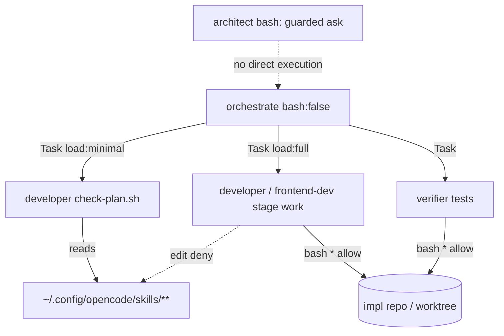

# 2026-05-17 — Unattended execution permissions and OpenCode config access

**Filename date (`YYYY-MM-DD` prefix):** **2026-05-17** — the calendar day this **Cursor chat was created** (first user message). Implementation continued into **2026-05-18** on the same thread; the filename uses **chat creation date** for date-ordered filing with other `TO REVIEW` records.

| Field | Date / ID | Source |
| --- | --- | --- |
| Chat created | **2026-05-17**, ~23:09 UTC+1 | First message timestamp in this Cursor session |
| Session work finalized | **2026-05-18**, ~12:45 UTC+1 | Last permission-ordering / external-directory fixes in same thread |
| This TO REVIEW doc last expanded | 2026-06-01 | Documentation pass; does **not** change the filename prefix |
| Prior related session (same day, earlier) | **2026-05-17**, ~13:47 UTC+1 | [`2026-05-17-subagent-bash-permissions-and-orchestrator-delegation.md`](2026-05-17-subagent-bash-permissions-and-orchestrator-delegation.md) — expanded bash allowlists + `check-plan.sh` delegation |
| Cursor transcript (follow-up / this thread) | [`940a773f-367d-477c-a1d6-23bd264d60ba`](940a773f-367d-477c-a1d6-23bd264d60ba) | Referenced from sibling TO REVIEW doc; overnight-run permission work |

If Finder shows **Modified: Jun 1**, that is file-save time — keep **`2026-05-17`** in the name for date order.

**Session scope:** Eliminate OpenCode **Permission required** prompts that blocked **unattended overnight orchestration**. Allow execution/review subagents to run arbitrary in-repo shell (Rails tests, pipes, worktree `cd && …`) and read/execute shared OpenCode skills under `~/.config/opencode` without confirmation, while keeping **`architect`** and **`orchestrate`** guarded. Tighten **external directory** so shared config is readable but not editable; document residual shell sandbox limits.

**Status:** Designed, implemented, and finalized in chat **2026-05-17 → 2026-05-18**. **Verify on disk before merge** — agent frontmatter may have been removed or superseded by later sessions. See [Current on-disk check](#14-current-on-disk-check).

---

## Executive summary

| Topic | Outcome |
| --- | --- |
| `check-plan.sh` prompts | Iteration 1: three narrow `permission.bash` allows on `developer`. **Superseded** by `bash: { "*": allow }` on execution lane. |
| Rails / pipe prompts | `bin/rails test … \| head -60` failed allowlist matching → wildcard bash on execution/review subagents. |
| Primary agents stay guarded | `architect` read-only bash; `orchestrate` `bash: false`, Task delegation only. |
| Security vs convenience | Reverted brief `external_directory: { "*": allow }`; final model: OpenCode config **allow**, sensitive home paths **deny**, catch-all **ask**. |
| Shared OpenCode config | Explicit allows for `~/.config/opencode/**` + absolute path; **edit deny** on writers for those paths. |
| Pattern ordering | Specific allows/denies **before** wildcard `ask` / `allow` (first-match safety). |
| Validator | `scripts/validate-opencode-config.sh` extended with unattended-agent and ordering checks. |

---

## 1. Relationship to earlier same-day work

This chat is the **follow-up** to [`2026-05-17-subagent-bash-permissions-and-orchestrator-delegation.md`](2026-05-17-subagent-bash-permissions-and-orchestrator-delegation.md) (~13:47 same day):

| Earlier session (~13:47) | This session (~23:09 → 2026-05-18) |
| --- | --- |
| Expanded per-command `permission.bash` allowlists | Replaced allowlists with `bash: "*": allow` on execution lane |
| Added `git add` / `git commit` / `cd * && …` patterns | Makes allowlist maintenance unnecessary for overnight runs |
| Delegated `check-plan.sh` to `developer` via Task | Added narrow then wildcard bash so delegated script runs without prompt |
| Left `external_directory` mostly default/ask | Added explicit OpenCode config allows + ordering |

Later external-directory portability work: [`2026-05-18-external-directory-permission-portability.md`](2026-05-18-external-directory-permission-portability.md).

---

## 2. Problems reported (operator)

### 2.1 Plan validation — `check-plan.sh`

```text
Permission required
Run check-plan.sh script
$ /usr/bin/env bash /Users/robo/.config/opencode/skills/orchestrate-execution/lib/check-plan.sh ".plan/feature.org-management-ui.md"

Always allow
- /usr/bin/env *
```

**Why:** `orchestrate` has `bash: false`; `developer` runs the script via Task (`load: minimal`). Script path is under **`~/.config/opencode`** (external to impl-repo worktree) and invocation uses **`/usr/bin/env bash`**, neither matched the long allowlist.

### 2.2 Rails tests with pipe

```text
Permission required
Run organisations controller tests
$ cd /Users/robo/.warp/worktrees/BlocShed/cobalt-shimmer && bin/rails test test/controllers/organisations_controller_test.rb 2>&1 | head -60

Always allow
- bin/rails *
- head *
```

**Why:** Allowlist had `bin/rails *` but not reliably `cd … && bin/rails … | head …` as a single matched pattern; `"*": ask` catch-all blocked unattended runs.

### 2.3 OpenCode skills directory

```text
Permission required
Access external directory ~/.config/opencode/skills/orchestrate-execution
Patterns
- /Users/robo/.config/opencode/skills/orchestrate-execution/*
```

**Why:** After tightening `external_directory: { "*": ask }`, shared config was not pre-allowed.

### 2.4 Operator requirements (verbatim intent)

1. Leave agents running **overnight** without mid-task confirmation.
2. **Guardrails at orchestrator/architect** — execution subagents behave like the operator **inside the git directory**.
3. **Use** OpenCode config files (read/execute); **do not edit** shared config from impl-repo sessions.
4. Changes outside working directory should be **restricted** (read-only / ask); git tracks in-repo work.

---

## 3. Root cause

1. **`permission.bash` default `"*": ask`** with incomplete allowlists — every new command shape prompts.
2. **`permission.edit` ≠ `permission.bash`** — broad edit allow did not grant shell.
3. **Agent rules override global `opencode.json`** for keys defined in agent frontmatter.
4. **`external_directory`** is separate from bash — paths outside session cwd prompt even when bash is allowed.
5. **Pattern order** — if `"*": ask` is listed before specific allows, first-match engines prompt before OpenCode config allow is reached.
6. **Unrestricted bash is not path-sandboxed** — file-tool external rules do not constrain shell mutations.

---

## 4. Implementation timeline (this chat)

| Step | Change | Superseded by |
| --- | --- | --- |
| 1 | Add three `check-plan.sh` bash allows on `developer` | Step 3 |
| 2 | `bash: "*": allow` on 12 execution/review subagents; remove ~80-line allowlists | — (kept) |
| 2b | Brief `external_directory: "*": allow` on execution agents | Step 4 (user security concern) |
| 3 | `external_directory: ask` + sensitive denies + OpenCode config allows | — (kept) |
| 4 | OpenCode config **edit deny** on writers | — (kept) |
| 5 | Reorder: specific rules before wildcards | — (kept) |
| 6 | Extend `validate-opencode-config.sh` | May be reverted on disk |

---

## 5. Files changed (this chat)

| File | Action |
| --- | --- |
| `agents/developer.md` | Replace `permission.bash` allowlist → `"*": allow`; add `external_directory` + ordered `edit` |
| `agents/frontend-dev.md` | Same |
| `agents/ux-dev.md` | Same (+ was prototype-scoped edit; chat used broad edit allow + OpenCode deny) |
| `agents/senior-dev.md` | Same |
| `agents/verifier.md` | Wildcard bash + `external_directory` |
| `agents/scribe.md` | Wildcard bash + external allows + OpenCode edit deny |
| `agents/worktree-env.md` | Wildcard bash + external allows |
| `agents/helper.md` | Add bash + external allows |
| `agents/review.md` | Remove read-only bash guard → wildcard bash + external allows |
| `agents/security-reviewer.md` | Same |
| `agents/performance-reviewer.md` | Same |
| `agents/doc-reviewer.md` | Same |
| `scripts/validate-opencode-config.sh` | Unattended + ordering enforcement |
| `agents/architect.md` | **Unchanged** |
| `agents/orchestrate.md` | **Unchanged** |
| `opencode.json` | **Unchanged in this chat** |

---

## 6. Reproducible implementation for another AI

Apply YAML inside each agent file’s frontmatter (`---` … `---`). **Order matters** if OpenCode uses first-match semantics: list **specific allows/denies before wildcard** `ask` / `allow`.

### 6.1 Global context at session start — `opencode.json`

At chat time, global permission included `external_directory` (subagents still override when they define their own block):

```json
"permission": {
  "external_directory": {
    "*": "allow",
    "~/.ssh/**": "deny",
    "~/.gnupg/**": "deny",
    "~/.aws/**": "deny",
    "~/.config/**": "ask",
    "~/.config/opencode/**": "allow"
  },
  "edit": {
    "*": "allow",
    "opencode.json": "ask",
    "*.pem": "deny",
    "*.key": "deny",
    ".env": "deny",
    ".env.*": "deny"
  }
}
```

**Live repo note:** Current `opencode.json` may have slimmed this block — always read disk before merging.

### 6.2 `agents/orchestrate.md` — do not change

```yaml
tools:
  write: false
  edit: false
  bash: false
  skill: true
permission:
  edit: deny
  skill: { "orchestrate-execution": "allow", "orchestrate-recovery": "allow", "github-issue-run": "allow", "handoff": "allow", "zoom-out": "allow", "caveman": "allow" }
  task:
    "*": deny
    scribe: allow
    worktree-env: allow
    developer: allow
    frontend-dev: allow
    ux-dev: allow
    verifier: allow
    helper: allow
    vision: allow
    senior-dev: allow
    review: allow
```

### 6.3 Iteration 1 only — narrow `check-plan.sh` allows (superseded)

If you are **not** yet ready for wildcard bash, insert these lines into `agents/developer.md` `permission.bash` (after `git grep` allows, before `git add`):

```yaml
    "bash skills/orchestrate-execution/lib/check-plan.sh *": allow
    "cd * && bash skills/orchestrate-execution/lib/check-plan.sh *": allow
    "/usr/bin/env bash /Users/robo/.config/opencode/skills/orchestrate-execution/lib/check-plan.sh *": allow
```

**This chat’s final state:** remove the entire per-command allowlist and use §6.4 instead.

### 6.4 Final — write-capable execution agents

**Applies to:** `developer`, `frontend-dev`, `ux-dev`, `senior-dev`

Replace the entire `permission:` block **or** merge these keys. Keep each agent’s existing `skill:` map (only the `skill` line differs per agent).

#### `agents/developer.md`

```yaml
permission:
  external_directory:
    "~/.config/opencode/**": allow
    "/Users/robo/.config/opencode/**": allow
    "~/.ssh/**": deny
    "~/.gnupg/**": deny
    "~/.aws/**": deny
    "*": ask
  skill: { "developer": "allow", "preflight": "allow", "debug-fix": "allow", "zoom-out": "allow", "caveman": "allow" }
  edit:
    "~/.config/opencode/**": deny
    "/Users/robo/.config/opencode/**": deny
    "*": allow
  bash:
    "*": allow
```

#### `agents/frontend-dev.md`

```yaml
permission:
  external_directory:
    "~/.config/opencode/**": allow
    "/Users/robo/.config/opencode/**": allow
    "~/.ssh/**": deny
    "~/.gnupg/**": deny
    "~/.aws/**": deny
    "*": ask
  skill: { "frontend-dev": "allow" }
  edit:
    "~/.config/opencode/**": deny
    "/Users/robo/.config/opencode/**": deny
    "*": allow
  bash:
    "*": allow
```

#### `agents/ux-dev.md`

```yaml
permission:
  external_directory:
    "~/.config/opencode/**": allow
    "/Users/robo/.config/opencode/**": allow
    "~/.ssh/**": deny
    "~/.gnupg/**": deny
    "~/.aws/**": deny
    "*": ask
  skill: { "ux-dev": "allow" }
  edit:
    "~/.config/opencode/**": deny
    "/Users/robo/.config/opencode/**": deny
    "*": allow
  bash:
    "*": allow
```

#### `agents/senior-dev.md`

```yaml
permission:
  external_directory:
    "~/.config/opencode/**": allow
    "/Users/robo/.config/opencode/**": allow
    "~/.ssh/**": deny
    "~/.gnupg/**": deny
    "~/.aws/**": deny
    "*": ask
  skill: { "senior-dev": "allow" }
  edit:
    "~/.config/opencode/**": deny
    "/Users/robo/.config/opencode/**": deny
    "*": allow
  bash:
    "*": allow
```

#### `agents/scribe.md`

```yaml
permission:
  external_directory:
    "~/.config/opencode/**": allow
    "/Users/robo/.config/opencode/**": allow
    "~/.ssh/**": deny
    "~/.gnupg/**": deny
    "~/.aws/**": deny
    "*": ask
  bash:
    "*": allow
  skill: { "scribe": "allow" }
  edit:
    "~/.config/opencode/**": deny
    "/Users/robo/.config/opencode/**": deny
    "*": allow
```

### 6.5 Final — read-only unattended agents

**Applies to:** `verifier`, `helper`, `worktree-env`, `review`, `security-reviewer`, `performance-reviewer`, `doc-reviewer`

Shared template (adjust `skill:` and retain agent-specific `task:` where present):

```yaml
permission:
  external_directory:
    "~/.config/opencode/**": allow
    "/Users/robo/.config/opencode/**": allow
    "~/.ssh/**": deny
    "~/.gnupg/**": deny
    "~/.aws/**": deny
    "*": ask
  edit: deny
  skill: { "<agent-name>": "allow" }
  bash:
    "*": allow
```

**Agent-specific additions:**

```yaml
# agents/helper.md
  task: { "*": deny }

# agents/worktree-env.md — no task block in chat-era file

# agents/review.md
  task:
    "*": deny
    security-reviewer: allow
    performance-reviewer: allow
    doc-reviewer: allow

# agents/security-reviewer.md, performance-reviewer.md, doc-reviewer.md
  task: { "*": deny }
```

### 6.6 What to remove when applying §6.4–§6.5

Delete the old **`permission.bash`** allowlist block (~80 lines per agent), including patterns like:

```yaml
  bash:
    "*": ask
    "pwd": allow
    "git status": allow
    "bin/rails *": allow
    "cd * && bin/rails *": allow
    # … npm, pytest, go test, cargo, bundle exec, make test …
    "rm -rf *": deny
    "sudo *": deny
    "curl *|*sh*": deny
```

Replace with:

```yaml
  bash:
    "*": allow
```

Also remove per-path **`permission.edit`** denies that duplicated global rules (`opencode.json`, `.env`, `*.pem`) if you adopt broad `"*": allow` + OpenCode config deny only.

---

## 7. Exact ApplyPatch — `developer.md` (wildcard bash transition)

Literal diff from this chat (replaces allowlist + adds external/edit ordering):

```diff
 permission:
+  external_directory:
+    "~/.config/opencode/**": allow
+    "/Users/robo/.config/opencode/**": allow
+    "~/.ssh/**": deny
+    "~/.gnupg/**": deny
+    "~/.aws/**": deny
+    "*": ask
   skill: { "developer": "allow", "preflight": "allow", "debug-fix": "allow", "zoom-out": "allow", "caveman": "allow" }
   edit:
-    "*": allow
-    "opencode.json": ask
-    "*.pem": deny
-    ...
+    "~/.config/opencode/**": deny
+    "/Users/robo/.config/opencode/**": deny
+    "*": allow
   bash:
-    "*": ask
-    "pwd": allow
-    ... ~80 lines ...
-    "curl *|*sh*": deny
-    "wget *|*sh*": deny
+    "*": allow
```

Apply the same structural change to `frontend-dev`, `ux-dev`, `senior-dev` (with their `skill` maps).

---

## 8. External directory ordering fix (ApplyPatch excerpt)

**Wrong** (OpenCode config may still prompt):

```yaml
  external_directory:
    "*": ask
    "~/.config/opencode/**": allow
```

**Correct:**

```yaml
  external_directory:
    "~/.config/opencode/**": allow
    "/Users/robo/.config/opencode/**": allow
    "~/.ssh/**": deny
    "~/.gnupg/**": deny
    "~/.aws/**": deny
    "*": ask
```

**Edit block for writers — wrong vs correct:**

```yaml
# wrong
edit:
  "*": allow
  "~/.config/opencode/**": deny

# correct
edit:
  "~/.config/opencode/**": deny
  "/Users/robo/.config/opencode/**": deny
  "*": allow
```

---

## 9. `scripts/validate-opencode-config.sh` — append after skill-existence check

Replace the old “read-only planning/review agents” list: **remove** `review`, `security-reviewer`, `performance-reviewer`, `doc-reviewer` from guarded-bash list. **Append** the following blocks (chat-final):

```bash
echo "Checking read-only planning agents have guarded bash..."
READONLY_GUARDED_BASH_AGENTS=(
  architect
  strategist
  debugger
  refactor
  document
  designer
)
for agent in "${READONLY_GUARDED_BASH_AGENTS[@]}"; do
  f="agents/$agent.md"
  if [[ ! -f "$f" ]]; then
    echo "  MISSING: expected read-only agent file $f"
    ERR=1
    continue
  fi
  fm=$(awk '{sub(/\r$/,"")} BEGIN{n=0} /^---$/{n++; next} n==1 {print}' "$f")
  if ! echo "$fm" | grep -q '^[[:space:]]*edit:[[:space:]]*deny[[:space:]]*$'; then
    echo "  UNSAFE: $f missing edit: deny"
    ERR=1
  fi
  if ! echo "$fm" | grep -q '^[[:space:]]*bash:[[:space:]]*true[[:space:]]*$'; then
    echo "  UNSAFE: $f should keep bash: true for read-only discovery"
    ERR=1
  fi
  for required in \
    '"*": ask' \
    '"rg *": allow' \
    '"find *": allow' \
    '"git diff *": allow' \
    '"rm *": deny' \
    '"mv *": deny' \
    '"git add *": deny' \
    '"git commit *": deny' \
    '"git push *": deny' \
    '"git reset *": deny' \
    '"git checkout *": deny' \
    '"git restore *": deny' \
    '"git clean *": deny' \
    '"git apply *": deny' \
    '"*>*": deny' \
    '"*>>*": deny'
  do
    if ! echo "$fm" | grep -Fq "$required"; then
      echo "  UNSAFE: $f missing bash guard $required"
      ERR=1
    fi
  done
  if echo "$fm" | grep -q '^[[:space:]]*task:[[:space:]]*{[[:space:]]*"\*":[[:space:]]*allow'; then
    echo "  UNSAFE: $f allows wildcard task delegation"
    ERR=1
  fi
done

echo "Checking unattended execution/review subagents allow bash..."
UNATTENDED_BASH_AGENTS=(
  developer
  frontend-dev
  ux-dev
  senior-dev
  verifier
  scribe
  worktree-env
  helper
  review
  security-reviewer
  performance-reviewer
  doc-reviewer
)
for agent in "${UNATTENDED_BASH_AGENTS[@]}"; do
  f="agents/$agent.md"
  if [[ ! -f "$f" ]]; then
    echo "  MISSING: expected unattended agent file $f"
    ERR=1
    continue
  fi
  fm=$(awk '{sub(/\r$/,"")} BEGIN{n=0} /^---$/{n++; next} n==1 {print}' "$f")
  if ! echo "$fm" | grep -Fq '"*": allow'; then
    echo "  BLOCKING: $f should allow wildcard bash for unattended execution"
    ERR=1
  fi
  if ! echo "$fm" | grep -Fq '"*": ask'; then
    echo "  UNSAFE: $f should ask before external directory file access"
    ERR=1
  fi
  for opencode_path in '~/.config/opencode/**' '/Users/robo/.config/opencode/**'; do
    if ! echo "$fm" | grep -Fq "\"$opencode_path\": allow"; then
      echo "  BLOCKING: $f should allow read/execute access to $opencode_path"
      ERR=1
    fi
    opencode_allow_line=$(echo "$fm" | grep -nF "\"$opencode_path\": allow" | head -1 | cut -d: -f1)
    external_ask_line=$(echo "$fm" | grep -nF '"*": ask' | head -1 | cut -d: -f1)
    if [[ -n "$opencode_allow_line" && -n "$external_ask_line" && "$opencode_allow_line" -gt "$external_ask_line" ]]; then
      echo "  BLOCKING: $f should list $opencode_path allow before external wildcard ask"
      ERR=1
    fi
  done
  for sensitive in '~/.ssh/**' '~/.gnupg/**' '~/.aws/**'; do
    if ! echo "$fm" | grep -Fq "\"$sensitive\": deny"; then
      echo "  UNSAFE: $f should deny external sensitive path $sensitive"
      ERR=1
    fi
  done
done

echo "Checking unattended writers cannot edit shared OpenCode config externally..."
UNATTENDED_WRITER_AGENTS=(
  developer
  frontend-dev
  ux-dev
  senior-dev
  scribe
)
for agent in "${UNATTENDED_WRITER_AGENTS[@]}"; do
  f="agents/$agent.md"
  fm=$(awk '{sub(/\r$/,"")} BEGIN{n=0} /^---$/{n++; next} n==1 {print}' "$f")
  for opencode_path in '~/.config/opencode/**' '/Users/robo/.config/opencode/**'; do
    if ! echo "$fm" | grep -Fq "\"$opencode_path\": deny"; then
      echo "  UNSAFE: $f should deny edits to shared OpenCode config path $opencode_path"
      ERR=1
    fi
    opencode_deny_line=$(echo "$fm" | grep -nF "\"$opencode_path\": deny" | head -1 | cut -d: -f1)
    wildcard_allow_line=$(echo "$fm" | awk '
      /^  edit:/ { in_edit=1; next }
      /^  [A-Za-z_]+:/ { if (in_edit) exit }
      in_edit && /"\*": allow/ { print NR; exit }
    ')
    if [[ -n "$opencode_deny_line" && -n "$wildcard_allow_line" && "$opencode_deny_line" -gt "$wildcard_allow_line" ]]; then
      echo "  UNSAFE: $f should list $opencode_path edit deny before wildcard edit allow"
      ERR=1
    fi
  done
done
```

Run:

```bash
./scripts/validate-opencode-config.sh
```

---

## 10. Orchestration protocol (unchanged — but required for `check-plan.sh`)

From [`2026-05-17-subagent-bash-permissions-and-orchestrator-delegation.md`](2026-05-17-subagent-bash-permissions-and-orchestrator-delegation.md) — **`skills/orchestrate-execution/SKILL.md`** plan precondition:

```markdown
## Plan precondition (mandatory before the stage loop)

When an artifact path is known (user supplied, handoff, or selected from `.plan/`):

1. Invoke **`developer`** via Task with **`load: minimal`** to run this from the **repository root**:

   `bash skills/orchestrate-execution/lib/check-plan.sh "<artifact_path>"`

   Orchestrate has no `bash` tool; this precondition must be delegated, not run directly.

2. On **non-zero** exit from the delegated command, print the script’s stderr **verbatim**, **do not** start stage execution, and instruct the user to return to **`architect` / `architect-plan`** to repair the plan artifact.

3. On success, continue to **Stage Loop**.
```

**Task prompt template for orchestrate → developer:**

```text
load: minimal

From the repository root of the implementation workspace, run:

bash skills/orchestrate-execution/lib/check-plan.sh ".plan/feature.<slug>.md"

Return exit code and stderr verbatim. Do not implement stages — plan validation only.
```

**Script path (when present):** `skills/orchestrate-execution/lib/check-plan.sh` — validates required `##` headings per `docs/plan-artifact-schema.md`. May be absent in some repo snapshots; restore from upgrade docs if missing.

**GitHub-issue helper path pattern** (same external-directory concern):

```bash
bash "${OPENCODE_CONFIG:-$HOME/.config/opencode}/skills/github-issue-run/lib/next-runnable-issue.sh" "<slug>"
```

---

## 11. Flow diagram



---

## 12. Security model (final chat position)

| Layer | Policy | Blocks overnight prompts? | Blocks shell `rm -rf ~/`? |
| --- | --- | --- | --- |
| `bash: "*": allow` (execution lane) | Yes | Yes | **No** |
| `external_directory` OpenCode allow | Read/execute config | Yes | N/A (file tools) |
| `external_directory: ask` catch-all | Other paths | May still prompt on external **file reads** | N/A |
| `edit` OpenCode deny (writers) | No config edits via write tool | N/A | N/A |
| `architect` / `orchestrate` guarded | Coordinator control | N/A | Partial |

**Operator acceptance:** trust **git** + **verifier** + **PR review** for in-repo changes; accept residual shell risk outside repo unless OS sandboxing is added later.

---

## 13. Operational notes

1. **Restart / re-enter OpenCode** after permission frontmatter changes.
2. UI **Always allow until restart** does not replace agent frontmatter updates.
3. **`OPENCODE_CONFIG`** — scripts reference `$HOME/.config/opencode`; symlink installs should keep that path valid.
4. Hardcoded **`/Users/robo/.config/opencode/**`** duplicates `~/.config/…` for engines that do not expand `~`; portability follow-up in [`2026-05-18-external-directory-permission-portability.md`](2026-05-18-external-directory-permission-portability.md).

---

## 14. Current on-disk check

The config repo **may have removed** inline `permission.bash` / `permission.external_directory` from agents (permissions moved elsewhere or simplified). Verify:

```bash
grep -l 'external_directory:' agents/*.md
grep -l '"\*": allow' agents/developer.md agents/verifier.md
./scripts/validate-opencode-config.sh
wc -l scripts/validate-opencode-config.sh   # chat-era extended script was ~180+ lines
```

If blocks are missing, re-apply **§6.4–§6.9** or reconcile with the portable deny-only model in the portability doc.

---

## 15. Acceptance checklist

- [ ] `developer` runs `check-plan.sh` without prompt (after OpenCode restart)
- [ ] `cd worktree && bin/rails test … | head -60` without prompt
- [ ] Read `~/.config/opencode/skills/**` without external-directory prompt
- [ ] Other external paths still **ask** (not silent allow)
- [ ] Writers cannot **edit** `~/.config/opencode/**` via file tools
- [ ] `architect` / `orchestrate` still have no unrestricted bash
- [ ] `./scripts/validate-opencode-config.sh` passes (extended rules if present)
- [ ] OpenCode config allows listed **before** `"*": ask` in every unattended agent

---

## 16. One-shot reapply command list (for another AI)

```text
1. Read agents/developer.md frontmatter — if permission.bash has "*": ask, apply §6.4.
2. Repeat §6.4 for frontend-dev, ux-dev, senior-dev, scribe.
3. Apply §6.5 for verifier, helper, worktree-env, review, security-reviewer, performance-reviewer, doc-reviewer.
4. Confirm orchestrate.md still has bash: false (§6.2).
5. Merge validate-opencode-config.sh blocks from §9 (or run manual checks in §14).
6. Run ./scripts/validate-opencode-config.sh
7. Tell operator to restart OpenCode before overnight run.
```
