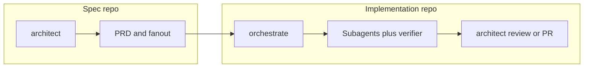

# 2026-05-18 — New Project Initialization Setup Guide

**Cursor chat created:** 2026-05-18 11:38:28 (local filesystem birth time of transcript)  
**Cursor chat ID:** `bb686a1c-a9aa-4c27-acaa-ea326e32a4e0`  
**Filename date (`2026-05-18`):** Same as **Cursor chat creation date** (ISO `YYYY-MM-DD` prefix for sort order in `TO REVIEW/`).  
**Last transcript activity:** 2026-06-01 ~19:23 (TO REVIEW doc edits and date-correction follow-ups in the same thread).

**Session scope:** Produce a short, operator-facing **new project initialization** guide for the OpenCode agent orchestration config. No application code, bootstrap scripts, or permanent docs paths were changed in the first deliverable turn — only chat text. This `TO REVIEW` record was added on a later follow-up in the same chat.

**Status:** Finalized in chat. **Verify on disk before merge** — `README.md` no longer contains the `## Setup` section that was the primary source at guide-writing time; stack bootstrap may now be `setup-project` instead of raw `new-spec-repo` (see [Workspace drift](#workspace-drift-since-session)).

---

## How to use this doc (another AI / re-implementer)

1. **Read [Workspace drift](#workspace-drift-since-session)** — reconcile `new-spec-repo` vs `setup-project` before publishing operator docs.
2. **Recreate the deliverable** using [Appendix A — Final setup guide (chat output)](#appendix-a--final-setup-guide-chat-output) — paste into `docs/guides/new-project-setup.md` or restore a `## Setup` block in `README.md` (snippets in [Appendix G](#appendix-g--optional-promotion-to-permanent-docs)).
3. **No shell/code patches were applied in turn 1** — this session was documentation synthesis only. Use [Appendix B — Source material read during research](#appendix-b--source-material-read-during-research) to re-derive if sources changed.
4. **Recreate the TO REVIEW file** — this document; filename must use **chat creation date** (`2026-05-18`), not the calendar day of later edits.
5. **Validate** against [Verification checklist](#verification-checklist).

---

## Executive summary

| Area | Outcome |
| --- | --- |
| User request (turn 1) | “Can you generate me a short setup guide for new project initialization?” |
| User request (turn 2+) | Record everything in `TO REVIEW/` with date-prefixed filename; later: use chat **creation** date; include code snippets for re-implementation |
| Repo code changes | **None** in turn 1 |
| Repo doc changes | **`TO REVIEW/2026-05-18-new-project-initialization-setup-guide.md`** (this file) |
| Primary deliverable | Five-step operator guide: prerequisites → repo shape → per-repo `setup-skills` → optional spec/multi-repo bootstrap → daily workflow |
| Research tools used | `Glob`, `SemanticSearch`, `Read` on `README.md`, `skills/setup-skills/SKILL.md`, `docs/RUNBOOK.md`, `docs/upgrade-spec/onboarding-supplement.md`, `bin/new-spec-repo` references |

---

## User prompts (exact)

### Turn 1

```text
Can you generate me a short setup guide for new project initialization?
```

### Turn 2

```text
@TO REVIEW Can you creat a document in this folder in mark down that full documents everything that was implemented and finalised in this chat, the title should include todays date, I will be addin oother documents so it should appear in date order.
```

### Turn 3–4 (date correction)

```text
my mistake the file name should include todays date, it should include the date on which this chat completed its previuse work.
```

```text
Some final details to include in the file. The file date should use the same date that the cursor chat was created. Also please include any pertinent code snippets that would help another AI recreated the changes required that were actioned in this chat. We need as much detail as possible.
```

---

## What was implemented in this chat

### Turn 1 — Setup guide (chat-only deliverable)

The assistant:

1. Ran `Glob` on `**/*.{md,json,yml,yaml,toml}` under the config repo.
2. Ran semantic search: “Where is new project initialization or setup documented?”
3. Read `README.md` (included a `## Setup` section at that time — see [Appendix B.1](#b1-readmemd-setup-section-at-guide-writing-time)).
4. Read `skills/setup-skills/SKILL.md` (first 100 lines; included bundled-template copy table §4b at that time).
5. Read `docs/RUNBOOK.md` (first 80 lines).
6. Synthesized [Appendix A](#appendix-a--final-setup-guide-chat-output) and returned it in chat (not written to a permanent repo path unless promoted).

### Turn 2+ — TO REVIEW documentation

Created and iteratively expanded this markdown file under `TO REVIEW/`.

---

## Files touched

| File | Change |
| --- | --- |
| `TO REVIEW/2026-05-18-new-project-initialization-setup-guide.md` | **Created / expanded** — this document |
| `TO REVIEW/2026-06-01-new-project-initialization-setup-guide.md` | **Superseded / remove** — wrong date prefix (used work-completion day, not chat creation date) |
| All other paths | **Unchanged** by this chat |

---

## Workspace drift since session

| Topic | At guide-writing time | Current on-disk state (verify) |
| --- | --- | --- |
| `README.md` | Had `## Setup`, `## Daily use`, workflow mermaid (~86 lines) | **39 lines** — no `## Setup`; points to `docs/RUNBOOK.md` only |
| Bootstrap entrypoint | Documented `~/.config/opencode/bin/new-spec-repo` from README | Sibling sessions document **`bin/setup-project`** as canonical; `new-spec-repo` may be a deprecation shim (see [`2026-05-19-spec-central-stack-workflow-implementation.md`](2026-05-19-spec-central-stack-workflow-implementation.md)) |
| `skills/setup-skills/SKILL.md` | Included §4b “Copy bundled templates from this repo” | Current checkout may omit §4b — seeds under `## Seed:` remain |
| `docs/upgrade-spec/onboarding-supplement.md` | Referenced as deep checklist | May be absent from checkout — use TO REVIEW cross-refs |

When promoting the guide, **merge** Appendix A with `setup-project` flow from [`2026-06-01-setup-project-shell-bootstrap.md`](2026-06-01-setup-project-shell-bootstrap.md) rather than shipping stale `new-spec-repo`-only instructions.

---

## Appendix A — Final setup guide (chat output)

Reproduce verbatim (or merge with `setup-project` as noted above):

```markdown
## New project initialization (OpenCode)

### 0. Prerequisites

- **OpenCode** using this config: either symlink this checkout to `~/.config/opencode`, or set `OPENCODE_CONFIG_DIR` to this directory so `opencode.json`, agents, skills, and rules load.
- **GitHub CLI** (`gh`) authenticated if you use Issues, `new-spec-repo`, or fanout workflows.

### 1. Pick your shape

| You are starting… | Do this first |
| --- | --- |
| **One implementation repo** | Create/clone the repo, then go to step 2. |
| **Spec repo + several impl repos** (`APP-web`, `APP-api`, …) | Create impl repos on GitHub and clone them as **siblings** under one parent folder (e.g. `~/code/APP/`). Then go to step 3. |

Prefer names like `<app>-web`, `<app>-api` (surface/capability), not vague “frontend” only.

### 2. Wire each application repo (once per repo)

1. Add **`CONTEXT.md`** and **`opencode.md`** — start from `docs/templates/opencode.md.template` in this config repo.
2. Run **`setup-skills`** once (e.g. via **architect** when that skill is enabled). It scaffolds **`docs/agents/`** (issue tracker, triage labels, domain) and an **`## Agent skills`** block in **`AGENTS.md`** or **`README.md`**. It can add **`LANGUAGE.md`** if missing.
3. Optionally merge in bundled copies from this config (see `skills/setup-skills/SKILL.md`): templates under `skills/setup-skills/templates/`, `templates/bin/feature-context`, child issue template under `templates/.github/ISSUE_TEMPLATE/`.

### 3. Optional: create the spec repo from the parent folder

From the **parent** that contains sibling clones (e.g. `APP-web`, `APP-api`):

\`\`\`bash
export GH_ORG=YOUR_ORG
mkdir -p ~/code/APP && cd ~/code/APP
gh repo clone "$GH_ORG/APP-web"
gh repo clone "$GH_ORG/APP-api"
~/.config/opencode/bin/new-spec-repo
\`\`\`

- With no args, the script uses the **current folder name** as the app slug, discovers sibling git repos, creates or syncs **`<app>-spec`**, updates **`docs/agents/repos.md`**, and runs **`link-spec-repo`** in each local impl repo.
- Impl repos **must exist** before `new-spec-repo` (it only creates **`<app>-spec`**). Explicit repos: `new-spec-repo APP APP-web APP-api …`.
- Optional: `gh secret set LABEL_SYNC_PAT` on the spec repo for label sync (`templates/spec-repo/.github/workflows/sync-labels.yml`).

### 4. After bootstrap

- **Day-to-day flow:** **architect** (plan / PRD / review) → **orchestrate** (execute issues or `.plan` files). Details: `docs/RUNBOOK.md`.
- **PRD path (spec repo):** approve PRD → `bin/fanout` → child issues → **orchestrate** on `feature:<slug>` queue.
- **Deeper checklist (GitHub, branch protection, `.gitignore` for agent scratch):** `docs/upgrade-spec/onboarding-supplement.md`.

### 5. Agent scratch `.gitignore` (recommended)

\`\`\`gitignore
# OpenCode agent scratch
tmp/
.research/
.qa/
.plan/*.completed.md
\`\`\`
```

---

## Appendix B — Source material read during research

### B.1 `README.md` `## Setup` section at guide-writing time

The assistant read a longer `README.md` than the current 39-line version. Reconstruct the **Setup** portion that drove the guide (from session transcript + semantic index):

```markdown
## Setup

1. **Use this directory as your OpenCode config** — Symlink to `~/.config/opencode`, or set `OPENCODE_CONFIG_DIR` to this path so agents, skills, rules, and `opencode.json` load here.
2. **Each application repository** — Run **`setup-skills`** once (via architect when that skill is enabled). Add **`CONTEXT.md`** and **`opencode.md`** from [`docs/templates/opencode.md.template`](docs/templates/opencode.md.template). `setup-skills` can scaffold **`LANGUAGE.md`** when missing.
3. **Optional: spec repo + multiple implementation repos** — Create your implementation repos on GitHub first (e.g. `<app>-web`, `<app>-api`) and clone them as siblings under one folder. Then run **`new-spec-repo` from that parent folder**. With no arguments, it uses the current folder name as the app slug, discovers sibling git repos, creates or syncs `<app>-spec`, updates `docs/agents/repos.md`, and runs `link-spec-repo` inside each local implementation repo.

\`\`\`bash
export GH_ORG=OWNER
mkdir -p ~/code/APP && cd ~/code/APP   # parent folder for APP-web, APP-api, APP-spec, ...
gh repo clone "$GH_ORG/APP-web"
gh repo clone "$GH_ORG/APP-api"   # every impl repo you need
~/.config/opencode/bin/new-spec-repo
\`\`\`

Optional: `gh secret set LABEL_SYNC_PAT` on the spec repo for [label sync](templates/spec-repo/.github/workflows/sync-labels.yml).

Implementation repos must exist before `new-spec-repo` can discover them (it creates only **`<app>-spec`**). You can still be explicit when needed: `new-spec-repo APP APP-web APP-mobile APP-ingest`. After renaming, adding, or removing local implementation repo folders, rerun `new-spec-repo` from the parent folder to replace the routing list in **`<app>-spec/docs/agents/repos.md`** and relink available repos. Existing PRDs, ADRs, prototypes, and other spec files are left alone. Templates: [`templates/spec-repo/`](templates/spec-repo/). Deeper walkthrough: [`docs/upgrade-spec/onboarding-supplement.md`](docs/upgrade-spec/onboarding-supplement.md).

**Repo naming:** Prefer **surface or capability** (`<app>-web`, `<app>-mobile`, `<app>-api`) over legacy “frontend” so names stay accurate for web stacks, native mobile, workers, etc.
```

**Also present in that README snapshot:** `## Daily use`, workflow mermaid, `## Quick reference` table — see [`2026-06-01-setup-project-shell-bootstrap.md`](2026-06-01-setup-project-shell-bootstrap.md) for restored bootstrap snippets if promoting to README.

### B.2 `skills/setup-skills/SKILL.md` — process + seeds (current)

**Frontmatter:**

```yaml
---
name: setup-skills
description: Scaffold per-repo agent context — issue tracker, triage labels, domain doc layout — under docs/agents/ and an AGENTS.md or README section. Run once per repo before relying on to-issues, grill-me CONTEXT persistence, or cross-session portability.
---
```

**Explore step (run in target repo):**

```bash
git remote -v
# Also inspect: README.md, AGENTS.md, CLAUDE.md, CONTEXT.md, CONTEXT-MAP.md, docs/adr/, docs/agents/
```

**Canonical triage labels:**

| Role | Default string |
| --- | --- |
| Maintainer must evaluate | `needs-triage` |
| Waiting on reporter | `needs-info` |
| AFK agent can pick up | `ready-for-agent` |
| Needs human implementation | `ready-for-human` |
| Won't fix | `wontfix` |

**Scribe write targets:**

```text
docs/agents/issue-tracker.md
docs/agents/triage-labels.md
docs/agents/domain.md
AGENTS.md  OR  README.md (## Agent skills block — never both)
```

**Seed: `docs/agents/issue-tracker.md`:**

```markdown
# Issue tracker

Issues for this repository are tracked on **GitHub**.

- **CLI:** `gh issue create`, `gh issue view`, `gh issue list`
- **Remote:** (fill from `git remote get-url origin`)

Non-GitHub workflows belong in this file as plain-English steps for agents.
```

**Seed: `docs/agents/triage-labels.md`:**

```markdown
# Triage labels

| Role | Label on this repo |
|------|---------------------|
| Needs triage | needs-triage |
| Needs info | needs-info |
| Ready for agent | ready-for-agent |
| Ready for human | ready-for-human |
| Won't fix | wontfix |

When creating issues, use the **Label on this repo** column. If a label does not exist yet, create it or omit and note in the issue body.
```

**Seed: `docs/agents/domain.md`:**

```markdown
# Domain docs for agents

## Layout

- **Mode:** single-context | multi-context
- **Glossary:** `CONTEXT.md` at repo root (or see `CONTEXT-MAP.md` for paths)
- **ADRs:** `docs/adr/` (system-wide); bounded contexts may use `<context>/docs/adr/`

## Consumer rules

1. Before naming entities in plans or issues, read the active `CONTEXT.md`.
2. Before changing architecture, scan `docs/adr/` for decisions in that area.
3. `CONTEXT.md` is glossary-only — not implementation specs.
```

**Seed: `## Agent skills` block:**

```markdown
## Agent skills

### Issue tracker

Configured for this repo. See `docs/agents/issue-tracker.md`.

### Triage labels

See `docs/agents/triage-labels.md`.

### Domain docs

See `docs/agents/domain.md`.
```

### B.3 `skills/setup-skills/SKILL.md` §4b at guide-writing time (may be removed now)

At session time the skill also documented **file copies** from the OpenCode config checkout into each target repo:

| Source (config repo) | Destination (target repo) |
| --- | --- |
| `skills/setup-skills/templates/issue-tracker.md` | `docs/agents/issue-tracker.md` (edit `SPEC_REPO:` line) |
| `skills/setup-skills/templates/triage-labels.md` | `docs/agents/triage-labels.md` |
| `skills/setup-skills/templates/domain.md` | `docs/agents/domain.md` |
| `skills/setup-skills/templates/CONTEXT.md` | `CONTEXT.md` (only if missing) |
| `skills/setup-skills/templates/LANGUAGE.md` | `LANGUAGE.md` (only if missing) |
| `templates/bin/feature-context` | `bin/feature-context` (`chmod +x`) |
| `templates/.github/ISSUE_TEMPLATE/child-feature.yml` | `.github/ISSUE_TEMPLATE/child-feature.yml` |

**Example copy commands for a re-implementer:**

```bash
OC="${OPENCODE_CONFIG_DIR:-$HOME/.config/opencode}"
TARGET="/path/to/impl-repo"
mkdir -p "$TARGET/docs/agents" "$TARGET/bin" "$TARGET/.github/ISSUE_TEMPLATE"
cp "$OC/skills/setup-skills/templates/issue-tracker.md" "$TARGET/docs/agents/"
cp "$OC/skills/setup-skills/templates/triage-labels.md" "$TARGET/docs/agents/"
cp "$OC/skills/setup-skills/templates/domain.md" "$TARGET/docs/agents/"
[[ -f "$TARGET/CONTEXT.md" ]] || cp "$OC/skills/setup-skills/templates/CONTEXT.md" "$TARGET/CONTEXT.md"
[[ -f "$TARGET/LANGUAGE.md" ]] || cp "$OC/skills/setup-skills/templates/LANGUAGE.md" "$TARGET/LANGUAGE.md"
cp "$OC/templates/bin/feature-context" "$TARGET/bin/feature-context"
chmod +x "$TARGET/bin/feature-context"
cp "$OC/templates/.github/ISSUE_TEMPLATE/child-feature.yml" "$TARGET/.github/ISSUE_TEMPLATE/"
# Edit docs/agents/issue-tracker.md — set SPEC_REPO: owner/name when linked to a spec repo
```

### B.4 `docs/templates/opencode.md.template` (full — copy to project root as `opencode.md`)

````markdown
# Project context (OpenCode)

Copy this file to your **project root** as `opencode.md` and fill in. For **personal overrides**, use `opencode.local.md` (add to `.gitignore`).

## Commands

```bash
# Build
# ...

# Test
# ...

# Lint / format
# ...

# Dev server
# ...
```

## Architecture (why, not what)

- Non-obvious boundaries (e.g. API vs workers, auth flow).
- Data stores and when to use each.

## Domain terms

- **Term** — definition.

## Workflow

- Branch/PR conventions.
- What to run before pushing.

## Don'ts

- Generated paths, secrets, or files agents must not edit.
````

### B.5 `docs/RUNBOOK.md` — post-bootstrap flow (excerpt read in turn 1)

```markdown
## Canonical Flow

1. `architect` asks for plan type (Feature/Debug/Refactor/Review/Document/Prototype Design) when request is greeting/unspecified.
2. **Features:** architect classifies **`## Difficulty`**, runs Claude Context readiness, investigates …
3. `architect` invokes `scribe` to write the artifact to `.plan/<type>.<slug>.md` (mandatory step).
4. User switches to `orchestrate`.
…
16. Architect (post-implementation): … scribe **archives** the primary implementation artifact to `.plan/<type>.<slug>.completed.md`
```

**Spec-driven path (from guide synthesis — align with current RUNBOOK if promoted):**

```text
grill-me → to-prd → human approves → bin/fanout <slug> → orchestrate (feature:<slug>) → architect Mode F
```

**Local plan path:**

```text
bin/feature-context <issue> → architect → .plan/<type>.<slug>.md → orchestrate
```

### B.6 `docs/upgrade-spec/onboarding-supplement.md` — Part 2 initiation (excerpt)

Manual steps before/after OpenCode for greenfield projects:

```markdown
### Step 1 — Idea & research (human-led, no OpenCode yet)
- Write a paragraph: what you're building, why, who for.
- Drop URLs of prior art into a scratch folder.
- Note constraints: deploy target, perf budget, integrations, deadlines.
- Decide which target repos will host code, or create new ones (`gh repo create`).

### Step 2 — Create the PRD in roborew/spec
cd ~/code/roborew/spec
git checkout -b prd/<slug>
opencode
```

**Recommended `.gitignore` in every target repo (Part 1.9):**

```gitignore
# OpenCode agent scratch
tmp/
.research/
.qa/

# Completed plans (keep active ones tracked)
.plan/*.completed.md
```

### B.7 `bin/new-spec-repo` — deprecation shim (if present in checkout)

From [`2026-05-19-spec-central-stack-workflow-implementation.md`](2026-05-19-spec-central-stack-workflow-implementation.md):

```bash
#!/usr/bin/env bash
echo "DEPRECATED: use bin/setup-project (from your PROJECT parent folder)" >&2
exec "$(dirname "$0")/setup-project" "$@"
```

**Modern replacement bootstrap (from sibling TO REVIEW):**

```bash
export GH_ORG=your-github-login-or-org
mkdir -p ~/code/myapp && cd ~/code/myapp
gh repo clone "$GH_ORG/myapp-web"
gh repo clone "$GH_ORG/myapp-api"
setup-project
```

---

## Appendix C — Architect / OpenCode prompts to reproduce setup

### C.1 Enable `setup-skills` on architect

Ensure `agents/architect.md` includes (pattern from [`2026-05-14-mattpocock-skills-adoption-and-guardrails.md`](2026-05-14-mattpocock-skills-adoption-and-guardrails.md)):

```yaml
permission:
  skill:
    "setup-skills": "allow"
    # … other skills …
```

### C.2 Operator prompt — single implementation repo

```text
Run setup-skills for this repository. Use GitHub Issues, default triage labels, single-context layout with CONTEXT.md at repo root. Write docs/agents/* via scribe and add ## Agent skills to AGENTS.md.
```

### C.3 Operator prompt — full stack (prefer `setup-project` today)

```text
From the spec repo (or project parent), run setup-project to bootstrap APP-spec, APP-web, and APP-api. GH_ORG is <owner>.
```

---

## Appendix D — Workflow diagrams (from README snapshot)



| You want | Where | Notes |
| --- | --- | --- |
| Product / PRD | Spec repo | `grill-me` → `to-prd` → human approves → `bin/fanout` → child issues in impl repos |
| Ship a feature | Impl repo | **`orchestrate`** on `feature:<slug>` queue or local `.plan` |
| Bug or refactor | Impl repo | Architect + specialist → `.plan` → orchestrate |
| Domain / ADR | Either | Update **`CONTEXT.md`** or **`docs/adr/*`** via scribe when warranted |

---

## Appendix E — Research commands (replay discovery)

```bash
# From OpenCode config repo root
rg -l "setup-project|new-spec-repo|setup-skills" --glob '*.md'
rg -l "new project|initialization|bootstrap" docs/ README.md skills/

# Read canonical sources
sed -n '1,120p' README.md
sed -n '1,150p' skills/setup-skills/SKILL.md
sed -n '1,100p' docs/RUNBOOK.md
test -f docs/upgrade-spec/onboarding-supplement.md && sed -n '1,120p' docs/upgrade-spec/onboarding-supplement.md
```

**Semantic search queries used:**

```text
Where is new project initialization or setup documented?
```

---

## Appendix F — TO REVIEW file creation (turn 2)

**Target path:**

```text
TO REVIEW/2026-05-18-new-project-initialization-setup-guide.md
```

**Required header pattern (match sibling TO REVIEW docs):**

```markdown
# 2026-05-18 — New Project Initialization Setup Guide

**Cursor chat created:** 2026-05-18 11:38:28
**Cursor chat ID:** bb686a1c-a9aa-4c27-acaa-ea326e32a4e0
**Filename date (`2026-05-18`):** Same as Cursor chat creation date (ISO YYYY-MM-DD).
```

**Naming rule (finalized in chat):**

- Prefix **`YYYY-MM-DD-`** = **Cursor chat creation date** (not last edit date, not necessarily “today” when the TO REVIEW note is written).
- Sorts lexicographically with other `TO REVIEW/2026-MM-DD-*.md` files.

---

## Appendix G — Optional promotion to permanent docs

### G.1 Create `docs/guides/new-project-setup.md`

Copy [Appendix A](#appendix-a--final-setup-guide-chat-output) and add a **Bootstrap** section that prefers `setup-project`:

```markdown
### 3. Bootstrap the stack (recommended)

From project parent `~/code/myapp/`:

\`\`\`bash
export GH_ORG=your-github-login-or-org
gh repo clone "$GH_ORG/myapp-web"
gh repo clone "$GH_ORG/myapp-api"
setup-project
\`\`\`

Legacy: `~/.config/opencode/bin/new-spec-repo` delegates to `setup-project`.
```

### G.2 Restore compact `## Setup` in `README.md`

Insert after the opening paragraph:

```markdown
## Setup

1. **Config** — Symlink this checkout to `~/.config/opencode` or set `OPENCODE_CONFIG_DIR`.
2. **Per repo** — Run **`setup-skills`** once; add **`CONTEXT.md`** + **`opencode.md`** from [`docs/templates/opencode.md.template`](docs/templates/opencode.md.template).
3. **Multi-repo stack** — Clone impl repos as siblings; run **`setup-project`** from the parent folder.

Details: [`docs/guides/new-project-setup.md`](docs/guides/new-project-setup.md).
```

---

## Related sessions

| Date | Doc | Relationship |
| --- | --- | --- |
| 2026-05-14 | [`2026-05-14-mattpocock-skills-adoption-and-guardrails.md`](2026-05-14-mattpocock-skills-adoption-and-guardrails.md) | Introduced `setup-skills` skill and architect permission |
| 2026-05-19 | [`2026-05-19-spec-central-stack-workflow-implementation.md`](2026-05-19-spec-central-stack-workflow-implementation.md) | `setup-project` supersedes `new-spec-repo` / `link-spec-repo` |
| 2026-06-01 | [`2026-06-01-setup-project-shell-bootstrap.md`](2026-06-01-setup-project-shell-bootstrap.md) | `GH_ORG`, re-run idempotency, README bootstrap snippets |
| 2026-06-01 | [`2026-06-01-feature-pipeline-and-architect-front-door.md`](2026-06-01-feature-pipeline-and-architect-front-door.md) | Post-bootstrap feature pipeline |

---

## Verification checklist

- [ ] `TO REVIEW/2026-05-18-new-project-initialization-setup-guide.md` exists; old `2026-06-01-new-project-initialization-setup-guide.md` removed
- [ ] Filename date = Cursor chat creation date (`2026-05-18`)
- [ ] Transcript ID `bb686a1c-a9aa-4c27-acaa-ea326e32a4e0` matches Cursor history
- [ ] Appendix A guide text matches original chat deliverable
- [ ] If promoting: reconcile `new-spec-repo` → `setup-project` per workspace drift table
- [ ] `setup-skills` seeds produce `docs/agents/*` + `AGENTS.md` or README block in a smoke repo
- [ ] `gh auth status` succeeds when following bootstrap bash snippets

---

## Session metadata

- **Cursor chat created:** 2026-05-18 11:38:28
- **Cursor chat ID:** `bb686a1c-a9aa-4c27-acaa-ea326e32a4e0`
- **Filename / title date:** 2026-05-18 (chat creation — **not** 2026-06-01)
- **Turn 1 trigger:** Short setup guide for new project initialization
- **Turn 2+ trigger:** TO REVIEW record; date = chat creation; maximum detail + snippets for AI re-implementation
