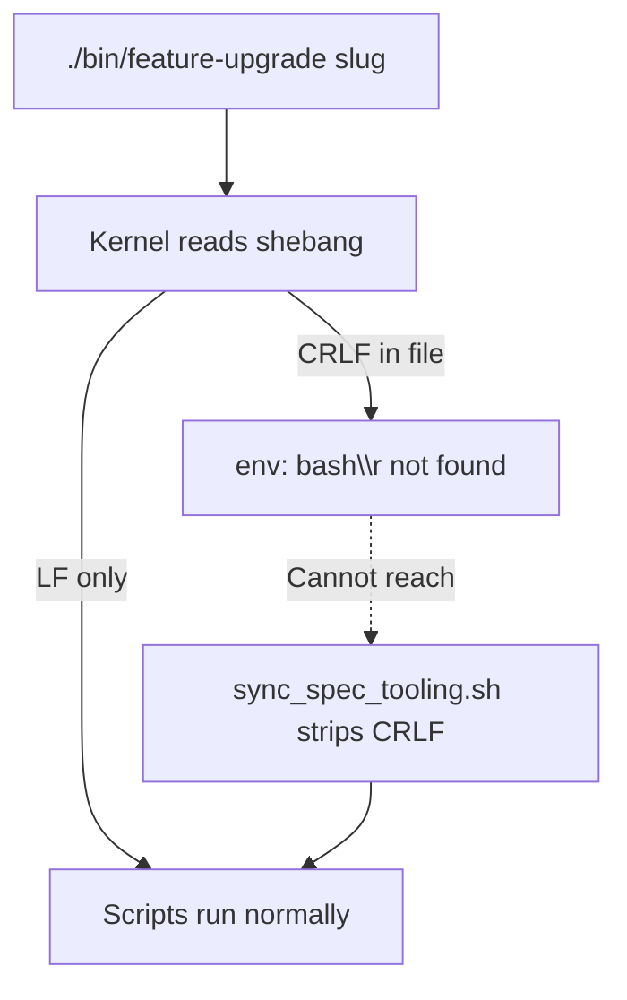

# 2026-05-19 — CRLF line endings hardening

**Cursor chat created:** 2026-05-19 (transcript birth: `2026-05-19 23:10:23` local)  
**Cursor chat ID:** [`c5a02f2f-0dac-45c3-9ea7-968f6dfccce2`](../../.cursor/projects/Users-robo-config-opencode/agent-transcripts/c5a02f2f-0dac-45c3-9ea7-968f6dfccce2/c5a02f2f-0dac-45c3-9ea7-968f6dfccce2.jsonl)

**Session scope:** Diagnose and design out `env: bash\r: No such file or directory` failures in spec-repo `bin/*` scripts; resync blocshed-spec; harden sync and wrapper paths; document agent recovery.

**Status:** Implemented and finalized in chat. **Verify on disk before merge** — this repo may have since reorganized (e.g. `bin/` removed or scripts consolidated). Search for the behaviors and paths below in the active entrypoint if paths differ.

**Companion docs (same date, separate chats):**

- [`2026-05-19-crlf-line-endings-and-architect-bash-permissions.md`](2026-05-19-crlf-line-endings-and-architect-bash-permissions.md) — bulk normalize (112 files), `check-crlf.sh`, `strip_crlf` introduction (commit `d257744`), architect bash allow-by-default
- [`2026-06-01-link-spec-repo-new-spec-repo-crlf-line-endings.md`](2026-06-01-link-spec-repo-new-spec-repo-crlf-line-endings.md) — CRLF on `bin/new-spec-repo` / `bin/link-spec-repo` (later session)

**Primary slug / repo referenced in chat:** `downgrade-archival-recovery` in **blocshed-spec** (`/Users/robo/05_Repos/01_PROJECTS/apps/blocshed/blocshed-spec`).

---

## Executive summary

| Area | Outcome |
| --- | --- |
| Symptom | `./bin/feature-upgrade` → `env: bash\r: No such file or directory` |
| Root cause | CRLF shebang in spec-repo working copy (stale sync or reintroduced after sync) |
| P0 | One-time `sync_spec_tooling.sh` on blocshed-spec — bins LF; exit 3 = registry/tickets (unrelated) |
| P1 | Project-parent `bin/feature-upgrade` **always** syncs before `exec` |
| P2 | New `templates/spec-repo/.gitattributes`; copied into spec repos on sync |
| P3 | RUNBOOK + setup-project skill CRLF recovery sections |
| P4 | Removed template `__pycache__/`; added `templates/spec-repo/.gitignore` |
| Design rule | Agents run sync — never per-file CRLF hacks |

---

## 1. Problem reported

### 1.1 Triggering command

From **blocshed-spec** while resyncing PRD tooling:

```bash
./bin/feature-upgrade downgrade-archival-recovery
```

### 1.2 Error

```text
env: bash\r: No such file or directory
```

### 1.3 Investigation output

```bash
file bin/feature-upgrade
# bin/feature-upgrade: Bourne-Again shell script text executable, Unicode text, UTF-8 text, with CRLF line terminators
```

Effective shebang (CRLF):

```text
#!/usr/bin/env bash\r
```

### 1.4 Agent workarounds attempted (before plan implementation)

These were blocked or suboptimal in the agent sandbox:

```bash
# Blocked: sed -i and redirects
sed -i '' 's/\r$//' bin/feature-upgrade

# Blocked: which dos2unix 2>/dev/null

# Worked but wrong pattern (per-file, not sync):
python3 -c "
path = 'bin/feature-upgrade'
with open(path, 'rb') as f:
    content = f.read()
content = content.replace(b'\r\n', b'\n')
with open(path, 'wb') as f:
    f.write(content)
"

# Bulk per-file fix (also wrong pattern):
python3 -c "
import os, glob
for root, dirs, files in os.walk('bin'):
    for f in files:
        p = os.path.join(root, f)
        with open(p, 'rb') as fh:
            c = fh.read()
        if b'\r\n' in c:
            c = c.replace(b'\r\n', b'\n')
            with open(p, 'wb') as fh:
                fh.write(c)
            print(f'fixed: {p}')
"
```

After CRLF was cleared manually, `feature-upgrade` ran and reported **registry/ticket validation** errors (capabilities/owners) — **not** line-ending issues.

---

## 2. Root cause analysis

### 2.1 Technical mechanism

On Unix, the kernel reads line 1 of an executable as the interpreter path. CRLF makes `/usr/bin/env` look for `bash\r`.

### 2.2 Copy path (healthy after prior commit `d257744`)

```text
templates/spec-repo/bin (LF)
  → install in sync_spec_tooling.sh
  → strip_crlf on destination
  → APP-spec/bin/* (LF)
```

OpenCode **templates** were LF at investigation time. CRLF in blocshed-spec was **stale or reintroduced**, not “templates ship CRLF.”

| Scenario | What went wrong |
| --- | --- |
| Stale install | Synced before `strip_crlf` existed; never re-synced |
| Post-sync corruption | Editor/Git without spec-repo `.gitattributes` |
| Manual edit | Direct `bin/*` edits outside sync |

### 2.3 Bootstrap gap (chicken-and-egg)



- In-spec [`templates/spec-repo/bin/feature-upgrade`](templates/spec-repo/bin/feature-upgrade) calls sync on each run — **only after bash starts**.
- Project-parent [`bin/feature-upgrade`](bin/feature-upgrade) **previously** synced only when target script was missing.

---

## 3. Pre-existing infrastructure (commit `d257744`, not reimplemented this chat)

Another session on the same date added bulk repo hygiene. This chat **relied on** and **extended** that work.

### 3.1 Root `.gitattributes` (OpenCode config repo)

```gitattributes
# Normalize line endings on checkout and commit (critical for bin/* shebangs on macOS/Linux).
* text=auto eol=lf

*.sh text eol=lf
bin/** text eol=lf
scripts/** text eol=lf
templates/** text eol=lf
```

### 3.2 `strip_crlf` + `sync_bin` in `bin/stack/sync_spec_tooling.sh`

Insert after `echo "==> Syncing spec tooling..."` (lines ~51–83 in session snapshot):

```bash
# Ensure LF shebangs (CRLF breaks `env: bash\r` on macOS/Linux).
strip_crlf() {
  python3 -c "
import pathlib, sys
p = pathlib.Path(sys.argv[1])
raw = p.read_bytes()
data = raw.replace(b'\r\n', b'\n').replace(b'\r', b'\n')
if data != raw:
    p.write_bytes(data)
" "$1"
}
sync_bin() {
  install -m0755 "$1" "$2"
  strip_crlf "$2"
}
sync_bin "$TEMPLATE/bin/fanout" "$SPEC/bin/fanout"
for lib in validate_tickets.py validate_prd_frontmatter.py prd_io.py toposort_tickets.py \
  build_issue_body.sh issue_contract.py extract_issue_sections.py extract_task_meta.py \
  task_meta_to_yaml.py validate_issue_body.py task_map.sh; do
  src="$TEMPLATE/bin/lib/$lib"
  [[ -f "$src" ]] || continue
  if [[ "$lib" == *.py ]]; then
    sync_bin "$src" "$SPEC/bin/lib/$lib"
  else
    install -m0644 "$src" "$SPEC/bin/lib/$lib"
    strip_crlf "$SPEC/bin/lib/$lib"
  fi
done
for script in status new-prd sync-fanout-bodies feature-check feature-upgrade; do
  [[ -f "$TEMPLATE/bin/$script" ]] || continue
  sync_bin "$TEMPLATE/bin/$script" "$SPEC/bin/$script"
done
```

Same `strip_crlf` pattern exists in [`bin/stack/sync_impl_tooling.sh`](bin/stack/sync_impl_tooling.sh) for implementation repos.

### 3.3 In-spec `feature-upgrade` sync block (unchanged this chat; context for P1)

From [`templates/spec-repo/bin/feature-upgrade`](templates/spec-repo/bin/feature-upgrade) (~lines 19–27):

```bash
OC="${OPENCODE_CONFIG:-$HOME/.config/opencode}"

if [[ "$SKIP_TOOLING" != "true" && -x "${OC}/bin/stack/sync_spec_tooling.sh" ]]; then
  echo "==> Syncing spec tooling from OpenCode templates..."
  "${OC}/bin/stack/sync_spec_tooling.sh" "$ROOT" || true
fi
```

### 3.4 `scripts/check-crlf.sh` (reference)

```bash
#!/usr/bin/env bash
# Fail if any tracked text file under bin/, scripts/, or templates/ uses CRLF.
set -euo pipefail

ROOT="$(cd "$(dirname "$0")/.." && pwd)"
cd "$ROOT"

paths=(bin scripts templates .gitattributes)

bad=()
for base in "${paths[@]}"; do
  [[ -e "$base" ]] || continue
  while IFS= read -r -d '' f; do
    [[ -f "$f" ]] || continue
    if grep -q $'\r' "$f" 2>/dev/null; then
      bad+=("$f")
    fi
  done < <(find "$base" -type f ! -path '*/__pycache__/*' ! -name '*.pyc' -print0 2>/dev/null)
done

if ((${#bad[@]} > 0)); then
  echo "ERROR: CRLF line endings (use LF for shell scripts and tooling):" >&2
  printf '  %s\n' "${bad[@]}" >&2
  echo "Fix: python3 scripts/normalize-line-endings.py" >&2
  exit 1
fi

echo "check-crlf: ok"
```

### 3.5 `scripts/normalize-line-endings.py` (reference — bulk LF normalize)

Core normalize logic:

```python
def normalize_file(path: Path) -> bool:
    data = path.read_bytes()
    if b"\x00" in data:
        return False
    if b"\r\n" not in data and b"\r" not in data:
        return False
    normalized = data.replace(b"\r\n", b"\n").replace(b"\r", b"\n")
    if normalized != data:
        path.write_bytes(normalized)
        return True
    return False
```

Run: `python3 scripts/normalize-line-endings.py [root]`

---

## 4. Changes implemented in this chat (P0–P4)

### P0 — One-time heal: blocshed-spec

**Command run:**

```bash
"$HOME/.config/opencode/bin/stack/sync_spec_tooling.sh" \
  /Users/robo/05_Repos/01_PROJECTS/apps/blocshed/blocshed-spec
echo "exit: $?"   # 3 = registry incomplete (expected); bins still synced
```

**Verify:**

```bash
file /Users/robo/05_Repos/01_PROJECTS/apps/blocshed/blocshed-spec/bin/feature-upgrade \
     /Users/robo/05_Repos/01_PROJECTS/apps/blocshed/blocshed-spec/bin/feature-check
# Expected: UTF-8 text — NO "with CRLF line terminators"
```

**Sample sync stderr (unrelated to CRLF — do not treat as line-ending failure):**

```text
INCOMPLETE: roborew/blocshed-api, roborew/blocshed-web
ticket web-fix-billing-route: capability 'Subscription/billing (Stripe)' not in declared capabilities ...
ticket web-fix-billing-route: owner 'developer' not in registry agent_owner ['frontend-dev'] ...
```

---

### P1 — `bin/feature-upgrade` wrapper always syncs

**File:** `bin/feature-upgrade`

**Full file after change** (only tail changed; header/arg parsing unchanged):

```bash
#!/usr/bin/env bash
# Wrapper: run spec repo bin/feature-upgrade from project parent (finds *-spec).
#
# Usage:
#   feature-upgrade <slug>                 # from project parent (finds *-spec)
#   feature-upgrade <slug> --spec <path>   # explicit spec repo path
#
set -euo pipefail
SLUG="${1:?slug required}"
shift || true
SPEC_PATH=""
while [[ $# -gt 0 ]]; do
  case "$1" in
    --spec) SPEC_PATH="${2:?}"; shift 2 ;;
    *) echo "unknown arg: $1" >&2; exit 2 ;;
  esac
done

OC="${OPENCODE_CONFIG:-$HOME/.config/opencode}"

if [[ -z "$SPEC_PATH" ]]; then
  PARENT="$(pwd)"
  for d in "$PARENT"/*-spec "$PARENT"/*-Spec; do
    [[ -d "$d/docs/prd" ]] || continue
    SPEC_PATH="$d"
    break
  done
fi

[[ -n "$SPEC_PATH" ]] || {
  echo "ERROR: could not find spec repo. Run from project parent or pass --spec <path>" >&2
  exit 2
}

# --- CHANGE START (P1) ---
if [[ -x "${OC}/bin/stack/sync_spec_tooling.sh" ]]; then
  echo "==> Syncing spec tooling from OpenCode templates..."
  "${OC}/bin/stack/sync_spec_tooling.sh" "$SPEC_PATH" || true
fi
# --- CHANGE END ---

exec "${SPEC_PATH}/bin/feature-upgrade" "$SLUG"
```

**Exact diff applied in chat:**

```diff
-UPGRADE="${SPEC_PATH}/bin/feature-upgrade"
-if [[ ! -x "$UPGRADE" ]]; then
-  echo "==> Installing spec tooling..."
-  "${OC}/bin/stack/sync_spec_tooling.sh" "$SPEC_PATH"
-fi
-
 exec "${SPEC_PATH}/bin/feature-upgrade" "$SLUG"
+
+# replaced with:
+if [[ -x "${OC}/bin/stack/sync_spec_tooling.sh" ]]; then
+  echo "==> Syncing spec tooling from OpenCode templates..."
+  "${OC}/bin/stack/sync_spec_tooling.sh" "$SPEC_PATH" || true
+fi
+
+exec "${SPEC_PATH}/bin/feature-upgrade" "$SLUG"
```

**Note:** `|| true` on sync — registry/PRD validation may exit 3/6; wrapper still runs spec `feature-upgrade`.

---

### P2 — Spec-repo `.gitattributes` + sync copy

**New file:** `templates/spec-repo/.gitattributes`

```gitattributes
# Normalize line endings (CRLF breaks bin/* shebangs on macOS/Linux).
* text=auto eol=lf

*.sh text eol=lf
bin/** text eol=lf
```

**Patch:** `bin/stack/sync_spec_tooling.sh` — after PRD/skill copies:

```diff
 cp "$TEMPLATE/docs/prd/_template.md" "$SPEC/docs/prd/_template.md"
 cp "$TEMPLATE/skills/fanout-issues/SKILL.md" "$SPEC/skills/fanout-issues/SKILL.md"
+if [[ -f "$TEMPLATE/.gitattributes" ]]; then
+  cp "$TEMPLATE/.gitattributes" "$SPEC/.gitattributes"
+fi
```

**Post-sync in blocshed-spec:**

```bash
head -5 /Users/robo/05_Repos/01_PROJECTS/apps/blocshed/blocshed-spec/.gitattributes
# Normalize line endings (CRLF breaks bin/* shebangs on macOS/Linux).
# * text=auto eol=lf
# ...
```

Commit `.gitattributes` in each spec repo after sync if tracking prevention in Git.

---

### P3 — Documentation inserts

#### `docs/RUNBOOK.md` — insert **before** `## Smoke Checklist`

```markdown
## Troubleshooting: CRLF / `env: bash\r`

On macOS/Linux, **CRLF** line endings in `bin/*` shell scripts break the shebang (`env: bash\r: No such file or directory`). OpenCode templates are LF; spec-repo copies are normalized on every **`sync_spec_tooling.sh`** run (`strip_crlf` after `install`).

**Agents:** Do not fix CRLF file-by-file with sed/Python. Run one of:

```bash
# From spec repo (when ./bin/* fails)
bash bin/feature-upgrade <slug>
"$HOME/.config/opencode/bin/stack/sync_spec_tooling.sh" "$(pwd)"

# From project parent (wrapper syncs tooling before exec)
feature-upgrade <slug>
```

**Prevention:** Spec repos receive [`.gitattributes`](../templates/spec-repo/.gitattributes) on sync so Git keeps `bin/**` as LF. Re-run **`setup-project`** or **`sync_spec_tooling.sh`** after pulling OpenCode config updates that touch `templates/spec-repo/bin/`.
```

#### `skills/setup-project/SKILL.md` — insert **before** `## Hard rules`

```markdown
## CRLF / broken `bin/*` shebangs

If `./bin/feature-upgrade` or other synced scripts fail with `env: bash\r: No such file or directory`, the spec repo has stale or CRLF-corrupted scripts. **Do not** hand-edit line endings per file.

From spec repo (delegated bash):

```bash
OC="${OPENCODE_CONFIG:-$HOME/.config/opencode}"
bash bin/feature-upgrade <slug>   # bypasses shebang until sync heals files
"$OC/bin/stack/sync_spec_tooling.sh" "$(pwd)"
```

From project parent, **`feature-upgrade <slug>`** syncs tooling before exec. See [RUNBOOK.md](../../docs/RUNBOOK.md) — Troubleshooting: CRLF.
```

---

### P4 — Template `__pycache__` hygiene

**Removed directory:**

```text
templates/spec-repo/bin/lib/__pycache__/
  issue_contract.cpython-314.pyc
  extract_task_meta.cpython-314.pyc
  toposort_tickets.cpython-314.pyc
```

**Command:**

```bash
rm -rf templates/spec-repo/bin/lib/__pycache__
```

**New file:** `templates/spec-repo/.gitignore`

```gitignore
# Python
__pycache__/
*.py[cod]
```

**Note:** Only `.gitattributes` is copied to spec repos by sync. `.gitignore` applies to the OpenCode template tree.

---

## 5. Step-by-step recreation guide (for another AI)

Execute in order:

1. **Confirm pre-requisites** from commit `d257744` (or companion doc): root `.gitattributes`, `strip_crlf` in `sync_spec_tooling.sh`, `check-crlf.sh`, `normalize-line-endings.py`, CI step in `config-integrity.yml`.

2. **P1 — Edit `bin/feature-upgrade`:** Replace conditional sync-on-missing with unconditional sync-before-exec (full snippet in §4 P1).

3. **P2 — Create `templates/spec-repo/.gitattributes`** (full content in §4 P2).

4. **P2 — Patch `bin/stack/sync_spec_tooling.sh`:** Add `cp` of `.gitattributes` after PRD/skill template copies.

5. **P3 — Patch `docs/RUNBOOK.md`:** Insert CRLF troubleshooting section before Smoke Checklist.

6. **P3 — Patch `skills/setup-project/SKILL.md`:** Insert CRLF section before Hard rules.

7. **P4 — Delete** `templates/spec-repo/bin/lib/__pycache__/` if present.

8. **P4 — Create `templates/spec-repo/.gitignore`** with Python cache rules.

9. **P0 — Operator one-time:** Run `sync_spec_tooling.sh` on each stale spec repo (e.g. blocshed-spec).

10. **Validate:**

```bash
bash scripts/check-crlf.sh
file templates/spec-repo/bin/feature-upgrade   # no CRLF
# From project parent:
feature-upgrade <slug> --spec /path/to/spec    # should print "Syncing spec tooling..."
```

**Do not:**

- Loop `bin/*` with Python/sed per file when sync exists
- Treat sync exit 3/6 as CRLF failure
- Edit the plan file `.cursor/plans/crlf_line_endings_d91849d6.plan.md` as part of merge

---

## 6. Recovery commands (operator reference)

| Situation | Command |
| --- | --- |
| `./bin/*` broken in spec repo | `bash bin/feature-upgrade <slug>` |
| Heal all synced scripts | `"$HOME/.config/opencode/bin/stack/sync_spec_tooling.sh" "$(pwd)"` |
| Bulk normalize tree | `python3 "$HOME/.config/opencode/scripts/normalize-line-endings.py" "$(pwd)"` |
| From project parent (after P1) | `feature-upgrade <slug>` or `feature-upgrade <slug> --spec <path>` |

---

## 7. Files touched in this chat

| File | Action |
| --- | --- |
| `bin/feature-upgrade` | Modified — always sync before exec |
| `bin/stack/sync_spec_tooling.sh` | Modified — copy `.gitattributes` to spec repo |
| `templates/spec-repo/.gitattributes` | **Created** |
| `templates/spec-repo/.gitignore` | **Created** |
| `templates/spec-repo/bin/lib/__pycache__/` | **Deleted** |
| `docs/RUNBOOK.md` | Modified — CRLF troubleshooting |
| `skills/setup-project/SKILL.md` | Modified — CRLF recovery |
| `TO REVIEW/2026-05-19-crlf-line-endings-hardening.md` | **Created** (this doc) |

**External:**

| Path | Action |
| --- | --- |
| `.../blocshed-spec/bin/*` | Re-synced; LF |
| `.../blocshed-spec/.gitattributes` | Installed by sync |

**Not modified this chat:** `strip_crlf` body, `check-crlf.sh`, root `.gitattributes`, `sync_impl_tooling.sh`, in-spec `templates/spec-repo/bin/feature-upgrade` logic.

---

## 8. Validation performed in chat

```bash
bash scripts/check-crlf.sh
# check-crlf: ok

file .../blocshed-spec/bin/feature-upgrade .../blocshed-spec/bin/feature-check
# Bourne-Again shell script ... UTF-8 text (no CRLF mention)

test -f .../blocshed-spec/.gitattributes && head -3 .../blocshed-spec/.gitattributes
```

**Not run to completion:** `feature-upgrade downgrade-archival-recovery` with clean registry (blocked by ticket validation after CRLF fix).

---

## 9. Review checklist

- [ ] Cursor chat ID and date match filename prefix `2026-05-19`
- [ ] `bin/feature-upgrade` syncs unconditionally before `exec` (§4 P1)
- [ ] `sync_spec_tooling.sh` copies `templates/spec-repo/.gitattributes`
- [ ] Template `.gitattributes` and `.gitignore` exist; no `__pycache__` under template `bin/lib/`
- [ ] RUNBOOK and setup-project CRLF sections present (§4 P3)
- [ ] `bash scripts/check-crlf.sh` passes
- [ ] Re-sync stale spec repos; commit `.gitattributes` in spec repo
- [ ] Fix blocshed registry/ticket validation separately

---

## 10. References

- Plan: `.cursor/plans/crlf_line_endings_d91849d6.plan.md`
- Prior commit: `d257744` — normalize line endings + `strip_crlf`
- Transcript: `agent-transcripts/c5a02f2f-0dac-45c3-9ea7-968f6dfccce2/c5a02f2f-0dac-45c3-9ea7-968f6dfccce2.jsonl`
- Review doc format: `TO REVIEW/2026-05-20-setup-project-empty-targets-fix.md`
