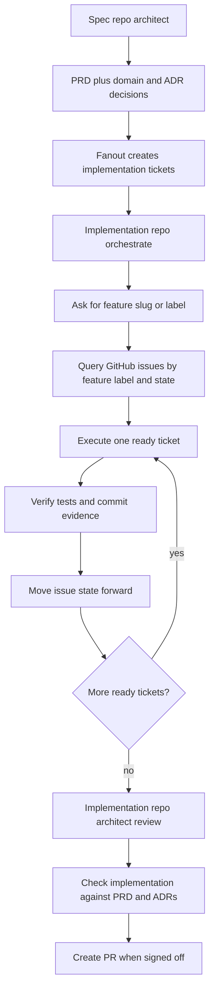

# 2026-06-01 — GitHub Issue–Backed Execution (plan implementation)

**Filename date (`2026-06-01`):** Date this chat **finished the implementation work** (all six plan todos completed), not the date of later follow-up messages in the same thread. Implementation session transcript last activity: **2026-06-01 ~19:19** ([`0b06ebd3-1262-42fc-91a7-173cfca23dae`](../../.cursor/projects/Users-robo-config-opencode/agent-transcripts/0b06ebd3-1262-42fc-91a7-173cfca23dae/0b06ebd3-1262-42fc-91a7-173cfca23dae.jsonl)).

**Session scope:** Implement the attached **GitHub Issue Backed Execution Plan** (`github-issue-execution_8fcfb0d1.plan.md`) without editing the plan file. Work was organized into six plan todos; all were marked **completed** in-session.

**Status:** Documented and finalized in chat. **Verify on disk before relying on this config** — at the time this review doc was written, `main` in this repo was still a slim README/architect baseline and did **not** include several paths created in-session (see §10).

**Related TO REVIEW context:**

- [`2026-06-01-issue-backed-workflow-orchestrate-handoff.md`](2026-06-01-issue-backed-workflow-orchestrate-handoff.md) — why `state:ready-for-agent` still requires switching to orchestrate
- [`2026-05-19-spec-fanout-bin-tooling-and-prerequisites.md`](2026-05-19-spec-fanout-bin-tooling-and-prerequisites.md) — fanout prerequisites and `tickets:` schema
- [`2026-06-01-spec-impl-issue-workflow-split.md`](2026-06-01-spec-impl-issue-workflow-split.md) — later spec/impl split and `opencode-task-yaml` (may supersede parts of §3.1 body contract)
- [`2026-06-01-feature-pipeline-and-architect-front-door.md`](2026-06-01-feature-pipeline-and-architect-front-door.md) — product vs implementation front door
- [`2026-05-19-spec-central-stack-workflow-implementation.md`](2026-05-19-spec-central-stack-workflow-implementation.md) — issue-expand + stage loop variant

---

## Executive summary

| Topic | Outcome |
| --- | --- |
| **Paradigm shift** | For spec-driven features, **GitHub child issues** (after `bin/fanout`) become the **primary execution queue**; **`.plan/`** remains for local features, debug, refactor, review remediation, design, and recovery. |
| **PRD + fanout** | PRD frontmatter gains **`tickets: []`** (multiple ordered issues per repo); `bin/fanout` creates **one issue per ticket** with topo sort on `depends_on`. |
| **Triage** | Execution lifecycle labels: `state:in-progress`, `state:ready-for-review`, `state:blocked`, `state:done` (+ existing `state:ready-for-agent`). |
| **Orchestrate** | Startup path **(A)** local `.plan`, **(B)** GitHub `feature:<slug>` backlog, **(C)** architect handoff; new skill **`github-issue-run`**. |
| **Executors** | `developer`, `frontend-dev`, `verifier` accept **`execution_mode: github_issue`** with `issue_number`, `repo`, `opencode_meta`. |
| **Architect** | **Mode F** — feature sign-off: compare completed issues to PRD/ADRs; skip `archive_plan` when execution was GitHub-only. |
| **Docs** | README + RUNBOOK updated for GitHub-first spec path; smoke checklist added. |

---

## 1. Target behavior (from plan)



**Compatibility (unchanged intent):** `.plan` validation and selection stay for non-spec flows; issue-backed path is **additive first**, then documented as the **recommended default** for spec-driven work.

---

## 2. Plan todos — completion record

| Todo ID | Plan requirement | Session outcome |
| --- | --- | --- |
| `schema-fanout` | PRD `tickets:` schema + fanout one issue per ticket | Implemented in spec-repo template paths (see §3) |
| `issue-lifecycle` | Triage labels + legal transitions | Extended `triage-labels.md`, `skills/triage`, `triage.sh`, spec `labels.yml` |
| `orchestrate-intake` | GitHub feature intake beside `.plan` | `orchestrate.md`, `orchestrate-execution/SKILL.md`, new `github-issue-run` skill |
| `executor-contract` | developer / frontend-dev / verifier issue mode | Agent + skill Hard Rules + execution flow |
| `architect-review` | Mode F feature sign-off vs PRD | `architect-review/SKILL.md`, `architect.md` routing + `github-issue-run` permission |
| `docs-update` | README + RUNBOOK + smoke | Expanded README/RUNBOOK; `docs/smoke/github-issue-execution.md` |

---

## 3. Files created or updated (by area)

### 3.1 Spec repo — PRD schema and fanout (`schema-fanout`)

| Path | Change |
| --- | --- |
| `templates/spec-repo/docs/prd/_template.md` | Frontmatter **`tickets: []`** with per-ticket fields: `id`, `repo`, `title`, `owner`, `depends_on`, `acceptance`, `test_commands`, `commit_message`, `mode`; retain legacy **`slices: {}`**; document ticket-oriented body sections. |
| `templates/spec-repo/bin/fanout` | If `tickets` non-empty: topo-order via **`bin/lib/toposort_tickets.py`**, one **`gh issue create`** per ticket; labels `feature:<slug>`, `category:feature`, `state:ready-for-agent`, `mode:afk\|hitl`; body includes fenced **`opencode-task-json`** and **`Blocked by: #n`** from `depends_on`; else legacy **slices** path. |
| `templates/spec-repo/bin/lib/toposort_tickets.py` | **New** — topological sort of ticket ids by `depends_on`. |
| `templates/spec-repo/skills/fanout-issues/SKILL.md` | Document **`tickets:`** (preferred) vs **`slices:`** (legacy). |

**Issue body metadata (this session’s contract):**

```json
{
  "task_id": "<id>",
  "repo": "owner/repo",
  "owner": "developer|frontend-dev",
  "acceptance": ["..."],
  "test_commands": ["..."],
  "commit_message": "...",
  "mode": "afk|hitl"
}
```

Embedded in a markdown fence: **`opencode-task-json`**.

### 3.2 Triage and state machine (`issue-lifecycle`)

| Path | Change |
| --- | --- |
| `docs/agents/triage-labels.md` | Added **`state:in-progress`**, **`state:ready-for-review`**, **`state:blocked`**, **`state:done`**; seeding loop updated. |
| `skills/triage/SKILL.md` | Expanded state list + optional GitHub execution transitions for agent work. |
| `skills/triage/lib/triage.sh` | `remove_state_labels` includes all new `state:*` labels. |
| `skills/setup-skills/templates/triage-labels.md` | Aligned with canonical states. |
| `templates/spec-repo/.github/labels.yml` | **`state:ready-for-review`** label; description tweaks for **`state:in-progress`**. |

**Typical agent-driven transitions:**

| From | To | When |
| --- | --- | --- |
| `state:ready-for-agent` | `state:in-progress` | Orchestrate starts a ticket |
| `state:in-progress` | `state:ready-for-review` | Verifier PASS + commit evidence on issue |
| `state:ready-for-review` | `state:done` | Architect Mode F sign-off |
| any active | `state:blocked` | ENV_BLOCKED / STAGE_STUCK / dependency failure |

### 3.3 Orchestrate GitHub intake (`orchestrate-intake`)

| Path | Change |
| --- | --- |
| `agents/orchestrate.md` | `permission.skill` includes **`github-issue-run`**; routing for GitHub backlog; Fresh Context **(A) .plan (B) GitHub feature (C) architect**. |
| `skills/orchestrate-execution/SKILL.md` | Plan picker **A/B/C**; **GitHub feature backlog loop** (delegate `gh`/scripts to **developer**, verifier per issue, label transitions, exit → architect Mode F). |
| `skills/github-issue-run/SKILL.md` | **New** — discovery, execution loop, state transitions; scripts under `lib/`. |
| `skills/github-issue-run/lib/next-runnable-issue.sh` | **New** — next open issue with `feature:<slug>` + `state:ready-for-agent` where **`Blocked by:`** deps are **CLOSED**; emits JSON with `opencode_meta`. |
| `skills/github-issue-run/lib/issue-state-transition.sh` | **New** — swap `state:*` labels via `gh`. |

**Script invocation convention (implementation repo cwd):**

```bash
OC="${OPENCODE_CONFIG:-$HOME/.config/opencode}"
bash "$OC/skills/github-issue-run/lib/next-runnable-issue.sh" <kebab-slug>
bash "$OC/skills/github-issue-run/lib/issue-state-transition.sh" <owner/repo> <n> state:in-progress
```

Orchestrate has **no bash** — must Task **developer** to run these.

**Per-ticket loop (orchestrate):**

1. `next-runnable-issue.sh` → JSON
2. `issue-state-transition.sh` → `state:in-progress`
3. Task **developer** or **frontend-dev** with `execution_mode: github_issue`
4. Task **verifier** with same contract
5. Require commit with `Refs: #n`
6. Transition → `state:ready-for-review` (or `state:done` per team policy)
7. Repeat until script exit 1 → prompt **architect Mode F**

### 3.4 Executor and verifier contracts (`executor-contract`)

| Path | Change |
| --- | --- |
| `agents/developer.md` | Responsibilities + Hard Rules for **`execution_mode: github_issue`** (`issue_number`, `repo`, `opencode_meta`) **or** `.plan` path. |
| `skills/developer/SKILL.md` | Dual start contract; fixed rule numbering; execution flow branch for GitHub mode (`plan_file: github:#n`, `stage_id: issue-<n>`). |
| `agents/frontend-dev.md` | Same start contract; owner must be `frontend-dev` for dispatch. |
| `skills/frontend-dev/SKILL.md` | **Start contract** subsection under Hard Rules. |
| `agents/verifier.md` | Verify `.plan` **or** `opencode_meta.acceptance` + `test_commands`; run all required test commands. |
| `skills/verifier/SKILL.md` | GitHub mode inputs; file-scope rules when meta lists paths; process step 2 updated. |

**Parent Task payload (orchestrate → child):**

```text
execution_mode: github_issue
issue_number: <n>
repo: owner/repo
opencode_meta: <JSON from opencode-task-json>
load: full|minimal|auto
```

**Developer commit rule:** use `commit_message` from meta + **`Refs: #<issue_number>`** in subject or body.

### 3.5 Architect Mode F (`architect-review`)

| Path | Change |
| --- | --- |
| `skills/architect-review/SKILL.md` | **Mode F** section: `gh issue list -l feature:<slug>`, PRD at **`$SPEC_REPO/docs/prd/<slug>.md`**, compare tickets to closed issues + commit evidence + ADRs; subagent flow via `review` / `document` / `scribe`; **skip `archive_plan`** when no `.plan` was executed. |
| `agents/architect.md` | `github-issue-run` in `permission.skill`; Mode F routing; front-door item for GitHub sign-off; Hard Rule 10 exception for Mode F. |

**Mode F checklist (architect-owned):**

- Every PRD **ticket id** for this impl repo has a matching **closed** issue (or documented deferral)
- Acceptance in meta matches verification evidence
- Commits reference issues
- Drift vs PRD/ADRs flagged → remediation issues or `.plan/review.<slug>.md`

### 3.6 Documentation (`docs-update`)

| Path | Change |
| --- | --- |
| `README.md` | Top-level mermaid aligned with plan; **GitHub-first** vs **`.plan` alternate** sections; updated “How to operate” diagram; implementation table row; multi-repo step 7; optional skills list includes **`github-issue-run`**. |
| `docs/RUNBOOK.md` | Overview, agent matrix, skill policy, canonical flow steps 3–20 for GitHub intake + Mode F; link to smoke doc. |
| `docs/smoke/github-issue-execution.md` | **New** — manual regression checklist (fanout, next issue, commits, verifier, Mode F). |

---

## 4. Design decisions (locked in session)

1. **Product feature / PRD** stays in the **spec repo** as canonical planning.
2. **Fanout** creates **multiple ordered tickets per implementation repo**, not one broad slice per repo.
3. Each ticket is the **execution unit** (acceptance, tests, owner, commit message on the issue).
4. **Orchestrate** asks **plan vs GitHub backlog** on fresh context when no artifact is pre-selected.
5. **One commit per ticket** unless the ticket explicitly allows otherwise.
6. **`.plan` remains** for local implementation, debug, refactor, review remediation, design, emergency recovery.
7. **`SPEC_REPO` env var** — optional local spec clone path for Mode F PRD reads.

---

## 5. Operator workflow (condensed)

### Spec repo

1. `grill-me` → `to-prd` → human approves PRD
2. Fill **`tickets:`** in `docs/prd/<slug>.md` frontmatter
3. `bin/fanout <slug>`

### Implementation repo

1. Switch to **`orchestrate`**
2. Choose **(B) GitHub feature backlog** → enter kebab slug (label `feature:<slug>`)
3. Let orchestrate run the per-issue loop (developer/frontend-dev → verifier → labels)
4. When no runnable issues: switch to **`architect`** → **Mode F** sign-off vs PRD (`SPEC_REPO` optional)

### Alternate (still supported)

1. `bin/feature-context <child-issue>` → **architect** → `.plan/feature.<slug>.md`
2. **orchestrate** → **(A)** select `.plan`
3. **architect** → **Mode B** → review, docs, **`archive_plan`**

---

## 6. Verification (from plan + session)

Manual checks documented in **`docs/smoke/github-issue-execution.md`**:

| # | Check |
| --- | --- |
| 1 | `bin/fanout` creates **multiple** issues for one repo from `tickets:` |
| 2 | `next-runnable-issue.sh` returns JSON for a ready, unblocked ticket |
| 3 | Issue execution produces commit referencing `#n` |
| 4 | Verifier approves from GitHub `acceptance` / `test_commands` |
| 5 | Architect Mode F compares `feature:<slug>` issues to PRD |

**Shell hygiene:** `chmod +x` on `next-runnable-issue.sh` and `issue-state-transition.sh` was run in-session.

---

## 7. What was explicitly not done

- **Plan file** `github-issue-execution_8fcfb0d1.plan.md` — **not edited** (per user instruction).
- **No git commit** in-session unless the user requested it separately.
- **No removal** of existing `.plan` validation (`check-plan.sh` etc.) — additive path only.
- **Automated tests** for fanout/gh — smoke doc is **manual** only.

---

## 8. Overlap and evolution notes

Other TO REVIEW sessions describe **overlapping or successor** designs:

| Later / related doc | How it relates |
| --- | --- |
| `2026-06-01-spec-impl-issue-workflow-split.md` | Moves detailed `test_commands` / file paths to **impl-only** planning; **`opencode-task-yaml`** instead of fat JSON |
| `2026-05-19-spec-central-stack-workflow-implementation.md` | **`issue-expand`** adds `stages[]` before orchestrate; `github_issue_stage` contract |
| `2026-06-01-issue-backed-workflow-orchestrate-handoff.md` | Explains manual orchestrate switch despite `ready-for-agent` |

When merging branches, reconcile **issue body contract** (JSON vs YAML vs stages[]) and whether orchestrate runs **flat ticket** vs **stage loop**.

---

## 9. Plan file reference (unchanged source)

Source plan: **GitHub Issue Backed Execution Plan** — attached as `github-issue-execution_8fcfb0d1.plan.md` in Cursor plans (not stored in this repo).

Rollout order implemented in session:

1. PRD task schema + fanout  
2. Labels / state machine  
3. Orchestrate GitHub intake  
4. Issue-backed executor / verifier contracts  
5. Architect Mode F  
6. README / RUNBOOK / smoke  

---

## 10. On-disk verification snapshot

**Last checked:** 2026-06-01 (re-verify before merge).

Quick check of **`main`** in `~/.config/opencode` showed:

| Expected from session | Present on `main`? |
| --- | --- |
| `skills/github-issue-run/` | **No** |
| `docs/smoke/github-issue-execution.md` | **No** |
| README / RUNBOOK GitHub-first sections | **No** (README is slim ~38 lines) |
| `agents/architect.md` Mode F / `github-issue-run` | **No** (slim architect) |
| `skills/architect-review/SKILL.md` Mode F | **No** (Mode B only) |
| `agents/developer.md` `github_issue` contract | **No** (shorter agent file) |
| `templates/spec-repo/bin/fanout` + `toposort_tickets.py` | **Not verified** in this workspace root |

**Action for reviewer:** Re-apply the diff from this session (or restore from branch/backup), then run the §6 smoke checklist in a real spec + implementation repo pair.

---

## 11. File manifest (quick index)

**New in session**

- `skills/github-issue-run/SKILL.md`
- `skills/github-issue-run/lib/next-runnable-issue.sh`
- `skills/github-issue-run/lib/issue-state-transition.sh`
- `templates/spec-repo/bin/lib/toposort_tickets.py` (if not already present)
- `docs/smoke/github-issue-execution.md`

**Updated in session**

- `templates/spec-repo/docs/prd/_template.md`
- `templates/spec-repo/bin/fanout`
- `templates/spec-repo/skills/fanout-issues/SKILL.md`
- `templates/spec-repo/.github/labels.yml`
- `docs/agents/triage-labels.md`
- `skills/triage/SKILL.md`
- `skills/triage/lib/triage.sh`
- `skills/setup-skills/templates/triage-labels.md`
- `agents/orchestrate.md`
- `skills/orchestrate-execution/SKILL.md`
- `agents/developer.md`, `skills/developer/SKILL.md`
- `agents/frontend-dev.md`, `skills/frontend-dev/SKILL.md`
- `agents/verifier.md`, `skills/verifier/SKILL.md`
- `agents/architect.md`
- `skills/architect-review/SKILL.md`
- `README.md`
- `docs/RUNBOOK.md`

---

*End of session record — 2026-06-01.*
