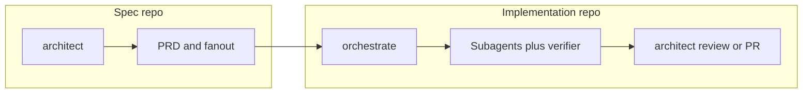

# 2026-06-01 — README Refactor, Web/Mobile Repo Naming, and `new-spec-repo` Sync Automation

**Cursor chat created:** 2026-06-01  
**Chat transcript:** [README / web-mobile / new-spec-repo session](29f92bf4-ba9b-4e6e-b2df-dd9b3ef05860) (`29f92bf4-ba9b-4e6e-b2df-dd9b3ef05860`)

**Session scope:** (1) Replace legacy “frontend” repo naming with surface-based `<app>-web` / `<app>-mobile` guidance; (2) restructure `README.md` setup-first and shorter; (3) rewrite `bin/new-spec-repo` as create-or-sync from parent folder with sibling discovery and automatic `link-spec-repo`; (4) fix sync bugs found on real `mycelia-tree` run; (5) document routing-only safety (no wiping spec product content).

**Status:** Implemented and finalized in this chat. **Verify on disk before merge** — later sessions may have moved logic to `bin/setup-project` / `bin/stack/create_or_sync_spec.sh` and shortened `README.md` again. Search for behaviors below in the active entrypoint.

**Related sessions (later):**

- [`2026-05-17-new-spec-repo-spec-repo-change-expectations.md`](2026-05-17-new-spec-repo-spec-repo-change-expectations.md)
- [`2026-05-18-new-spec-repo-main-default-branch-fix.md`](2026-05-18-new-spec-repo-main-default-branch-fix.md)
- [`2026-06-01-new-spec-repo-git-flow-main-develop.md`](2026-06-01-new-spec-repo-git-flow-main-develop.md) (may be dated 2026-05-18 on disk)
- [`2026-06-01-spec-central-stack-workflow-implementation.md`](2026-06-01-spec-central-stack-workflow-implementation.md) / [`2026-05-19-spec-central-stack-workflow-implementation.md`](2026-05-19-spec-central-stack-workflow-implementation.md)

---

## Executive summary

| Area | Outcome |
| --- | --- |
| Repo naming | Prefer **`<app>-web`**, **`<app>-mobile`**, **`<app>-api`** over **`frontend`** / **`APP-frontend`** |
| README | Setup + daily use at top; one mermaid; one-command parent-folder bootstrap |
| `new-spec-repo` | Create-or-sync; infer app from parent folder; discover sibling `.git` dirs; auto `link-spec-repo` |
| Sync fixes | Checkout GitHub default branch before sync; push `HEAD`; JSON branch-protection body |
| Safety | Only **`docs/agents/repos.md`** + impl wiring; refuse sync if spec repo dirty |
| Unchanged | **`frontend-dev`** agent name (UI execution, not repo naming) |

---

## Chat timeline (for another AI)

| Step | User request | Action |
| --- | --- | --- |
| 1 | Stop using `app-frontend`; use `app-web` / `app-mobile` | Grep + update README, templates, upgrade docs, architect prose |
| 2 | README too long; setup at top | Full README rewrite (~86 lines, setup-first) |
| 3 | Where to run `new-spec-repo`? | Clarify: **parent folder**, not spec repo |
| 4 | Automate discovery + linking; rerun after rename | Rewrite `bin/new-spec-repo` |
| 5 | `mycelia-tree` run: commit on wrong branch, 422 protection | Push `HEAD`; default-branch checkout; JSON protection API |
| 6 | Don't wipe existing spec content | Generated header on `repos.md`; README safety note; dirty-tree guard |

---

## 1. Repo naming convention

### Rule

Name implementation repos by **surface or capability**, not “frontend”:

| Prefer | Avoid |
| --- | --- |
| `<app>-web` | `<app>-frontend`, bare `frontend` |
| `<app>-mobile` | using “frontend” for native clients |
| `<app>-api`, `<app>-worker`, … | — |

**Do not rename** the `frontend-dev` execution subagent.

### Directory layout (expected)

```text
~/code/mycelia-tree/              ← parent (NOT a git repo); run scripts here
├── mycelia-tree-spec/            ← spec repo (git)
├── mycelia-tree-web/             ← implementation repo (git)
├── mycelia-tree-api/             ← implementation repo (git)
└── …
```

Local folder names must match GitHub repo short names for auto-discovery (`mycelia-tree-web` → `roborew/mycelia-tree-web` when `GH_ORG=roborew`).

---

## 2. File-by-file changes (recreate checklist)

| # | File | Change type |
| --- | --- | --- |
| 1 | `README.md` | Major restructure + naming + bootstrap |
| 2 | `bin/new-spec-repo` | Full rewrite + follow-up patches |
| 3 | `bin/link-spec-repo` | No logic change; invoked by `new-spec-repo` |
| 4 | `templates/spec-repo/docs/prd/_template.md` | Example ticket repo |
| 5 | `templates/spec-repo/.github/ISSUE_TEMPLATE/prd-parent.yml` | Placeholder repos |
| 6 | `docs/upgrade-spec/onboarding-supplement.md` | `roborew/frontend` → `roborew/web` (10 occurrences) |
| 7 | `docs/upgrade-spec/upgrade-plan.md` | YAML samples + prose |
| 8 | `skills/architect-plan/SKILL.md` | Multi-domain table row |
| 9 | `agents/architect.md` | Medium difficulty bullet |

---

## 3. `README.md`

### 3a. Naming patches (applied before full rewrite)

**Multi-repo prose — replace:**

```markdown
<!-- BEFORE -->
One **spec repository** per product (`<app-slug>-spec`) holds PRDs and parent issues; **implementation repositories** (any mix: frontend, API, workers, _etc._) hold code and **child** issues. OpenCode does **not** create the spec repo by itself—you run the helper script (or ask an agent with `bash` + `gh` to run the same commands).

<!-- AFTER -->
One **spec repository** per product (`<app-slug>-spec`) holds PRDs and parent issues; **implementation repositories** (any mix: **web**, **mobile**, API, workers, _etc._) hold code and **child** issues. Name repos by **surface or capability** (for example `<app>-web`, `<app>-mobile`, `<app>-api`) instead of legacy “frontend” — a web repo might be Next.js, a mobile repo might be React Native or native clients; both are product surfaces, not “the UI that renders the web.” OpenCode does **not** create the spec repo by itself—you run the helper script (or ask an agent with `bash` + `gh` to run the same commands).
```

**Bootstrap block — replace `APP-frontend` with `APP-web`:**

```bash
# BEFORE
gh repo clone "$GH_ORG/APP-frontend"
gh repo clone "$GH_ORG/APP-api"
~/.config/opencode/bin/new-spec-repo APP APP-frontend APP-api
cd APP-frontend && ~/.config/opencode/bin/link-spec-repo "$GH_ORG/APP-spec" && cd ..

# AFTER (intermediate — before automation)
gh repo clone "$GH_ORG/APP-web"
gh repo clone "$GH_ORG/APP-api"
~/.config/opencode/bin/new-spec-repo APP APP-web APP-api
cd APP-web && ~/.config/opencode/bin/link-spec-repo "$GH_ORG/APP-spec" && cd ..
```

**Follow-on line:**

```markdown
<!-- BEFORE -->
**Frontend-only or many backends:** pass only the repos that exist, e.g. `new-spec-repo APP APP-web` or `new-spec-repo APP APP-web APP-ingest APP-infer`.

<!-- AFTER -->
**Web-only, mobile-only, or many backends:** pass only the repos that exist, e.g. `new-spec-repo APP APP-web`, `new-spec-repo APP APP-mobile`, or `new-spec-repo APP APP-web APP-mobile APP-ingest APP-infer`.
```

### 3b. Session-final README (full file to write)

After restructure + automation patches, the session-final `README.md` was:

```markdown
# OpenCode Agent Orchestration

**Architect → Orchestrate → subagents** with model routing in [`opencode.json`](opencode.json). Canonical operations: [`docs/RUNBOOK.md`](docs/RUNBOOK.md). Capability overview: [`docs/architecture/opencode-capability-matrix.md`](docs/architecture/opencode-capability-matrix.md).

## Setup

1. **Use this directory as your OpenCode config** — Symlink to `~/.config/opencode`, or set `OPENCODE_CONFIG_DIR` to this path so agents, skills, rules, and `opencode.json` load here.
2. **Each application repository** — Run **`setup-skills`** once (via architect when that skill is enabled). Add **`CONTEXT.md`** and **`opencode.md`** from [`docs/templates/opencode.md.template`](docs/templates/opencode.md.template). `setup-skills` can scaffold **`LANGUAGE.md`** when missing.
3. **Optional: spec repo + multiple implementation repos** — Create your implementation repos on GitHub first (e.g. `<app>-web`, `<app>-api`) and clone them as siblings under one folder. Then run **`new-spec-repo` from that parent folder**. With no arguments, it uses the current folder name as the app slug, discovers sibling git repos, creates or syncs `<app>-spec`, updates `docs/agents/repos.md`, and runs `link-spec-repo` inside each local implementation repo.

```bash
export GH_ORG=OWNER
mkdir -p ~/code/APP && cd ~/code/APP   # parent folder for APP-web, APP-api, APP-spec, ...
gh repo clone "$GH_ORG/APP-web"
gh repo clone "$GH_ORG/APP-api"   # every impl repo you need
~/.config/opencode/bin/new-spec-repo
```

Optional: `gh secret set LABEL_SYNC_PAT` on the spec repo for [label sync](templates/spec-repo/.github/workflows/sync-labels.yml).

Implementation repos must exist before `new-spec-repo` can discover them (it creates only **`<app>-spec`**). You can still be explicit when needed: `new-spec-repo APP APP-web APP-mobile APP-ingest`. After renaming, adding, or removing local implementation repo folders, rerun `new-spec-repo` from the parent folder to replace the routing list in **`<app>-spec/docs/agents/repos.md`** and relink available repos. Existing PRDs, ADRs, prototypes, and other spec files are left alone. Templates: [`templates/spec-repo/`](templates/spec-repo/). Deeper walkthrough: [`docs/upgrade-spec/onboarding-supplement.md`](docs/upgrade-spec/onboarding-supplement.md).

**Repo naming:** Prefer **surface or capability** (`<app>-web`, `<app>-mobile`, `<app>-api`) over legacy “frontend” so names stay accurate for web stacks, native mobile, workers, etc.

## Daily use

- Start planned work with **`architect`**. It chooses **spec repo** vs **implementation repo** paths (PRD vs feature vs debug vs refactor).
- Run **`orchestrate`** to execute work: **GitHub feature backlog** (`feature:<slug>` issues from `bin/fanout`) is the default for spec-driven slices; or pick a local **`.plan/*.md`** when you are not on the ticket queue.
- Set **`SPEC_REPO`** to your local spec repo path when **`architect`** / **`orchestrate`** should read **`$SPEC_REPO/docs/prd/<slug>.md`** for GitHub feature sign-off (architect-review Mode F).

Copy-paste prompts for local `.plan` work: ask architect for a plan from **`tmp/feature-context.md`** after **`bin/feature-context <issue>`**; then in **`orchestrate`**, `Run .plan/feature.<slug>.md`. For work with no spec: implementation repo → architect (feature / bug / refactor) → `.plan` → orchestrate → back to architect for review/docs.

## Quick reference

| Topic | Location |
| --- | --- |
| Pipeline, grading, MCP, canonical flow | [`docs/RUNBOOK.md`](docs/RUNBOOK.md) |
| Spec + multi-repo vertical slices | This file **Setup** + [`docs/RUNBOOK.md`](docs/RUNBOOK.md) |
| Per-project template | [`docs/templates/opencode.md.template`](docs/templates/opencode.md.template) |
| Shared rules (`instructions`) | [`rules/`](rules/) |
| Scripts (secrets, format, tests, session) | [`scripts/`](scripts/) |
| Git guardrails | [`scripts/block-dangerous-git.sh`](scripts/block-dangerous-git.sh), [`scripts/preflight-git.sh`](scripts/preflight-git.sh) |

## How it works (short)

- **Built-in:** `plan` and `build` in `opencode.json` (DeepSeek V4 Pro / Flash).
- **Custom:** **`architect`** plans and hands off; **`orchestrate`** dispatches **`developer`**, **`frontend-dev`**, **`ux-dev`**, **`verifier`**, etc., and does not write product code itself; **`scribe`** writes plans and allowed docs per [`agents/scribe.md`](agents/scribe.md); **`review`** may Task focused reviewers.
- **Global:** [`rules/`](rules/) via **`instructions`**; **`permission`** in `opencode.json` allows normal edits, asks before changing `opencode.json`, blocks secrets in `.env*`.

Spec-driven execution: **`bin/fanout`** creates one GitHub issue per PRD **`tickets:`** row (labels `feature:<slug>`, `state:ready-for-agent`, `mode:afk|hitl`) with acceptance, tests, and **`opencode-task-json`**. Skills: **`skills/orchestrate-execution`**, **`skills/github-issue-run`**. Local **`.plan/*`** stays supported for discovery-heavy work, debug, refactors, and recovery.

## Workflow overview



| You want | Where | Notes |
| --- | --- | --- |
| Product / PRD | Spec repo | `grill-me` → `to-prd` → human approves → `bin/fanout` → child issues in impl repos |
| Ship a feature | Impl repo | Default: **`orchestrate`** on `feature:<slug>` queue. Optional: `bin/feature-context` + architect `.plan` + orchestrate |
| Bug or refactor | Impl repo | Architect + specialist path → `.plan` → orchestrate; promote to spec only if cross-repo |
| Domain / ADR | Either | Update **`CONTEXT.md`** or **`docs/adr/*`** via scribe when warranted—not every feature needs an ADR |

The spec repo tracks linked repos in **`docs/agents/repos.md`** and uses **`gh`** for issues; do heavy source work in the **target** implementation repo (use **`bin/feature-context`** when hydrating from a child issue).

**Optional skills** (grant via `permission.skill` in [`agents/*.md`](agents/)): [`skills/ship`](skills/ship), [`skills/hotfix`](skills/hotfix), [`skills/debug-fix`](skills/debug-fix), [`skills/tdd`](skills/tdd), [`skills/handoff`](skills/handoff), [`skills/zoom-out`](skills/zoom-out), [`skills/caveman`](skills/caveman), [`skills/to-issues`](skills/to-issues), [`skills/github-issue-run`](skills/github-issue-run), [`skills/setup-skills`](skills/setup-skills). **`grill-me`** (architect Mode A) follows [grill-with-docs](https://github.com/mattpocock/skills/tree/main/skills/engineering/grill-with-docs).

**Git:** This repo’s `opencode.json` does not ship PreToolUse hooks. Use [`scripts/preflight-git.sh`](scripts/preflight-git.sh) and [`scripts/block-dangerous-git.sh`](scripts/block-dangerous-git.sh) where your host supports them.

## Design prototypes

Keep canonical prototypes under **`APP-spec/docs/prototypes/<feature-slug>/`** and link from the PRD. `bin/new-prd` / `bin/feature-context` pull that context into implementation work; production code still lives in impl repos.

## Desktop / shell

If the OpenCode app misses toolchain on PATH, use `~/.zshenv` and optional `~/.opencode-agent-env` (see RUNBOOK). Prefer [`scripts/agent-run.zsh`](scripts/agent-run.zsh) for a login-shell–consistent command environment.
```

---

## 4. `bin/new-spec-repo` — session-final script

Replace the **entire** pre-session script (which aborted if spec repo existed) with this session-final version. Subsequent sessions may have moved equivalent logic to `bin/stack/create_or_sync_spec.sh`.

```bash
#!/usr/bin/env bash
# Create or sync an application spec repo from templates/spec-repo.
# Run from the parent folder that contains cloned implementation repos.
# Usage:
#   GH_ORG=roborew new-spec-repo                 # app slug = current folder; targets = sibling git dirs
#   GH_ORG=roborew new-spec-repo <app-slug>      # targets = sibling git dirs
#   GH_ORG=roborew new-spec-repo <app-slug> [target-repo ...]
#   target-repo: local folder name (e.g. app-web, app-mobile, app-api) or full owner/repo
set -euo pipefail

ORG="${GH_ORG:-roborew}"
ROOT="$(cd "$(dirname "$0")/.." && pwd)"
PARENT_DIR="$(pwd)"

if [[ $# -gt 0 ]]; then
  APP="$1"
  shift || true
else
  APP="$(basename "$PARENT_DIR")"
fi

SPEC_NAME="${APP}-spec"
SPEC_REPO="${ORG}/${SPEC_NAME}"
TARGETS=("$@")

discover_targets() {
  local spec_name="$1"
  local dir

  for dir in */; do
    dir="${dir%/}"
    [[ "$dir" == "$spec_name" ]] && continue
    [[ "$dir" == .* ]] && continue
    [[ -d "$dir/.git" ]] || continue
    printf '%s\n' "$dir"
  done
}

normalize_repo() {
  local target="$1"
  if [[ "$target" == */* ]]; then
    printf '%s\n' "$target"
  else
    printf '%s/%s\n' "$ORG" "$target"
  fi
}

local_dir_for_target() {
  local target="$1"
  if [[ "$target" == */* ]]; then
    printf '%s\n' "${target##*/}"
  else
    printf '%s\n' "$target"
  fi
}

if [[ ${#TARGETS[@]} -eq 0 ]]; then
  TARGETS=()
  while IFS= read -r target; do
    [[ -z "$target" ]] && continue
    TARGETS+=("$target")
  done < <(discover_targets "$SPEC_NAME")
fi

if [[ ${#TARGETS[@]} -eq 0 ]]; then
  echo "WARN: no implementation repo folders discovered under ${PARENT_DIR}" >&2
  echo "      Clone repos as siblings here, or pass target repo names explicitly." >&2
fi

CREATED_SPEC=false
if [[ -d "${SPEC_NAME}/.git" ]]; then
  echo "Using existing local spec repo ${SPEC_NAME}..."
elif gh repo view "$SPEC_REPO" &>/dev/null; then
  echo "Cloning existing ${SPEC_REPO}..."
  gh repo clone "$SPEC_REPO" "$SPEC_NAME"
else
  echo "Creating ${SPEC_REPO}..."
  gh repo create "$SPEC_REPO" --private --description "Spec repo: PRDs + parent issues for ${APP}" --clone
  CREATED_SPEC=true
fi

cd "${SPEC_NAME}"

DEFAULT_BRANCH=""
if [[ "$CREATED_SPEC" != "true" ]]; then
  DEFAULT_BRANCH="$(gh repo view "$SPEC_REPO" --json defaultBranchRef --jq .defaultBranchRef.name)"
  if [[ -n "$DEFAULT_BRANCH" ]]; then
    if ! git diff --quiet || ! git diff --cached --quiet; then
      echo "Spec repo ${SPEC_NAME} has uncommitted changes; commit or stash them before syncing." >&2
      exit 1
    fi

    git fetch origin "$DEFAULT_BRANCH" >/dev/null 2>&1 || true
    if git show-ref --verify --quiet "refs/heads/${DEFAULT_BRANCH}"; then
      git switch "$DEFAULT_BRANCH" >/dev/null
    else
      git switch -c "$DEFAULT_BRANCH" "origin/${DEFAULT_BRANCH}" >/dev/null
    fi
    git pull --ff-only origin "$DEFAULT_BRANCH" >/dev/null 2>&1 || true
  fi
fi

if [[ "$CREATED_SPEC" == "true" ]]; then
  echo "Copying scaffold from ${ROOT}/templates/spec-repo ..."
  cp -R "${ROOT}/templates/spec-repo/." .
else
  mkdir -p docs/agents
fi

{
  echo "# Generated by new-spec-repo."
  echo "# This file is routing configuration; rerunning the script replaces this list."
  echo "repos:"
  for target in "${TARGETS[@]}"; do
    full="$(normalize_repo "$target")"
    echo "  - name: ${full}"
    echo "    role: target"
  done
} > docs/agents/repos.md

git add -A
if git diff --cached --quiet; then
  echo "Spec repo already up to date."
else
  if [[ "$CREATED_SPEC" == "true" ]]; then
    git commit -m "chore: bootstrap ${SPEC_NAME} scaffold" || true
  else
    git commit -m "chore: sync ${SPEC_NAME} target repos" || true
  fi
fi
git push -u origin HEAD || true

echo "Branch protection on default branch..."
DEFAULT_BRANCH="${DEFAULT_BRANCH:-$(gh repo view "$SPEC_REPO" --json defaultBranchRef --jq .defaultBranchRef.name)}"
gh api -X PUT "repos/${SPEC_REPO}/branches/${DEFAULT_BRANCH}/protection" \
  --input - >/dev/null 2>&1 <<'JSON' || echo "(branch protection skipped — adjust permissions)"
{
  "required_status_checks": null,
  "enforce_admins": false,
  "required_pull_request_reviews": {
    "required_approving_review_count": 0,
    "dismiss_stale_reviews": true
  },
  "restrictions": null,
  "allow_force_pushes": false,
  "allow_deletions": false,
  "required_linear_history": true
}
JSON

seed_one() {
  local repo="$1"
  yq -o=json '.[]' .github/labels.yml 2>/dev/null | jq -c '.' | while read -r row; do
    name=$(echo "$row" | jq -r .name)
    color=$(echo "$row" | jq -r .color)
    desc=$(echo "$row" | jq -r '.description // ""')
    gh label create "$name" --repo "$repo" --color "$color" --description "$desc" --force 2>/dev/null || true
  done
}

if command -v yq &>/dev/null && command -v jq &>/dev/null; then
  echo "Seeding labels into ${SPEC_REPO}..."
  seed_one "$SPEC_REPO"
  while IFS= read -r r; do
    [[ -z "$r" ]] && continue
    echo "Seeding labels into ${r}..."
    seed_one "$r"
  done < <(yq -r '.repos[].name' docs/agents/repos.md 2>/dev/null || true)
else
  echo "WARN: install yq + jq to seed labels from .github/labels.yml" >&2
fi

echo ""
echo "Linking local implementation repos to ${SPEC_REPO}..."
for target in "${TARGETS[@]}"; do
  local_dir="$(local_dir_for_target "$target")"
  if [[ -d "${PARENT_DIR}/${local_dir}" ]]; then
    echo "Linking ${local_dir}..."
    (cd "${PARENT_DIR}/${local_dir}" && "${ROOT}/bin/link-spec-repo" "$SPEC_REPO")
  else
    echo "WARN: local directory ${local_dir} not found; skipped link-spec-repo" >&2
  fi
done

echo ""
echo "=== GitHub Project (optional) ==="
echo "Create a Project v2 board in the browser: https://github.com/orgs/${ORG}/projects — link repos ${SPEC_REPO} ${TARGETS[*]:-}"
echo "Automated field setup is not fully available via gh in all versions; enable **Auto-add to project** per repo in project settings."
echo ""
echo "=== LABEL_SYNC_PAT ==="
echo "Add a fine-grained PAT (Issues: write) for sibling repos:"
echo "  gh secret set LABEL_SYNC_PAT --repo ${SPEC_REPO}"
echo ""
echo "Done. Spec repo: https://github.com/${SPEC_REPO}"
```

### 4a. Key diffs vs pre-session script

| Before | After |
| --- | --- |
| `APP="${1:?app slug required}"` | Optional `$1`; default `basename "$PARENT_DIR"` |
| Abort if remote spec exists | Use local clone / clone remote / create new |
| Always `cp -R templates/spec-repo` | Full copy **only** on `CREATED_SPEC=true`; else `mkdir -p docs/agents` |
| Manual target args only | `discover_targets` scans sibling `*/` with `.git` |
| No auto-link | Loop calling `link-spec-repo` per target |
| `git push -u origin main \|\| master` inside commit `if` | `git push -u origin HEAD` **always** after commit check |
| `-F` branch protection form (422) | JSON `--input` heredoc |
| No dirty-tree guard | Exit 1 if uncommitted changes before branch switch |

### 4b. Pre-session script header (for reference — delete/replace)

```bash
#!/usr/bin/env bash
# Create application spec repo from templates/spec-repo, seed labels, branch protection, optional GitHub Project.
# Usage: GH_ORG=roborew new-spec-repo <app-slug> [target-repo ...]
#   target-repo: short name (app-frontend) or full owner/repo
# ...
if gh repo view "$SPEC_REPO" &>/dev/null; then
  echo "Repo $SPEC_REPO already exists — abort" >&2
  exit 1
fi
```

Usage comment was updated to:

```bash
#   target-repo: short name (e.g. app-web, app-mobile, app-api) or full owner/repo
```

---

## 5. `bin/link-spec-repo` (unchanged; called automatically)

No edits in this session. `new-spec-repo` invokes it. Reference implementation:

```bash
#!/usr/bin/env bash
# Run inside a target implementation repo. Links docs/agents/issue-tracker.md to the spec repo and installs bin/feature-context.
# Usage: link-spec-repo <owner/name-of-spec-repo>
set -euo pipefail
SPEC_REPO="${1:?owner/name spec repo required}"
ROOT="$(cd "$(dirname "$0")/.." && pwd)"
mkdir -p docs/agents bin
cat > docs/agents/issue-tracker.md <<'EOF'
# Issue tracker

Issues for this repository are tracked on **GitHub**.

- **CLI:** `gh issue create`, `gh issue view`, `gh issue list`
- **Remote:** (see `git remote get-url origin`)

## Spec repository (parent PRDs)

- **SPEC_REPO:** __SPEC_REPO__

`bin/feature-context` reads **SPEC_REPO** from this file.
EOF
sed -i.bak "s|__SPEC_REPO__|${SPEC_REPO}|g" docs/agents/issue-tracker.md && rm -f docs/agents/issue-tracker.md.bak

if [[ ! -f bin/feature-context ]]; then
  install -m0755 "${ROOT}/templates/bin/feature-context" bin/feature-context
  echo "Installed bin/feature-context from OpenCode config."
else
  echo "bin/feature-context already exists — not overwriting."
fi

touch .gitignore
if ! grep -q '^tmp/' .gitignore 2>/dev/null; then
  printf '\n# OpenCode scratch\ntmp/\n.research/\n.qa/\n.plan/*.completed.md\n' >> .gitignore
  echo "Appended tmp/ and scratch paths to .gitignore"
fi

echo ""
echo "Linked SPEC_REPO=${SPEC_REPO}"
echo "Next: run setup-skills in OpenCode if you have not already, then:"
echo "  bin/feature-context <issue-number>"
```

---

## 6. Spec repo templates

### 6a. `templates/spec-repo/docs/prd/_template.md`

In the example `tickets:` YAML block:

```yaml
# BEFORE
  - id: web-org-settings
    repo: myorg/my-frontend
    title: "UI: organization settings page"

# AFTER
  - id: web-org-settings
    repo: myorg/my-web
    title: "UI: organization settings page"
```

### 6b. `templates/spec-repo/.github/ISSUE_TEMPLATE/prd-parent.yml`

In `target_repos` placeholder:

```yaml
# BEFORE
      placeholder: |
        org/frontend
        org/api

# AFTER
      placeholder: |
        org/web
        org/mobile
        org/api
```

### 6c. Generated `docs/agents/repos.md` (runtime output)

```yaml
# Generated by new-spec-repo.
# This file is routing configuration; rerunning the script replaces this list.
repos:
  - name: roborew/mycelia-tree-api
    role: target
  - name: roborew/mycelia-tree-web
    role: target
```

---

## 7. Upgrade docs

### 7a. `docs/upgrade-spec/onboarding-supplement.md`

Global replace (10 occurrences):

```text
roborew/frontend  →  roborew/web
~/code/roborew/frontend  →  ~/code/roborew/web
```

**Submodule prose:**

```markdown
<!-- BEFORE -->
This is more ceremony and only useful if `frontend` needs to lag behind `opencode`'s `main` for stability.
**Recommendation:** … if you ever hit a "I upgraded opencode and broke frontend's pipeline" moment.

<!-- AFTER -->
This is more ceremony and only useful if the **web** (or other surface) repo needs to lag behind `opencode`'s `main` for stability.
**Recommendation:** … if you ever hit a "I upgraded opencode and broke the web repo's pipeline" moment.
```

**ASCII diagram boxes:**

```text
│ │frontend│ │  api   │ │ infra  │ ││   →   │ │  web   │ │  api   │ │ infra  │ ││
║   ├── frontend/         ← target repo                 ║
  →
║   ├── web/              ← target repo (web surface)  ║
```

### 7b. `docs/upgrade-spec/upgrade-plan.md`

```markdown
<!-- executive summary -->
`frontend`, `api`, `infra` etc.
→
**web**, **mobile**, `api`, `infra`, _etc._
```

```yaml
# BEFORE
target_repos: [frontend, api]
slices:
  frontend:
    title: "[dark-mode] Theme toggle + persisted preference"

# AFTER
target_repos: [web, api]
slices:
  web:
    title: "[dark-mode] Theme toggle + persisted preference"
```

```text
github.com/roborew/frontend/issues/137  →  github.com/roborew/web/issues/137
register roborew/frontend, roborew/api    →  register roborew/web, roborew/api
(frontend / api / infra — confirm)        →  (web / mobile / api / infra — confirm)
setup-skills per repo (`frontend`, …)   →  (`web`, `mobile` if applicable, `api`, …)
```

---

## 8. Agent / skill prose

### 8a. `skills/architect-plan/SKILL.md`

In the difficulty table, **medium** row spawn condition:

```markdown
<!-- BEFORE -->
**multi-domain** (e.g. backend + frontend + infra)

<!-- AFTER -->
**multi-domain** (e.g. API + web/mobile surfaces + infra)
```

### 8b. `agents/architect.md`

In **Medium** difficulty bullet:

```markdown
<!-- BEFORE -->
If **multi-domain** (e.g. backend + frontend + infra), **high uncertainty** …

<!-- AFTER -->
If **multi-domain** (e.g. API + web or mobile clients + infra), **high uncertainty** …
```

---

## 9. Routing-only safety contract

| On rerun | Touched | Not touched |
| --- | --- | --- |
| Spec repo | `docs/agents/repos.md` (full replace) | `docs/prd/*`, `docs/adr/*`, `docs/prototypes/*`, custom docs |
| Impl repos | `docs/agents/issue-tracker.md`, `.gitignore` scratch lines | Application source, plans, CONTEXT |
| Both | Label seeding (`--force`, idempotent) | Existing `bin/feature-context` |
| Guard | Exit 1 if spec repo has uncommitted changes before branch switch | — |

**When commit happens:** only if regenerated `repos.md` differs → message `chore: sync ${APP}-spec target repos`.  
**When no commit:** prints `Spec repo already up to date.` — labels/linking may still run.

---

## 10. Real-world validation (`mycelia-tree`, 2026-05-17 in user timestamps)

```text
robo@MacBookPro mycelia-tree % ~/.config/opencode/bin/new-spec-repo
Using existing local spec repo mycelia-tree-spec...
[feature/delploy-maintenance c2752c5] chore: sync mycelia-tree-spec target repos
 1 file changed, 2 insertions(+), 2 deletions(-)
branch 'main' set up to track 'origin/main'.
Everything up-to-date
Branch protection on default branch...
{ "message": "Invalid request...", "status": "422" }
```

**Root cause:** commit on `feature/delploy-maintenance`, push targeted `main`; branch protection used invalid `-F` API shape.

**Fixes applied in same chat:** default-branch checkout block + `git push -u origin HEAD` + JSON protection body.

---

## 11. Operator commands

```bash
# First-time or resync after folder rename/add/remove
cd ~/code/APP
~/.config/opencode/bin/new-spec-repo

# Explicit app slug + targets when discovery wrong
GH_ORG=roborew ~/.config/opencode/bin/new-spec-repo mycelia-tree owner/actual-repo-name

# Verify syntax
bash -n ~/.config/opencode/bin/new-spec-repo
bash -n ~/.config/opencode/bin/link-spec-repo
```

---

## 12. Verification checklist

- [ ] Parent folder contains sibling git clones; spec folder named `${APP}-spec`
- [ ] `new-spec-repo` with no args uses `basename(pwd)` as `APP`
- [ ] `docs/agents/repos.md` lists discovered repos with generated header
- [ ] Commit lands on GitHub **default branch**, not orphan feature branch
- [ ] `link-spec-repo` output for each impl folder
- [ ] PRDs and other spec files unchanged after rerun
- [ ] Rename `*-frontend` → `*-web` locally; rerun; `repos.md` shows `-web` not `-frontend`
- [ ] No duplicate `repos:` entries (full file replace, not append)

---

## 13. Suggested commit message

```text
docs(ops): web/mobile repo naming, README setup-first, new-spec-repo sync automation

Replace frontend repo examples with surface-based names; document parent-folder
bootstrap; make new-spec-repo create-or-sync with sibling discovery, auto
link-spec-repo, safe routing-only updates, and correct branch push behavior.
```
